# FIVUCSAS Architecture Diagrams

**Last Updated:** December 28, 2025
**Version:** 2.0
**Project:** Face and Identity Verification Using Cloud-based SaaS

This document contains all essential Mermaid diagrams for the FIVUCSAS project, designed for Software Engineering documentation requirements.

---

## Table of Contents

1. [System Architecture Overview](#1-system-architecture-overview)
2. [Module Structure](#2-module-structure)
3. [Component Diagram](#3-component-diagram)
4. [Deployment Diagram](#4-deployment-diagram)
5. [Data Flow Diagrams](#5-data-flow-diagrams)
6. [Sequence Diagrams](#6-sequence-diagrams)
7. [Class Diagrams](#7-class-diagrams)
8. [State Diagrams](#8-state-diagrams)
9. [Entity Relationship Diagram](#9-entity-relationship-diagram)
10. [Use Case Diagram](#10-use-case-diagram)

---

## 1. System Architecture Overview

### 1.1 High-Level System Architecture

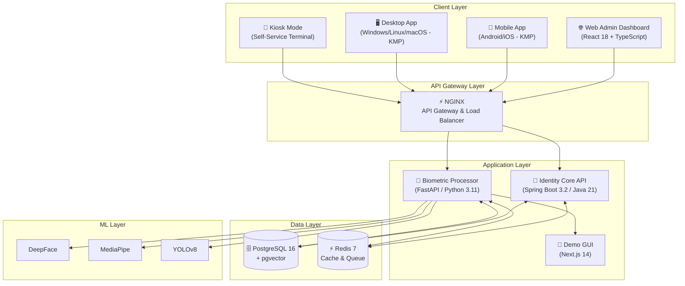
```mermaid
graph TB
    subgraph "Client Layer"
        WEB["🌐 Web Admin Dashboard<br/>(React 18 + TypeScript)"]
        MOBILE["📱 Mobile App<br/>(Android/iOS - KMP)"]
        DESKTOP["🖥️ Desktop App<br/>(Windows/Linux/macOS - KMP)"]
        KIOSK["🏪 Kiosk Mode<br/>(Self-Service Terminal)"]
    end

    subgraph "API Gateway Layer"
        NGINX["⚡ NGINX<br/>API Gateway & Load Balancer"]
    end

    subgraph "Application Layer"
        IDENTITY["🔐 Identity Core API<br/>(Spring Boot 3.2 / Java 21)"]
        BIOMETRIC["🧬 Biometric Processor<br/>(FastAPI / Python 3.11)"]
        DEMO["🎨 Demo GUI<br/>(Next.js 14)"]
    end

    subgraph "Data Layer"
        POSTGRES[("🗄️ PostgreSQL 16<br/>+ pgvector")]
        REDIS[("⚡ Redis 7<br/>Cache & Queue")]
    end

    subgraph "ML Layer"
        DEEPFACE["DeepFace"]
        MEDIAPIPE["MediaPipe"]
        YOLO["YOLOv8"]
    end

    WEB --> NGINX
    MOBILE --> NGINX
    DESKTOP --> NGINX
    KIOSK --> NGINX

    NGINX --> IDENTITY
    NGINX --> BIOMETRIC

    IDENTITY <--> POSTGRES
    IDENTITY <--> REDIS
    BIOMETRIC <--> POSTGRES
    BIOMETRIC <--> REDIS
    BIOMETRIC --> DEMO

    BIOMETRIC --> DEEPFACE
    BIOMETRIC --> MEDIAPIPE
    BIOMETRIC --> YOLO
```

### 1.2 Microservices Communication

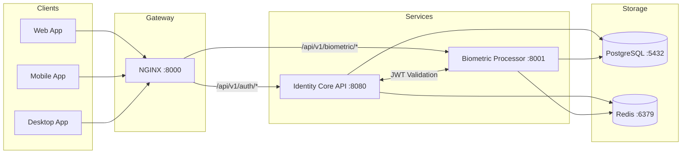
```mermaid
flowchart LR
    subgraph Clients
        C1[Web App]
        C2[Mobile App]
        C3[Desktop App]
    end

    subgraph Gateway
        GW[NGINX :8000]
    end

    subgraph Services
        ICA[Identity Core API :8080]
        BP[Biometric Processor :8001]
    end

    subgraph Storage
        PG[(PostgreSQL :5432)]
        RD[(Redis :6379)]
    end

    C1 & C2 & C3 --> GW
    GW -->|/api/v1/auth/*| ICA
    GW -->|/api/v1/biometric/*| BP

    ICA <-->|JWT Validation| BP
    ICA --> PG
    ICA --> RD
    BP --> PG
    BP --> RD
```

---

## 2. Module Structure

### 2.1 Repository Structure

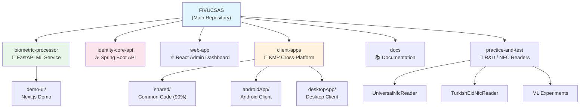
```mermaid
graph TD
    ROOT["FIVUCSAS<br/>(Main Repository)"]

    ROOT --> BP["biometric-processor<br/>🐍 FastAPI ML Service"]
    ROOT --> ICA["identity-core-api<br/>☕ Spring Boot API"]
    ROOT --> WA["web-app<br/>⚛️ React Admin Dashboard"]
    ROOT --> CA["client-apps<br/>📱 KMP Cross-Platform"]
    ROOT --> DOCS["docs<br/>📚 Documentation"]
    ROOT --> PT["practice-and-test<br/>🧪 R&D / NFC Readers"]

    CA --> SHARED["shared/<br/>Common Code (90%)"]
    CA --> ANDROID["androidApp/<br/>Android Client"]
    CA --> DESKAPP["desktopApp/<br/>Desktop Client"]

    BP --> DEMOGUI["demo-ui/<br/>Next.js Demo"]

    PT --> NFC1["UniversalNfcReader"]
    PT --> NFC2["TurkishEidNfcReader"]
    PT --> MLEXP["ML Experiments"]

    style ROOT fill:#e1f5fe
    style CA fill:#fff3e0
    style BP fill:#e8f5e9
    style ICA fill:#fce4ec
```

### 2.2 Submodule Dependencies

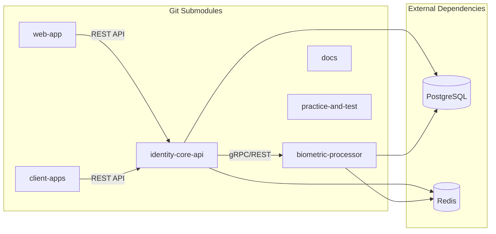
```mermaid
graph LR
    subgraph "Git Submodules"
        BP[biometric-processor]
        ICA[identity-core-api]
        WA[web-app]
        CA[client-apps]
        DOCS[docs]
        PT[practice-and-test]
    end

    subgraph "External Dependencies"
        PG[(PostgreSQL)]
        RD[(Redis)]
    end

    WA -->|REST API| ICA
    CA -->|REST API| ICA
    ICA -->|gRPC/REST| BP
    ICA --> PG
    ICA --> RD
    BP --> PG
    BP --> RD
```

---

## 3. Component Diagram

### 3.1 Identity Core API Components

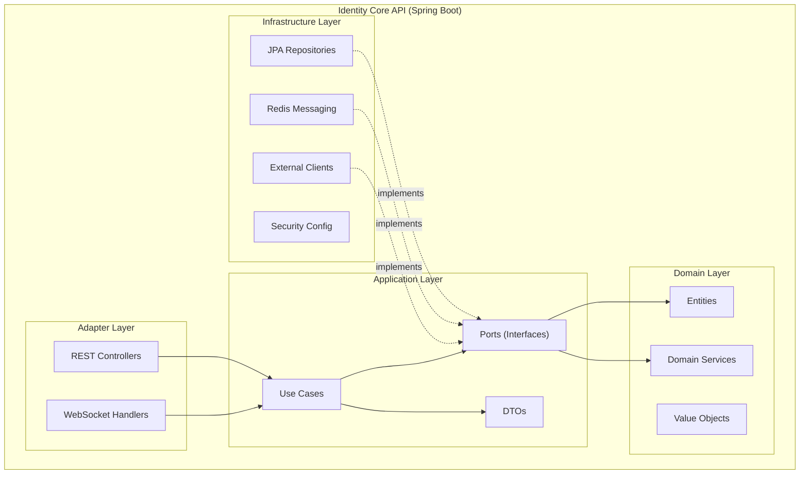
```mermaid
graph TB
    subgraph "Identity Core API (Spring Boot)"
        subgraph "Adapter Layer"
            REST["REST Controllers"]
            WS["WebSocket Handlers"]
        end

        subgraph "Application Layer"
            UC["Use Cases"]
            DTO["DTOs"]
            PORTS["Ports (Interfaces)"]
        end

        subgraph "Domain Layer"
            ENT["Entities"]
            VO["Value Objects"]
            SVC["Domain Services"]
        end

        subgraph "Infrastructure Layer"
            REPO["JPA Repositories"]
            SEC["Security Config"]
            MSG["Redis Messaging"]
            EXT["External Clients"]
        end
    end

    REST --> UC
    WS --> UC
    UC --> PORTS
    PORTS --> ENT
    PORTS --> SVC
    UC --> DTO
    REPO -.->|implements| PORTS
    MSG -.->|implements| PORTS
    EXT -.->|implements| PORTS
```

### 3.2 Biometric Processor Components

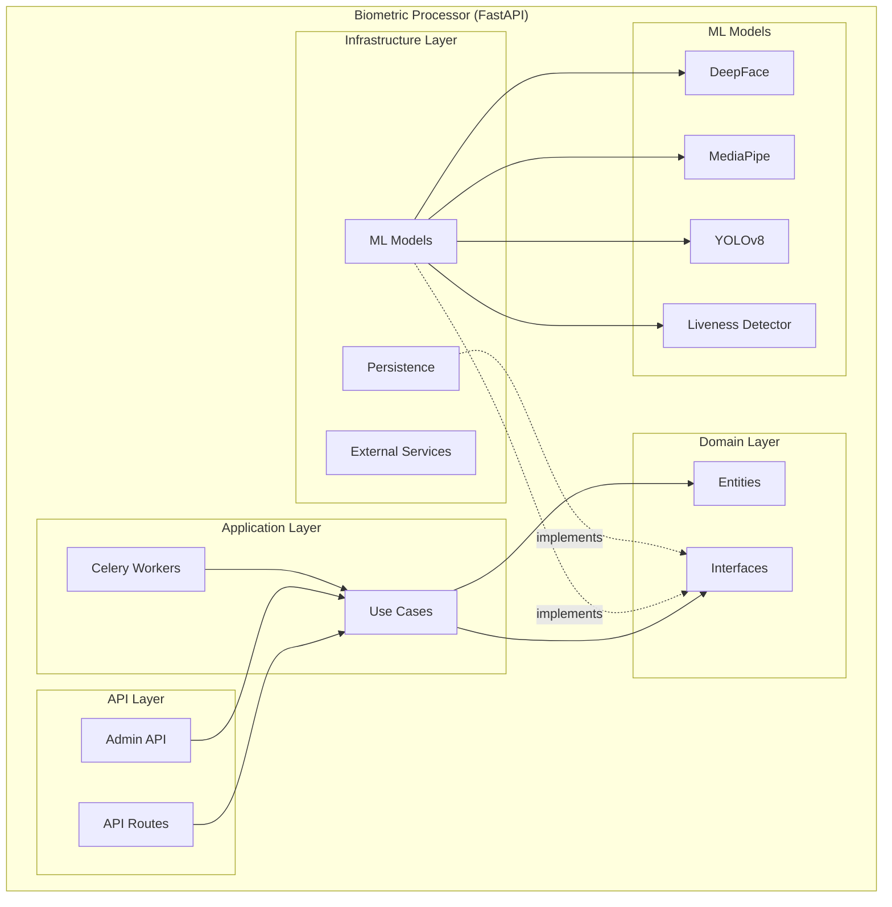
```mermaid
graph TB
    subgraph "Biometric Processor (FastAPI)"
        subgraph "API Layer"
            ROUTES["API Routes"]
            ADMIN["Admin API"]
        end

        subgraph "Application Layer"
            USECASES["Use Cases"]
            WORKERS["Celery Workers"]
        end

        subgraph "Domain Layer"
            ENTITIES["Entities"]
            INTERFACES["Interfaces"]
        end

        subgraph "Infrastructure Layer"
            ML["ML Models"]
            PERSIST["Persistence"]
            EXTERNAL["External Services"]
        end

        subgraph "ML Models"
            DF["DeepFace"]
            MP["MediaPipe"]
            YL["YOLOv8"]
            LV["Liveness Detector"]
        end
    end

    ROUTES --> USECASES
    ADMIN --> USECASES
    USECASES --> ENTITIES
    USECASES --> INTERFACES
    WORKERS --> USECASES
    ML -.->|implements| INTERFACES
    PERSIST -.->|implements| INTERFACES
    ML --> DF & MP & YL & LV
```

---

## 4. Deployment Diagram

### 4.1 Docker Compose Development Environment

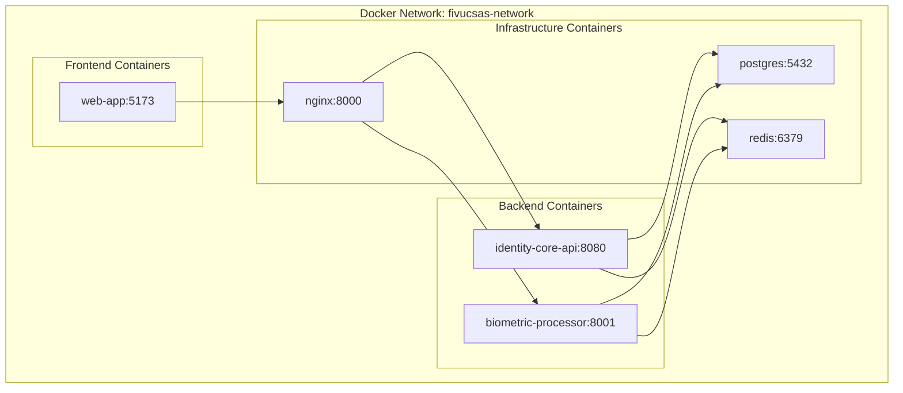
```mermaid
graph TB
    subgraph "Docker Network: fivucsas-network"
        subgraph "Frontend Containers"
            WEB["web-app:5173"]
        end

        subgraph "Backend Containers"
            ICA["identity-core-api:8080"]
            BP["biometric-processor:8001"]
        end

        subgraph "Infrastructure Containers"
            NGINX["nginx:8000"]
            PG["postgres:5432"]
            REDIS["redis:6379"]
        end
    end

    NGINX --> ICA
    NGINX --> BP
    ICA --> PG
    ICA --> REDIS
    BP --> PG
    BP --> REDIS
    WEB --> NGINX
```

### 4.2 Production Deployment Architecture

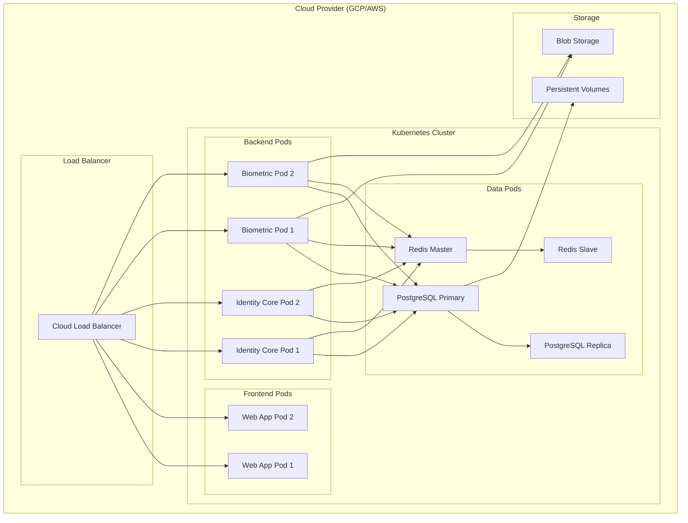
```mermaid
graph TB
    subgraph "Cloud Provider (GCP/AWS)"
        subgraph "Load Balancer"
            LB["Cloud Load Balancer"]
        end

        subgraph "Kubernetes Cluster"
            subgraph "Frontend Pods"
                WEB1["Web App Pod 1"]
                WEB2["Web App Pod 2"]
            end

            subgraph "Backend Pods"
                ICA1["Identity Core Pod 1"]
                ICA2["Identity Core Pod 2"]
                BP1["Biometric Pod 1"]
                BP2["Biometric Pod 2"]
            end

            subgraph "Data Pods"
                PG_PRIMARY["PostgreSQL Primary"]
                PG_REPLICA["PostgreSQL Replica"]
                REDIS_MASTER["Redis Master"]
                REDIS_SLAVE["Redis Slave"]
            end
        end

        subgraph "Storage"
            PV["Persistent Volumes"]
            BLOB["Blob Storage"]
        end
    end

    LB --> WEB1 & WEB2
    LB --> ICA1 & ICA2
    LB --> BP1 & BP2
    ICA1 & ICA2 --> PG_PRIMARY
    BP1 & BP2 --> PG_PRIMARY
    PG_PRIMARY --> PG_REPLICA
    ICA1 & ICA2 --> REDIS_MASTER
    BP1 & BP2 --> REDIS_MASTER
    REDIS_MASTER --> REDIS_SLAVE
    PG_PRIMARY --> PV
    BP1 & BP2 --> BLOB
```

---

## 5. Data Flow Diagrams

### 5.1 Face Enrollment Flow

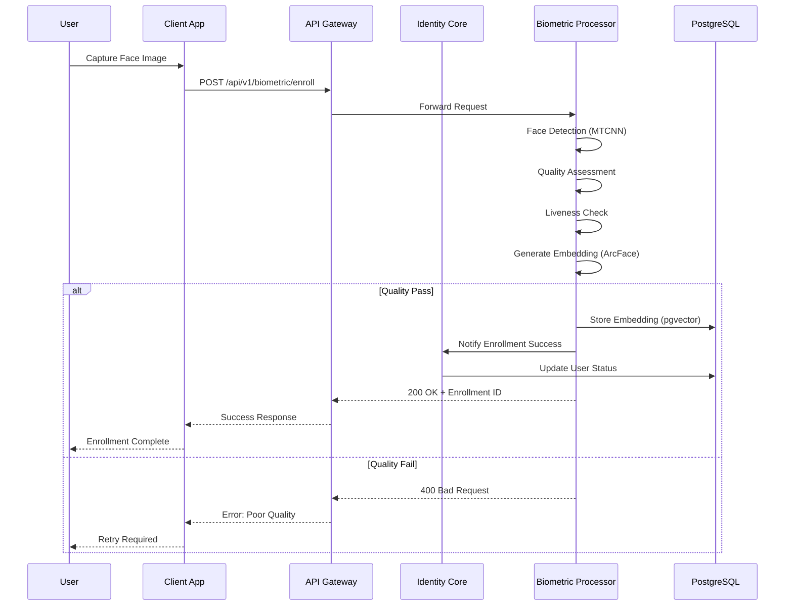
```mermaid
sequenceDiagram
    participant U as User
    participant C as Client App
    participant GW as API Gateway
    participant ICA as Identity Core
    participant BP as Biometric Processor
    participant DB as PostgreSQL

    U->>C: Capture Face Image
    C->>GW: POST /api/v1/biometric/enroll
    GW->>BP: Forward Request

    BP->>BP: Face Detection (MTCNN)
    BP->>BP: Quality Assessment
    BP->>BP: Liveness Check
    BP->>BP: Generate Embedding (ArcFace)

    alt Quality Pass
        BP->>DB: Store Embedding (pgvector)
        BP->>ICA: Notify Enrollment Success
        ICA->>DB: Update User Status
        BP-->>GW: 200 OK + Enrollment ID
        GW-->>C: Success Response
        C-->>U: Enrollment Complete
    else Quality Fail
        BP-->>GW: 400 Bad Request
        GW-->>C: Error: Poor Quality
        C-->>U: Retry Required
    end
```

### 5.2 Face Verification Flow

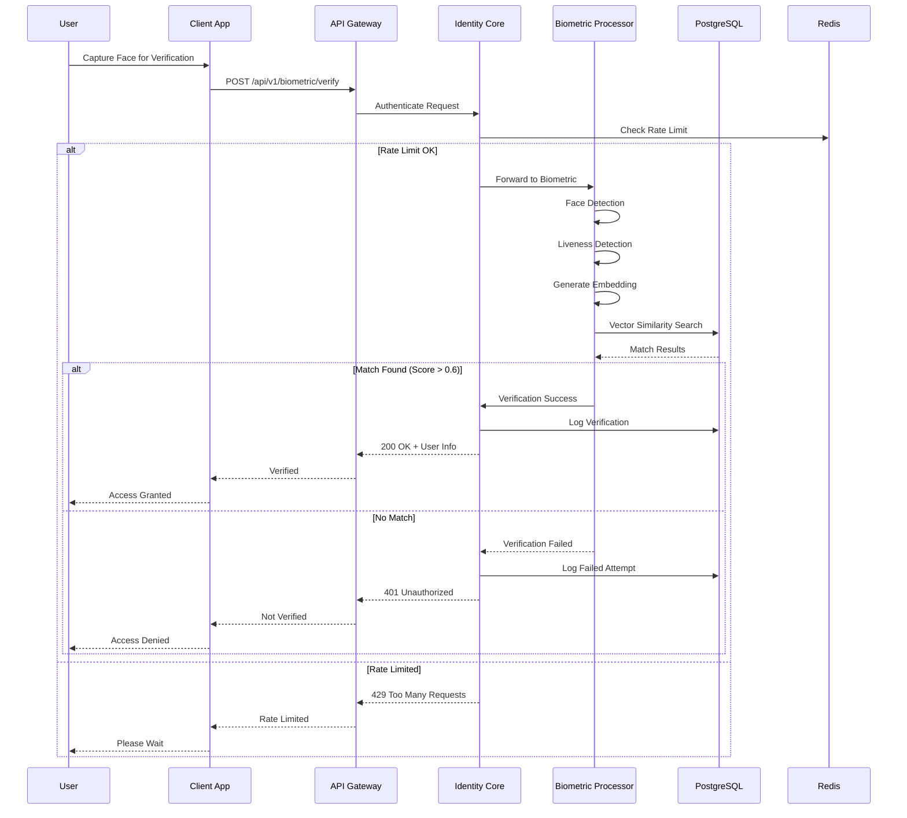
```mermaid
sequenceDiagram
    participant U as User
    participant C as Client App
    participant GW as API Gateway
    participant ICA as Identity Core
    participant BP as Biometric Processor
    participant DB as PostgreSQL
    participant RD as Redis

    U->>C: Capture Face for Verification
    C->>GW: POST /api/v1/biometric/verify
    GW->>ICA: Authenticate Request
    ICA->>RD: Check Rate Limit

    alt Rate Limit OK
        ICA->>BP: Forward to Biometric
        BP->>BP: Face Detection
        BP->>BP: Liveness Detection
        BP->>BP: Generate Embedding
        BP->>DB: Vector Similarity Search
        DB-->>BP: Match Results

        alt Match Found (Score > 0.6)
            BP->>ICA: Verification Success
            ICA->>DB: Log Verification
            ICA-->>GW: 200 OK + User Info
            GW-->>C: Verified
            C-->>U: Access Granted
        else No Match
            BP-->>ICA: Verification Failed
            ICA->>DB: Log Failed Attempt
            ICA-->>GW: 401 Unauthorized
            GW-->>C: Not Verified
            C-->>U: Access Denied
        end
    else Rate Limited
        ICA-->>GW: 429 Too Many Requests
        GW-->>C: Rate Limited
        C-->>U: Please Wait
    end
```

### 5.3 Biometric Puzzle (Active Liveness) Flow

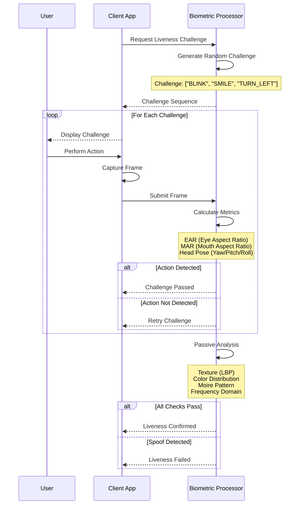
```mermaid
sequenceDiagram
    participant U as User
    participant C as Client App
    participant BP as Biometric Processor

    C->>BP: Request Liveness Challenge
    BP->>BP: Generate Random Challenge
    Note over BP: Challenge: ["BLINK", "SMILE", "TURN_LEFT"]
    BP-->>C: Challenge Sequence

    loop For Each Challenge
        C-->>U: Display Challenge
        U->>C: Perform Action
        C->>C: Capture Frame
        C->>BP: Submit Frame

        BP->>BP: Calculate Metrics
        Note over BP: EAR (Eye Aspect Ratio)<br/>MAR (Mouth Aspect Ratio)<br/>Head Pose (Yaw/Pitch/Roll)

        alt Action Detected
            BP-->>C: Challenge Passed
        else Action Not Detected
            BP-->>C: Retry Challenge
        end
    end

    BP->>BP: Passive Analysis
    Note over BP: Texture (LBP)<br/>Color Distribution<br/>Moire Pattern<br/>Frequency Domain

    alt All Checks Pass
        BP-->>C: Liveness Confirmed
    else Spoof Detected
        BP-->>C: Liveness Failed
    end
```

---

## 6. Sequence Diagrams

### 6.1 User Authentication Flow

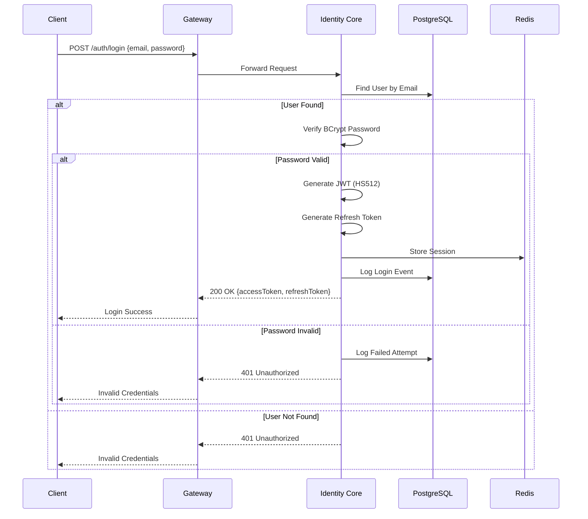
```mermaid
sequenceDiagram
    participant C as Client
    participant GW as Gateway
    participant ICA as Identity Core
    participant DB as PostgreSQL
    participant RD as Redis

    C->>GW: POST /auth/login {email, password}
    GW->>ICA: Forward Request
    ICA->>DB: Find User by Email

    alt User Found
        ICA->>ICA: Verify BCrypt Password
        alt Password Valid
            ICA->>ICA: Generate JWT (HS512)
            ICA->>ICA: Generate Refresh Token
            ICA->>RD: Store Session
            ICA->>DB: Log Login Event
            ICA-->>GW: 200 OK {accessToken, refreshToken}
            GW-->>C: Login Success
        else Password Invalid
            ICA->>DB: Log Failed Attempt
            ICA-->>GW: 401 Unauthorized
            GW-->>C: Invalid Credentials
        end
    else User Not Found
        ICA-->>GW: 401 Unauthorized
        GW-->>C: Invalid Credentials
    end
```

### 6.2 Multi-Tenant Request Flow

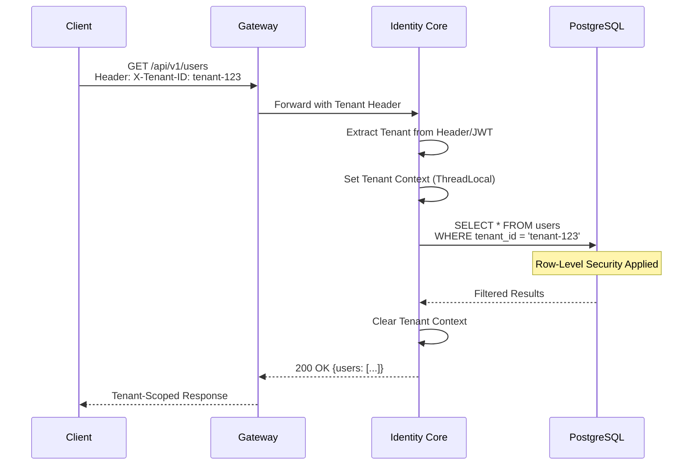
```mermaid
sequenceDiagram
    participant C as Client
    participant GW as Gateway
    participant ICA as Identity Core
    participant DB as PostgreSQL

    C->>GW: GET /api/v1/users<br/>Header: X-Tenant-ID: tenant-123
    GW->>ICA: Forward with Tenant Header

    ICA->>ICA: Extract Tenant from Header/JWT
    ICA->>ICA: Set Tenant Context (ThreadLocal)

    ICA->>DB: SELECT * FROM users<br/>WHERE tenant_id = 'tenant-123'
    Note over DB: Row-Level Security Applied

    DB-->>ICA: Filtered Results
    ICA->>ICA: Clear Tenant Context
    ICA-->>GW: 200 OK {users: [...]}
    GW-->>C: Tenant-Scoped Response
```

---

## 7. Class Diagrams

### 7.1 Domain Model - Core Entities

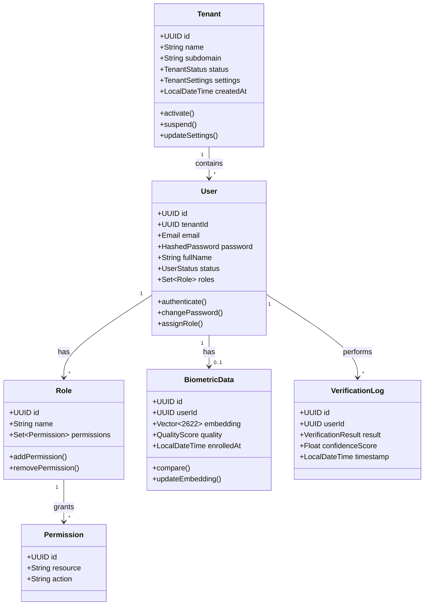
```mermaid
classDiagram
    class Tenant {
        +UUID id
        +String name
        +String subdomain
        +TenantStatus status
        +TenantSettings settings
        +LocalDateTime createdAt
        +activate()
        +suspend()
        +updateSettings()
    }

    class User {
        +UUID id
        +UUID tenantId
        +Email email
        +HashedPassword password
        +String fullName
        +UserStatus status
        +Set~Role~ roles
        +authenticate()
        +changePassword()
        +assignRole()
    }

    class Role {
        +UUID id
        +String name
        +Set~Permission~ permissions
        +addPermission()
        +removePermission()
    }

    class Permission {
        +UUID id
        +String resource
        +String action
    }

    class BiometricData {
        +UUID id
        +UUID userId
        +Vector~2622~ embedding
        +QualityScore quality
        +LocalDateTime enrolledAt
        +compare()
        +updateEmbedding()
    }

    class VerificationLog {
        +UUID id
        +UUID userId
        +VerificationResult result
        +Float confidenceScore
        +LocalDateTime timestamp
    }

    Tenant "1" --> "*" User : contains
    User "1" --> "*" Role : has
    Role "1" --> "*" Permission : grants
    User "1" --> "0..1" BiometricData : has
    User "1" --> "*" VerificationLog : performs
```

### 7.2 Application Layer - Use Cases

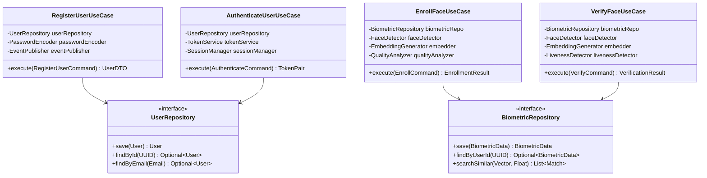
```mermaid
classDiagram
    class RegisterUserUseCase {
        -UserRepository userRepository
        -PasswordEncoder passwordEncoder
        -EventPublisher eventPublisher
        +execute(RegisterUserCommand) UserDTO
    }

    class AuthenticateUserUseCase {
        -UserRepository userRepository
        -TokenService tokenService
        -SessionManager sessionManager
        +execute(AuthenticateCommand) TokenPair
    }

    class EnrollFaceUseCase {
        -BiometricRepository biometricRepo
        -FaceDetector faceDetector
        -EmbeddingGenerator embedder
        -QualityAnalyzer qualityAnalyzer
        +execute(EnrollCommand) EnrollmentResult
    }

    class VerifyFaceUseCase {
        -BiometricRepository biometricRepo
        -FaceDetector faceDetector
        -EmbeddingGenerator embedder
        -LivenessDetector livenessDetector
        +execute(VerifyCommand) VerificationResult
    }

    class UserRepository {
        <<interface>>
        +save(User) User
        +findById(UUID) Optional~User~
        +findByEmail(Email) Optional~User~
    }

    class BiometricRepository {
        <<interface>>
        +save(BiometricData) BiometricData
        +findByUserId(UUID) Optional~BiometricData~
        +searchSimilar(Vector, Float) List~Match~
    }

    RegisterUserUseCase --> UserRepository
    AuthenticateUserUseCase --> UserRepository
    EnrollFaceUseCase --> BiometricRepository
    VerifyFaceUseCase --> BiometricRepository
```

---

## 8. State Diagrams

### 8.1 User Lifecycle States

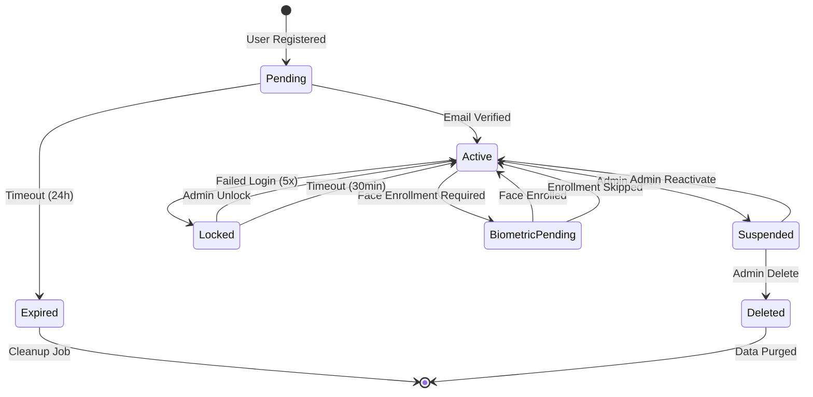
```mermaid
stateDiagram-v2
    [*] --> Pending: User Registered

    Pending --> Active: Email Verified
    Pending --> Expired: Timeout (24h)

    Active --> Suspended: Admin Action
    Active --> Locked: Failed Login (5x)
    Active --> BiometricPending: Face Enrollment Required

    BiometricPending --> Active: Face Enrolled
    BiometricPending --> Active: Enrollment Skipped

    Locked --> Active: Admin Unlock
    Locked --> Active: Timeout (30min)

    Suspended --> Active: Admin Reactivate
    Suspended --> Deleted: Admin Delete

    Expired --> [*]: Cleanup Job
    Deleted --> [*]: Data Purged
```

### 8.2 Verification Session States

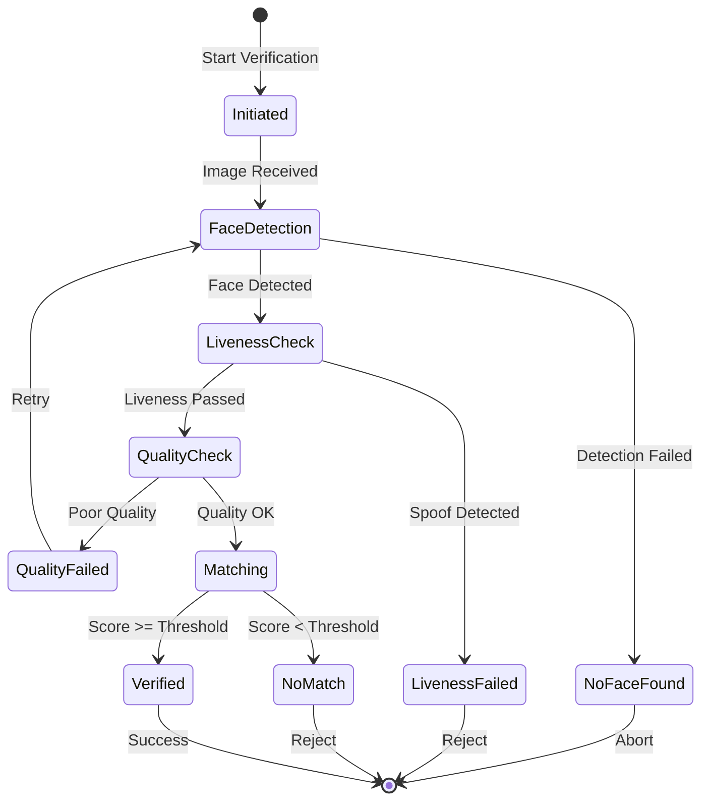
```mermaid
stateDiagram-v2
    [*] --> Initiated: Start Verification

    Initiated --> FaceDetection: Image Received

    FaceDetection --> NoFaceFound: Detection Failed
    FaceDetection --> LivenessCheck: Face Detected

    NoFaceFound --> [*]: Abort

    LivenessCheck --> LivenessFailed: Spoof Detected
    LivenessCheck --> QualityCheck: Liveness Passed

    LivenessFailed --> [*]: Reject

    QualityCheck --> QualityFailed: Poor Quality
    QualityCheck --> Matching: Quality OK

    QualityFailed --> FaceDetection: Retry

    Matching --> NoMatch: Score < Threshold
    Matching --> Verified: Score >= Threshold

    NoMatch --> [*]: Reject
    Verified --> [*]: Success
```

### 8.3 Biometric Puzzle Challenge States

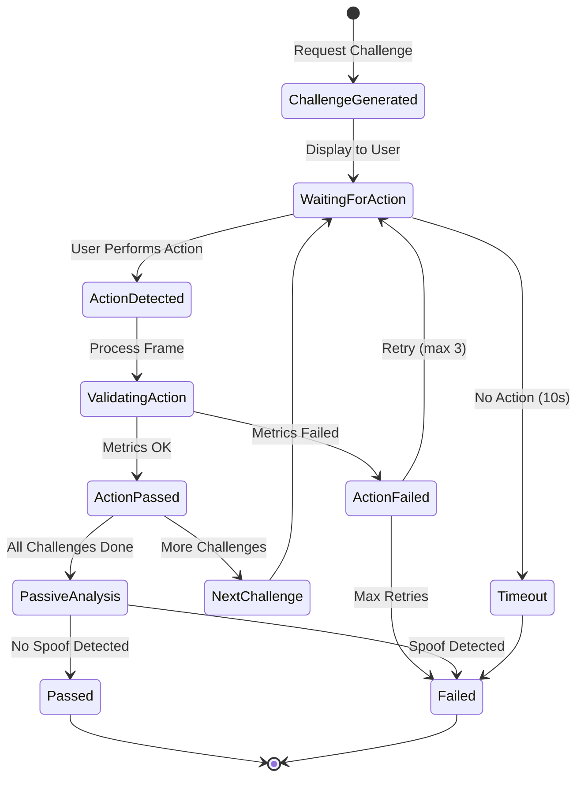
```mermaid
stateDiagram-v2
    [*] --> ChallengeGenerated: Request Challenge

    ChallengeGenerated --> WaitingForAction: Display to User

    WaitingForAction --> ActionDetected: User Performs Action
    WaitingForAction --> Timeout: No Action (10s)

    ActionDetected --> ValidatingAction: Process Frame

    ValidatingAction --> ActionPassed: Metrics OK
    ValidatingAction --> ActionFailed: Metrics Failed

    ActionPassed --> NextChallenge: More Challenges
    ActionPassed --> PassiveAnalysis: All Challenges Done

    ActionFailed --> WaitingForAction: Retry (max 3)
    ActionFailed --> Failed: Max Retries

    NextChallenge --> WaitingForAction

    PassiveAnalysis --> Passed: No Spoof Detected
    PassiveAnalysis --> Failed: Spoof Detected

    Timeout --> Failed

    Passed --> [*]
    Failed --> [*]
```

---

## 9. Entity Relationship Diagram

### 9.1 Complete Database Schema

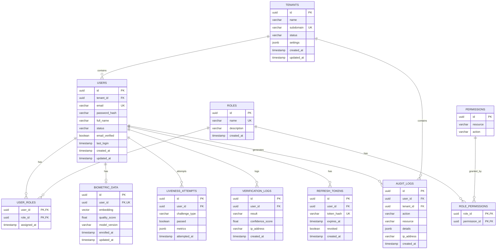
```mermaid
erDiagram
    TENANTS {
        uuid id PK
        varchar name
        varchar subdomain UK
        varchar status
        jsonb settings
        timestamp created_at
        timestamp updated_at
    }

    USERS {
        uuid id PK
        uuid tenant_id FK
        varchar email UK
        varchar password_hash
        varchar full_name
        varchar status
        boolean email_verified
        timestamp last_login
        timestamp created_at
        timestamp updated_at
    }

    ROLES {
        uuid id PK
        varchar name UK
        varchar description
        timestamp created_at
    }

    PERMISSIONS {
        uuid id PK
        varchar resource
        varchar action
    }

    ROLE_PERMISSIONS {
        uuid role_id PK,FK
        uuid permission_id PK,FK
    }

    USER_ROLES {
        uuid user_id PK,FK
        uuid role_id PK,FK
        timestamp assigned_at
    }

    BIOMETRIC_DATA {
        uuid id PK
        uuid user_id FK,UK
        vector embedding
        float quality_score
        varchar model_version
        timestamp enrolled_at
        timestamp updated_at
    }

    LIVENESS_ATTEMPTS {
        uuid id PK
        uuid user_id FK
        varchar challenge_type
        boolean passed
        jsonb metrics
        timestamp attempted_at
    }

    VERIFICATION_LOGS {
        uuid id PK
        uuid user_id FK
        varchar result
        float confidence_score
        varchar ip_address
        timestamp created_at
    }

    REFRESH_TOKENS {
        uuid id PK
        uuid user_id FK
        varchar token_hash UK
        timestamp expires_at
        boolean revoked
        timestamp created_at
    }

    AUDIT_LOGS {
        uuid id PK
        uuid user_id FK
        uuid tenant_id FK
        varchar action
        varchar resource
        jsonb details
        varchar ip_address
        timestamp created_at
    }

    TENANTS ||--o{ USERS : contains
    USERS ||--o{ USER_ROLES : has
    ROLES ||--o{ USER_ROLES : assigned_to
    ROLES ||--o{ ROLE_PERMISSIONS : has
    PERMISSIONS ||--o{ ROLE_PERMISSIONS : granted_by
    USERS ||--o| BIOMETRIC_DATA : has
    USERS ||--o{ LIVENESS_ATTEMPTS : attempts
    USERS ||--o{ VERIFICATION_LOGS : logs
    USERS ||--o{ REFRESH_TOKENS : has
    USERS ||--o{ AUDIT_LOGS : generates
    TENANTS ||--o{ AUDIT_LOGS : contains
```

---

## 10. Use Case Diagram

### 10.1 System Use Cases by Actor

```mermaid
graph TB
    subgraph Actors
        EU((End User))
        TA((Tenant Admin))
        SA((System Admin))
        EXT((External System))
    end

    subgraph "User Management"
        UC1[Register Account]
        UC2[Login/Logout]
        UC3[Reset Password]
        UC4[Update Profile]
    end

    subgraph "Biometric Operations"
        UC5[Enroll Face]
        UC6[Verify Identity]
        UC7[Complete Liveness Challenge]
        UC8[View Verification History]
    end

    subgraph "Tenant Administration"
        UC9[Manage Tenant Users]
        UC10[View Analytics]
        UC11[Configure Settings]
        UC12[View Audit Logs]
    end

    subgraph "System Administration"
        UC13[Manage Tenants]
        UC14[System Configuration]
        UC15[Monitor Health]
        UC16[Security Management]
    end

    subgraph "API Integration"
        UC17[Authenticate via API]
        UC18[Verify via API]
        UC19[Receive Webhooks]
    end

    EU --> UC1 & UC2 & UC3 & UC4
    EU --> UC5 & UC6 & UC7 & UC8

    TA --> UC2 & UC4
    TA --> UC9 & UC10 & UC11 & UC12

    SA --> UC2
    SA --> UC13 & UC14 & UC15 & UC16

    EXT --> UC17 & UC18 & UC19
```

---

## Appendix: Diagram Legend

| Symbol | Meaning |
|--------|---------|
| `[ ]` | Container/Service |
| `(( ))` | Actor |
| `[( )]` | Database |
| `-->` | Request/Data Flow |
| `-.->` | Implements/Depends |
| `<-->` | Bidirectional Communication |

---

**Document Location:** `docs/02-architecture/ARCHITECTURE_DIAGRAMS.md`
**Related Documents:**
- [Architecture Analysis](ARCHITECTURE_ANALYSIS.md)
- [System Design Decisions](SYSTEM_DESIGN_ANALYSIS_AND_DECISION.md)
- [PlantUML Diagrams](diagrams/PLANTUML_DIAGRAMS.md)
