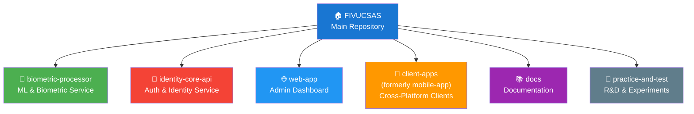
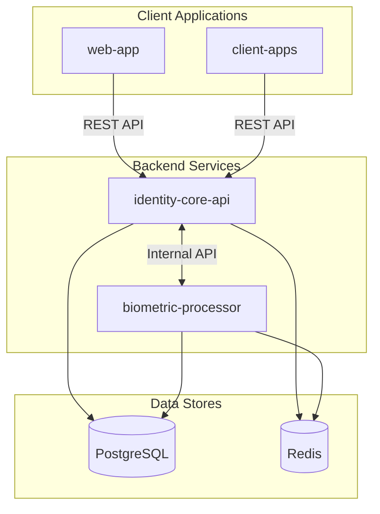

# FIVUCSAS Module Structure

**Last Updated:** December 28, 2025
**Version:** 2.0
**Status:** Approved Architecture

This document defines the official module structure for the FIVUCSAS project.

---

## Overview

FIVUCSAS is organized as a **monorepo with Git submodules**, following a microservices architecture pattern.



---

## Module Definitions

### 1. biometric-processor

| Attribute | Value |
|-----------|-------|
| **Purpose** | AI/ML biometric processing service |
| **Technology** | Python 3.11+, FastAPI |
| **Port** | 8001 |
| **Status** | ✅ 100% Complete |

**Responsibilities:**
- Face detection and recognition
- Liveness detection (passive + active "Biometric Puzzle")
- Quality assessment (ISO/IEC 29794-5)
- Demographics analysis (age, gender, emotion)
- Card/document type detection
- Embedding generation and storage
- Webhook notifications

**Contains:**
- `app/` - Main application code (Clean Architecture)
- `demo-ui/` - Next.js 14 Demo GUI (14+ pages)
- `tests/` - Pytest test suite
- `alembic/` - Database migrations

---

### 2. identity-core-api

| Attribute | Value |
|-----------|-------|
| **Purpose** | Authentication, authorization, identity management |
| **Technology** | Java 21, Spring Boot 3.2 |
| **Port** | 8080 |
| **Status** | ⚠️ 68% Complete |

**Responsibilities:**
- User registration and authentication
- JWT token management (access + refresh)
- Multi-tenant isolation
- Role-Based Access Control (RBAC)
- Audit logging
- Session management
- Biometric data orchestration

**Contains:**
- `src/main/java/` - Hexagonal Architecture implementation
- `src/main/resources/db/migration/` - Flyway migrations (6 versions)
- `src/test/` - JUnit 5 + Mockito tests

---

### 3. web-app

| Attribute | Value |
|-----------|-------|
| **Purpose** | Web-based admin dashboard |
| **Technology** | React 18, TypeScript 5, Material-UI |
| **Port** | 5173 (dev) |
| **Status** | ✅ 100% Complete |

**Responsibilities:**
- System administration interface
- Tenant administration interface
- User management
- Analytics and reporting
- Audit log viewing
- Configuration management

**Target Users:**
- System Administrators
- Tenant Administrators

---

### 4. client-apps (formerly mobile-app)

| Attribute | Value |
|-----------|-------|
| **Purpose** | Cross-platform client applications |
| **Technology** | Kotlin Multiplatform (KMP), Compose Multiplatform |
| **Platforms** | Android, iOS, Windows, Linux, macOS |
| **Status** | ⚠️ 60% Complete (UI) |

**Structure:**
```
client-apps/
├── shared/           # 90% shared code
│   └── commonMain/   # Business logic, ViewModels, UI components
├── androidApp/       # Android-specific code
├── iosApp/           # iOS-specific code (planned)
└── desktopApp/       # Desktop-specific code (Windows/Linux/macOS)
```

**Modes:**
- **User Mode** - Face enrollment, verification, profile
- **Admin Mode** - User management (for tenant admins)
- **Kiosk Mode** - Self-service terminals

**Target Users:**
- End Users (enrollment, verification)
- Tenant Administrators (mobile management)
- Kiosk operators (self-service)

---

### 5. docs

| Attribute | Value |
|-----------|-------|
| **Purpose** | Centralized documentation |
| **Format** | Markdown, PlantUML, Mermaid |
| **Status** | ✅ Comprehensive |

**Structure:**
```
docs/
├── 00-meta/           # Project artifacts, PSD
├── 01-getting-started/# Quick start guides
├── 02-architecture/   # System design, diagrams
├── 03-development/    # Developer guides
├── 04-api/            # API documentation
├── 05-testing/        # Testing guides
├── 06-deployment/     # Deployment guides
├── 07-status/         # Status reports
└── 99-archive/        # Historical documents
```

---

### 6. practice-and-test

| Attribute | Value |
|-----------|-------|
| **Purpose** | R&D, experiments, proof-of-concepts |
| **Status** | Mixed (POC + Production-ready) |

**Contains:**
- `UniversalNfcReader/` - Generic NFC reader (85% complete)
- `TurkishEidNfcReader/` - Turkish ID-specific reader (100%)
- `DeepFace_InsightFace_Pipeline/` - ML experiments
- `DeepFacePractice1/` - Early prototypes

**Note:** NFC readers are production-quality POCs, may be integrated into client-apps in future.

---

## Removed Modules

### ~~desktop-app~~ (DELETED)

| Attribute | Value |
|-----------|-------|
| **Status** | 🗑️ Removed |
| **Reason** | Redundant - desktop code is in client-apps/desktopApp |

The desktop application uses Kotlin Compose Multiplatform, not Electron.
All desktop functionality is part of the `client-apps` module.

---

## Module Relationships



---

## Technology Stack Summary

| Layer | Module | Technology |
|-------|--------|------------|
| **Frontend** | web-app | React 18, TypeScript, Material-UI |
| **Mobile** | client-apps | Kotlin Multiplatform, Compose |
| **Desktop** | client-apps | Kotlin Compose Desktop |
| **Backend** | identity-core-api | Spring Boot 3.2, Java 21 |
| **ML Service** | biometric-processor | FastAPI, Python 3.11 |
| **Database** | - | PostgreSQL 16 + pgvector |
| **Cache** | - | Redis 7 |
| **Gateway** | - | NGINX |

---

## Naming Conventions

| Convention | Example | Notes |
|------------|---------|-------|
| Module names | `kebab-case` | e.g., `identity-core-api` |
| Java packages | `com.fivucsas.*` | e.g., `com.fivucsas.identity` |
| Kotlin packages | `com.fivucsas.*` | e.g., `com.fivucsas.client` |
| Python modules | `snake_case` | e.g., `face_detector` |
| TypeScript | `camelCase` | e.g., `userService` |

---

## Git Submodule Configuration

```ini
# .gitmodules
[submodule "biometric-processor"]
    path = biometric-processor
    url = https://github.com/Rollingcat-Software/biometric-processor.git

[submodule "identity-core-api"]
    path = identity-core-api
    url = https://github.com/Rollingcat-Software/identity-core-api.git

[submodule "web-app"]
    path = web-app
    url = https://github.com/Rollingcat-Software/web-app.git

[submodule "client-apps"]
    path = client-apps
    url = https://github.com/Rollingcat-Software/client-apps.git

[submodule "docs"]
    path = docs
    url = https://github.com/Rollingcat-Software/docs.git

[submodule "practice-and-test"]
    path = practice-and-test
    url = https://github.com/Rollingcat-Software/practice-and-test.git
```

---

## Decision Log

| Date | Decision | Rationale |
|------|----------|-----------|
| 2025-12-28 | Delete `desktop-app` submodule | Redundant - desktop uses KMP in client-apps |
| 2025-12-28 | Rename `mobile-app` → `client-apps` | Accurately reflects Android + iOS + Desktop |
| 2025-12-28 | Keep NFC readers in `practice-and-test` | Still experimental/POC status |
| 2025-12-28 | Keep `docs` as submodule | Independent versioning, separation of concerns |

---

**Document Location:** `docs/02-architecture/MODULE_STRUCTURE.md`
