# FIVUCSAS - Complete PlantUML Diagrams Collection

**Document Version:** 2.0
**Date:** November 4, 2025
**Purpose:** Production-ready diagrams for documentation and architecture review

---

## Table of Contents

1. [Entity-Relationship Diagrams](#1-entity-relationship-diagrams)
2. [Class Diagrams](#2-class-diagrams)
3. [Sequence Diagrams](#3-sequence-diagrams)
4. [State Machine Diagrams](#4-state-machine-diagrams)
5. [Activity Diagrams](#5-activity-diagrams)

---

## 1. Entity-Relationship Diagrams

### 1.1 Complete Database ER Diagram

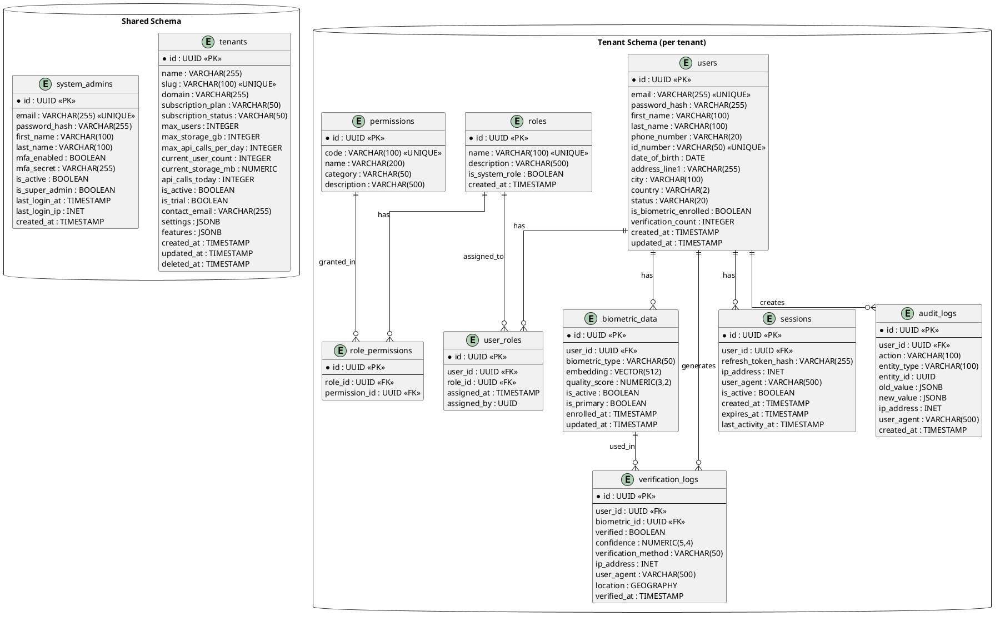

### 1.2 Core Business Entities ER Diagram (Simplified)

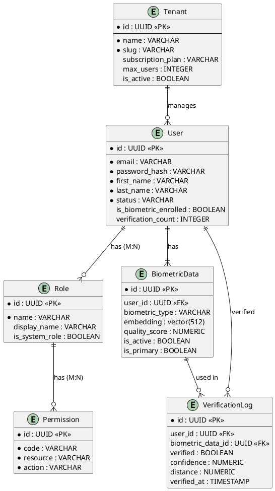

---

## 2. Class Diagrams

### 2.1 Domain Model - Complete Class Diagram

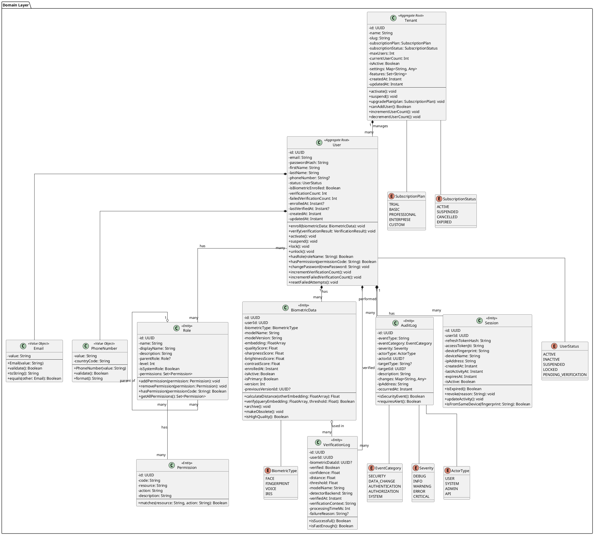

### 2.2 Service Layer Class Diagram

```plantuml
@startuml service_layer

skinparam classAttributeIconSize 0

package "Application Layer" {

    ' Service Interfaces
    interface UserService {
        + createUser(request: CreateUserRequest): User
        + updateUser(id: UUID, request: UpdateUserRequest): User
        + deleteUser(id: UUID): void
        + findById(id: UUID): User?
        + findAll(pageable: Pageable): Page<User>
        + search(query: String): List<User>
    }

    interface AuthService {
        + register(request: RegisterRequest): AuthResponse
        + login(request: LoginRequest): AuthResponse
        + logout(userId: UUID): void
        + refreshToken(refreshToken: String): TokenPair
        + verifyToken(token: String): Boolean
        + resetPassword(email: String): void
    }

    interface BiometricService {
        + enrollFace(userId: UUID, image: ByteArray): EnrollmentResponse
        + verifyFace(userId: UUID, image: ByteArray): VerificationResponse
        + deleteBiometric(id: UUID): void
        + getBiometricData(userId: UUID): List<BiometricData>
    }

    interface RoleService {
        + createRole(request: CreateRoleRequest): Role
        + updateRole(id: UUID, request: UpdateRoleRequest): Role
        + deleteRole(id: UUID): void
        + assignPermission(roleId: UUID, permissionId: UUID): void
        + removePermission(roleId: UUID, permissionId: UUID): void
    }

    ' Service Implementations
    class UserServiceImpl implements UserService {
        - userRepository: UserRepository
        - passwordEncoder: PasswordEncoder
        - eventPublisher: EventPublisher
        --
        + createUser(request: CreateUserRequest): User
        + updateUser(id: UUID, request: UpdateUserRequest): User
        - validateUser(request: CreateUserRequest): void
        - publishUserCreatedEvent(user: User): void
    }

    class AuthServiceImpl implements AuthService {
        - userRepository: UserRepository
        - passwordEncoder: PasswordEncoder
        - jwtService: JwtService
        - sessionRepository: SessionRepository
        --
        + register(request: RegisterRequest): AuthResponse
        + login(request: LoginRequest): AuthResponse
        - validateCredentials(email: String, password: String): User
        - handleFailedLogin(user: User): void
    }

    class BiometricServiceImpl implements BiometricService {
        - biometricRepository: BiometricDataRepository
        - userRepository: UserRepository
        - biometricClient: BiometricProcessorClient
        --
        + enrollFace(userId: UUID, image: ByteArray): EnrollmentResponse
        + verifyFace(userId: UUID, image: ByteArray): VerificationResponse
        - validateImageQuality(image: ByteArray): void
        - extractEmbedding(image: ByteArray): FloatArray
    }

    ' External Clients
    class BiometricProcessorClient {
        - webClient: WebClient
        - baseUrl: String
        --
        + enrollFace(image: ByteArray): EmbeddingResponse
        + verifyFace(image: ByteArray, embedding: FloatArray): VerificationResult
        + healthCheck(): Boolean
    }

    ' Repositories (Ports)
    interface UserRepository {
        + save(user: User): User
        + findById(id: UUID): User?
        + findByEmail(email: String): User?
        + findAll(pageable: Pageable): Page<User>
        + delete(id: UUID): void
    }

    interface BiometricDataRepository {
        + save(data: BiometricData): BiometricData
        + findByUserId(userId: UUID): List<BiometricData>
        + findPrimaryByUserId(userId: UUID): BiometricData?
        + searchSimilar(embedding: FloatArray, threshold: Float): List<BiometricData>
    }

    interface SessionRepository {
        + save(session: Session): Session
        + findByRefreshTokenHash(hash: String): Session?
        + findActiveByUserId(userId: UUID): List<Session>
        + deleteExpired(): Int
    }

    ' DTOs
    class CreateUserRequest {
        + email: String
        + password: String
        + firstName: String
        + lastName: String
        + phoneNumber: String?
    }

    class AuthResponse {
        + accessToken: String
        + refreshToken: String
        + tokenType: String
        + expiresIn: Long
        + user: UserDto
    }

    class EnrollmentResponse {
        + success: Boolean
        + userId: UUID
        + qualityScore: Float
        + message: String
    }

    class VerificationResponse {
        + verified: Boolean
        + confidence: Float
        + distance: Float
        + message: String
    }
}

' Relationships
UserServiceImpl ..> UserRepository : uses
AuthServiceImpl ..> UserRepository : uses
AuthServiceImpl ..> SessionRepository : uses
BiometricServiceImpl ..> BiometricDataRepository : uses
BiometricServiceImpl ..> UserRepository : uses
BiometricServiceImpl ..> BiometricProcessorClient : uses

@enduml
```

### 2.3 Biometric Processor Class Diagram

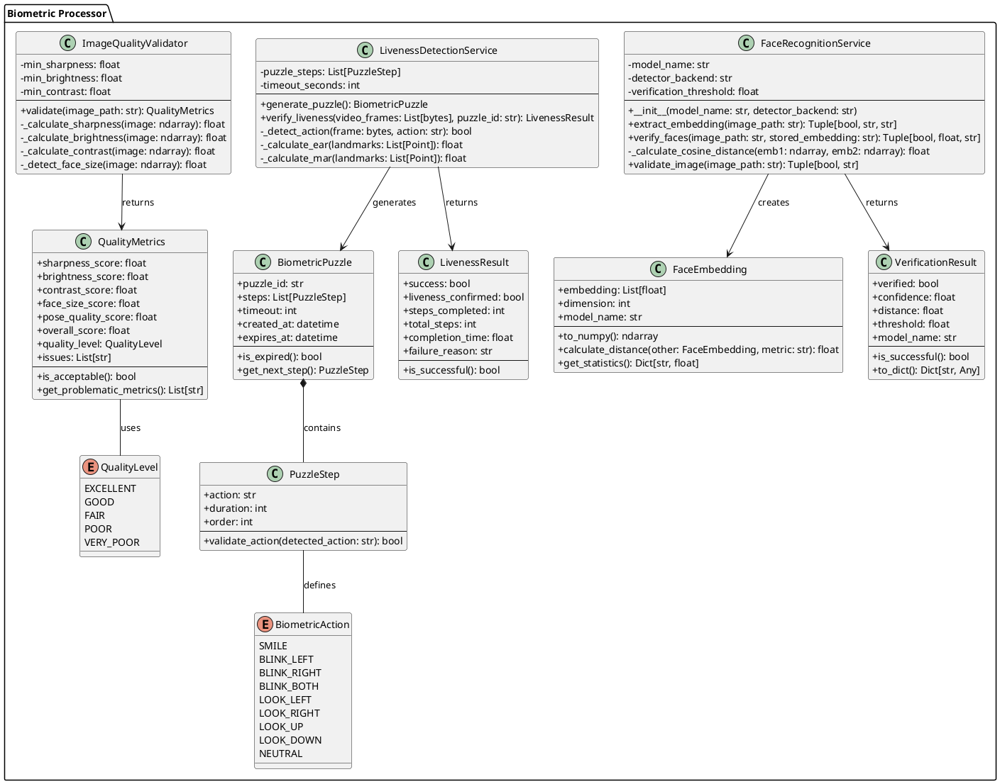

---

## 3. Sequence Diagrams

### 3.1 User Registration Flow

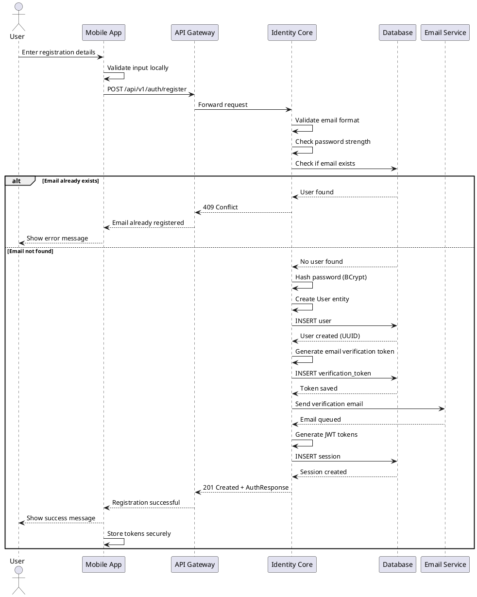

### 3.2 Face Enrollment with Quality Validation

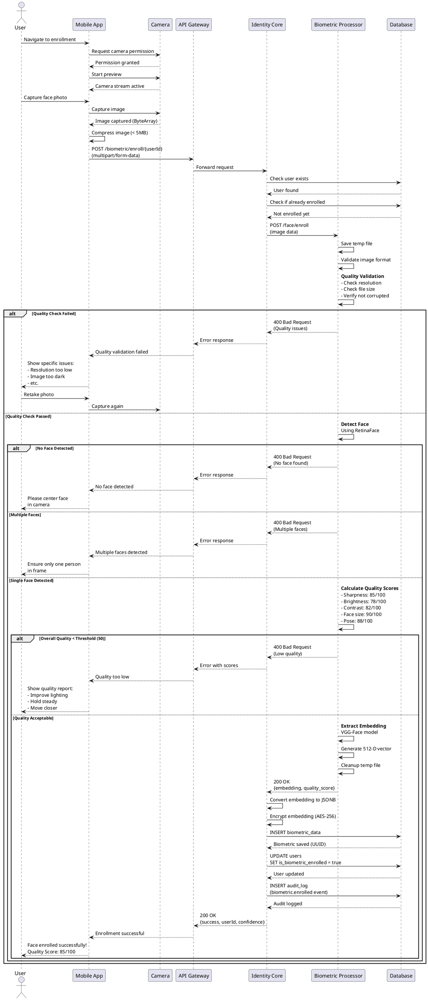

### 3.3 Face Verification with Liveness Detection

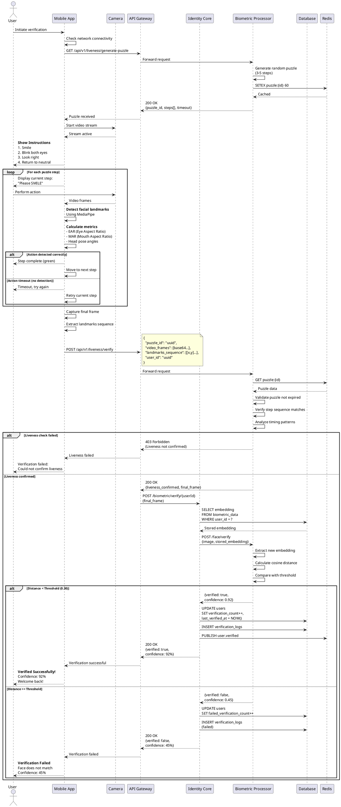

### 3.4 Multi-Tenant User Creation

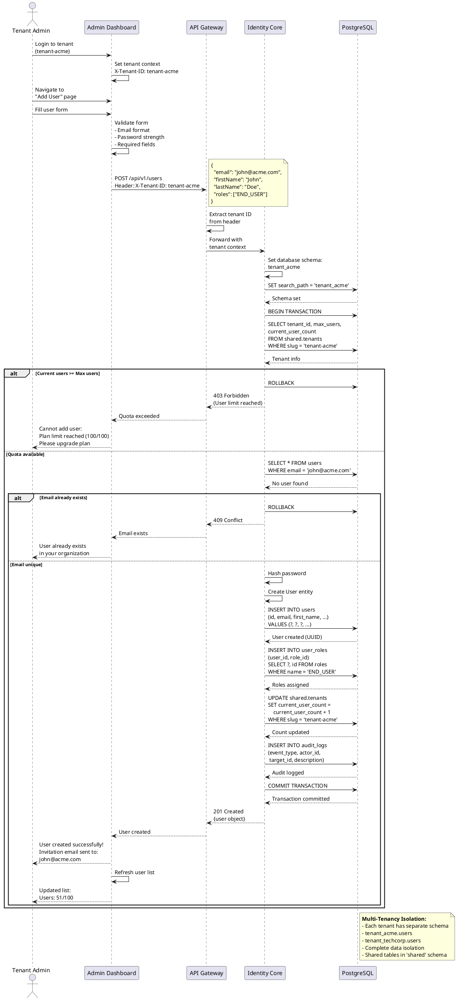

---

## 4. State Machine Diagrams

### 4.1 User Lifecycle State Machine

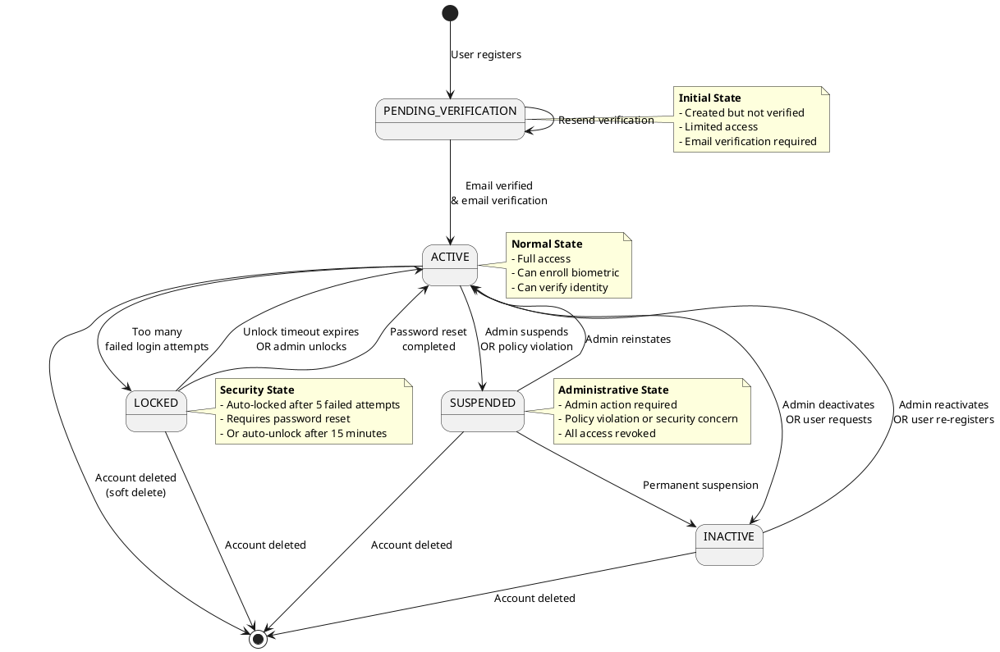

### 4.2 Biometric Enrollment State Machine

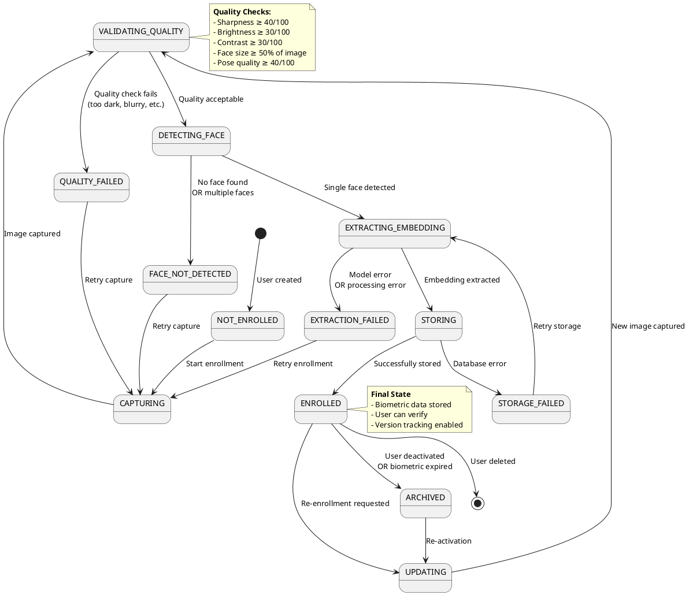

### 4.3 Verification Attempt State Machine

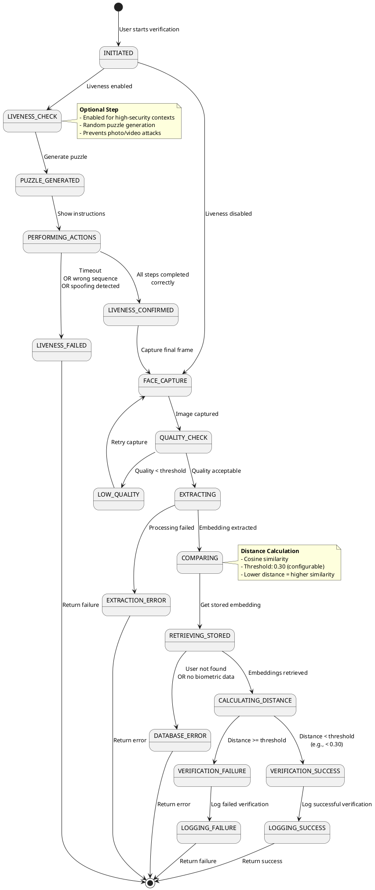

### 4.4 Session Lifecycle State Machine

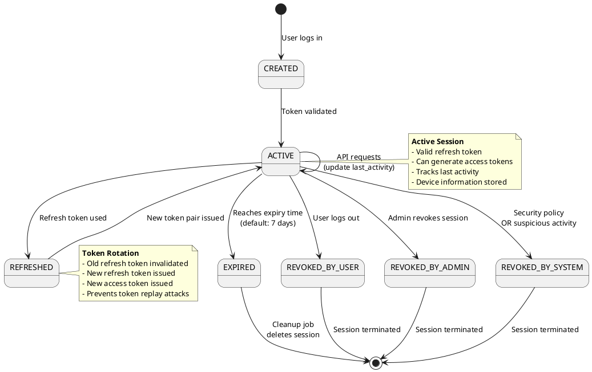

---

## 5. Activity Diagrams

### 5.1 Complete User Onboarding Activity

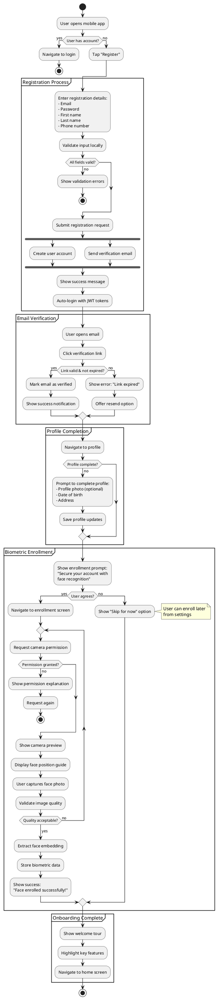

### 5.2 Face Verification Decision Activity

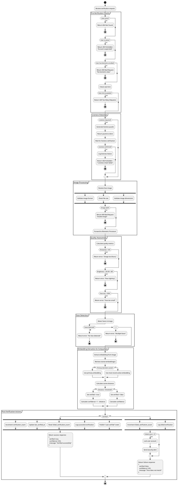

### 5.3 Tenant Management Activity

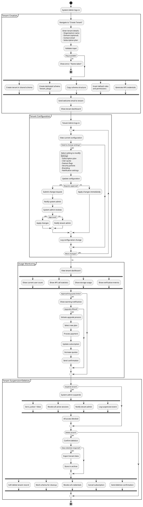

### 5.4 Biometric Re-enrollment Activity

```plantuml
@startuml biometric_reenrollment_activity

start

:User initiates re-enrollment;

partition "Reason Determination" {
  if (Why re-enroll?) then (Quality improvement)
    :User wants better quality;
  elseif (Appearance changed)
    :Significant change:
    - Weight loss/gain
    - Surgery
    - Aging;
  elseif (Failed verifications)
    :Multiple verification failures;
  elseif (Security concern)
    :Suspected compromise;
  elseif (Upgrade model)
    :New model available;
  endif
}

partition "Pre-Enrollment Validation" {
  :Retrieve existing biometric data;

  if (Active biometric exists?) then (no)
    :Redirect to initial enrollment;
    stop
  endif

  :Check re-enrollment cooldown;

  if (Too soon since last enrollment?) then (yes)
    :Show warning:
    "Please wait 24 hours
    between enrollments";

    if (Admin override?) then (no)
      stop
    endif
  endif

  :Require re-authentication;

  if (Password verified?) then (no)
    :Return to login;
    stop
  endif
}

partition "Capture New Biometric" {
  :Show camera interface;

  repeat
    :Capture face image;
    :Validate quality;
  repeat while (Quality < existing?) is (yes)
  ->better;

  :Extract new embedding;
}

partition "Comparison with Existing" {
  :Compare new vs. old embedding;

  if (Similarity > 0.5?) then (yes)
    :Likely same person;
    :Proceed with re-enrollment;
  else (no)
    :Suspiciously different;

    if (Admin approval required?) then (yes)
      :Create approval request;
      :Notify admin;

      :Wait for admin review;

      if (Approved?) then (no)
        :Reject re-enrollment;
        :Log security event;
        stop
      endif
    endif
  endif
}

partition "Version Management" {
  :Create new biometric_data record:
  - version = old_version + 1
  - previous_version_id = old_id;

  :Store new embedding;

  if (Keep old version?) then (yes)
    :Archive old biometric:
    - Set is_active = false
    - Keep for audit;
  else (no)
    :Delete old biometric;
  endif

  :Update user record:
  - enrolled_at = NOW()
  - Set new as primary;
}

partition "Testing New Biometric" {
  :Prompt user:
  "Test new enrollment?";

  if (User agrees?) then (yes)
    :Perform test verification;

    repeat
      :Capture test image;
      :Verify against new embedding;

      if (Verified successfully?) then (yes)
        :Show success message;
      else (no)
        :Show failure;

        if (Rollback?) then (yes)
          :Restore old biometric;
          :Delete new biometric;
          stop
        endif
      endif
    repeat while (Try again?) is (yes)
  endif
}

partition "Finalization" {
  fork
    :Log re-enrollment event;
  fork again
    :Update verification logs;
  fork again
    :Notify user via email;
  fork again
    :Update analytics;
  end fork

  :Show success screen:
  "Biometric updated successfully
  Quality improved: 75 → 92";
}

stop

@enduml
```

---

**This file contains:**
- ER Diagrams (2 variants)
- Class Diagrams (3 detailed diagrams)
- Sequence Diagrams (4 comprehensive flows)
- State Machine Diagrams (4 lifecycle diagrams)
- Activity Diagrams (4 complex processes)

**Continue to PLANTUML_DIAGRAMS_PART2.md for:**
- Component Diagrams
- Deployment Diagrams
- Use Case Diagrams
- Additional Diagrams
