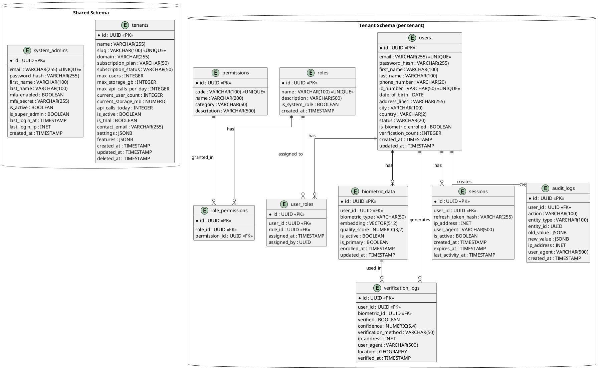
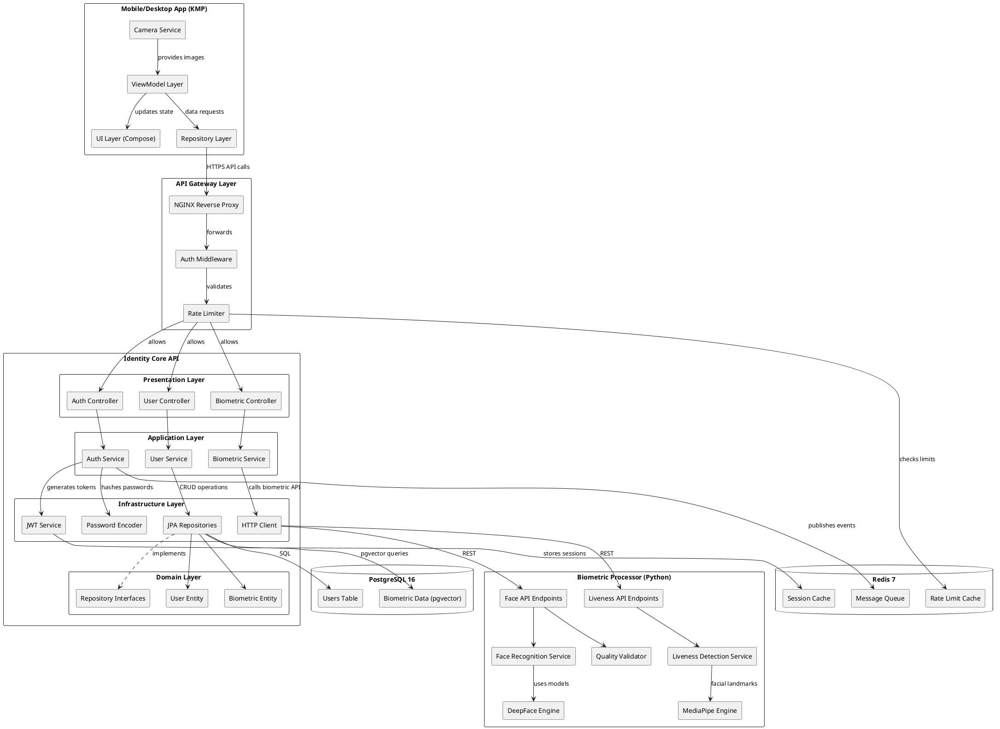
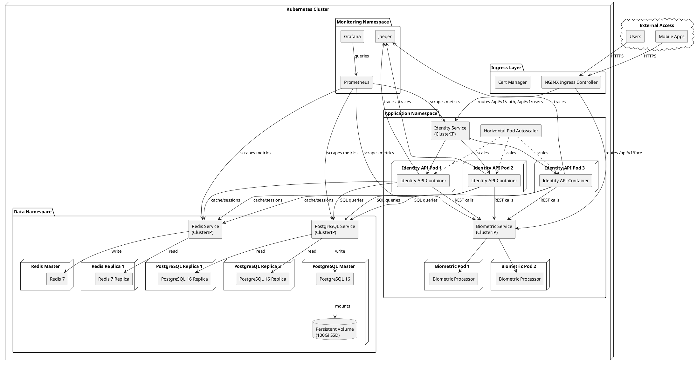
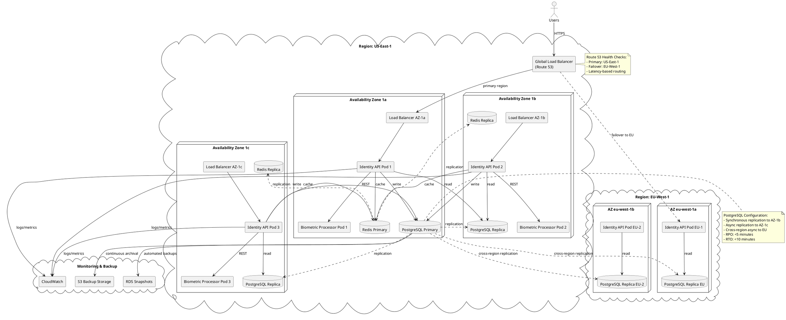
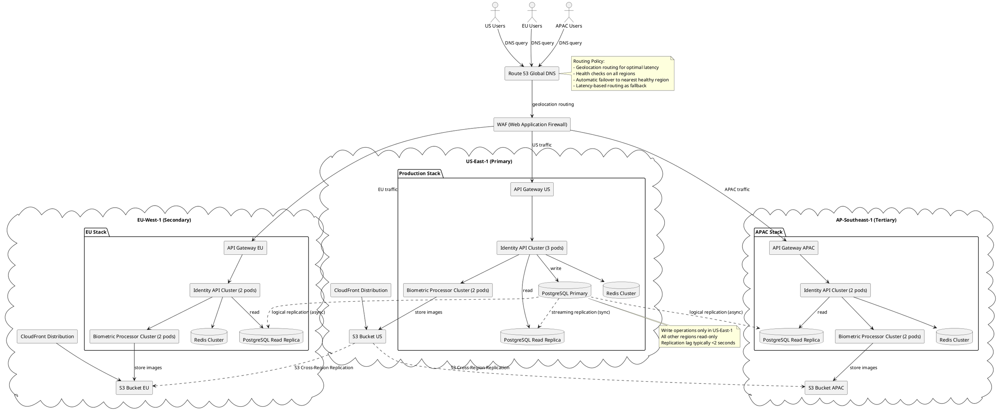
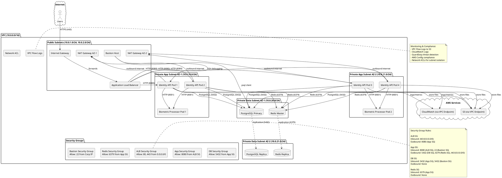
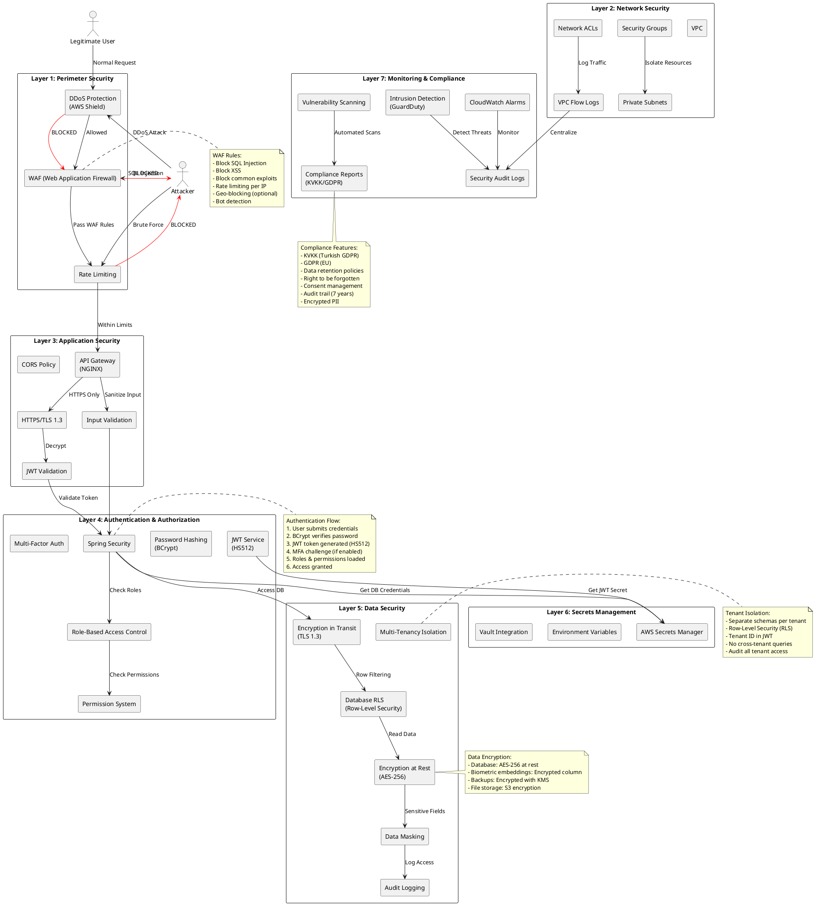

# FIVUCSAS - Fixed PlantUML Diagrams

**Purpose:** Fixed versions of diagrams that failed to generate due to C4-PlantUML dependencies or syntax issues

**Date:** November 4, 2025

---

## 1. Complete Database ER Diagram (Fixed)



---

## 2. System-Wide Components (Fixed - No C4)



---

## 3. Kubernetes Deployment (Fixed - Standard Deployment Diagram)



---

## 4. High Availability Deployment (Fixed)



---

## 5. Multi-Region Deployment (Fixed)



---

## 6. Network Architecture (Fixed)



---

## 7. Security Architecture (Fixed)



---

## How to Generate These Fixed Diagrams

### Method 1: PlantUML Online Editor
1. Visit: http://www.plantuml.com/plantuml/uml/
2. Copy the content between `@startuml` and `@enduml`
3. Paste into the editor
4. The diagram will render automatically
5. Download as PNG or SVG

### Method 2: VS Code with PlantUML Extension
1. Install "PlantUML" extension by jebbs
2. Open this markdown file
3. Right-click on a code block
4. Select "Preview Current Diagram"
5. Export via right-click → "Export Current Diagram"

### Method 3: Command Line (with Java and Graphviz)
```bash
# Install PlantUML
brew install plantuml   # macOS
# OR
apt-get install plantuml   # Ubuntu

# Generate diagram
plantuml diagram.puml -o output/

# Generate all diagrams in a file
plantuml -tpng PLANTUML_DIAGRAMS_FIXED.md
```

### Method 4: IntelliJ IDEA
1. Install "PlantUML integration" plugin
2. Open this file
3. Click the PlantUML icon in the gutter
4. Export via toolbar

---

## Differences from Original Diagrams

### What Was Fixed:

1. **Removed C4-PlantUML dependencies** (`!include <C4/C4_Component>`)
   - Replaced with standard PlantUML component syntax
   - Works with vanilla PlantUML installations

2. **Fixed deployment diagram syntax**
   - Replaced C4 deployment elements with standard `node`, `component`, `database`
   - More compatible with various PlantUML renderers

3. **Simplified ER diagram**
   - Changed from custom macros to standard `entity` syntax
   - Better compatibility across PlantUML versions

4. **Removed deployment-specific C4 elements**
   - `Container_Boundary` → `package`
   - `Component` → `[Component Name]`
   - `ContainerDb` → `database`

5. **Fixed network and security diagrams**
   - Used standard PlantUML `rectangle`, `package`, `component`
   - No external dependencies required

---

## Summary

**Fixed Diagrams:** 7 diagrams
- Complete Database ER Diagram
- System-Wide Components
- Kubernetes Deployment
- High Availability Deployment
- Multi-Region Deployment
- Network Architecture
- Security Architecture

**Compatibility:** Standard PlantUML (no C4 library required)

**Status:** ✅ Ready to generate with any PlantUML installation

---

**Note:** These fixed diagrams provide the same information as the original diagrams but use standard PlantUML syntax for maximum compatibility.
