# FIVUCSAS - PlantUML Diagrams Collection (Part 2)

**Document Version:** 2.0
**Date:** November 4, 2025
**Continuation of:** PLANTUML_DIAGRAMS.md

---

## 6. Component Diagrams

### 6.1 System-Wide Component Architecture

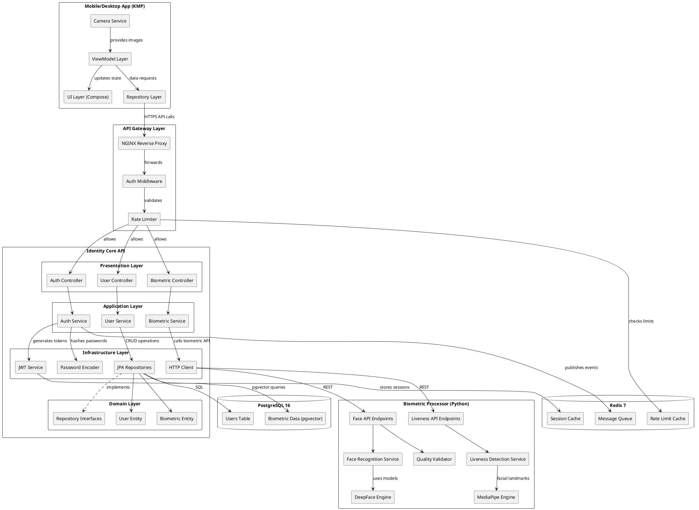

### 6.2 Identity Core API Internal Components

```plantuml
@startuml identity_core_internal

package "Presentation Layer" {
    [Auth Controller] as auth_ctrl
    [User Controller] as user_ctrl
    [Biometric Controller] as bio_ctrl
    [Role Controller] as role_ctrl
    [Tenant Controller] as tenant_ctrl
}

package "Application Layer" {
    [Auth Service] as auth_svc
    [User Service] as user_svc
    [Biometric Service] as bio_svc
    [Role Service] as role_svc
    [Tenant Service] as tenant_svc
    [Email Service] as email_svc
    [SMS Service] as sms_svc
}

package "Domain Layer" {
    [User Entity] as user_entity
    [Role Entity] as role_entity
    [BiometricData Entity] as bio_entity
    [Session Entity] as session_entity
    [Tenant Entity] as tenant_entity

    [User Repository Interface] as user_repo_i
    [Role Repository Interface] as role_repo_i
    [Biometric Repository Interface] as bio_repo_i
}

package "Infrastructure Layer" {
    [JPA User Repository] as user_repo
    [JPA Role Repository] as role_repo
    [JPA Biometric Repository] as bio_repo
    [Redis Session Repository] as session_repo

    [JWT Service] as jwt
    [Password Encoder] as pwd_encoder
    [Biometric Client] as bio_client
    [Email Provider] as email_provider
    [SMS Provider] as sms_provider
}

package "Cross-Cutting Concerns" {
    [Exception Handler] as exc_handler
    [Security Config] as security
    [Logging Aspect] as logging
    [Metrics Collector] as metrics
    [Audit Interceptor] as audit
}

' Controller -> Service
auth_ctrl --> auth_svc
user_ctrl --> user_svc
bio_ctrl --> bio_svc
role_ctrl --> role_svc
tenant_ctrl --> tenant_svc

' Service -> Service
auth_svc --> email_svc
user_svc --> email_svc
auth_svc --> sms_svc

' Service -> Repository Interface
auth_svc --> user_repo_i
user_svc --> user_repo_i
bio_svc --> bio_repo_i
role_svc --> role_repo_i
tenant_svc --> user_repo_i

' Service -> Infrastructure
auth_svc --> jwt
auth_svc --> pwd_encoder
auth_svc --> session_repo
bio_svc --> bio_client
email_svc --> email_provider
sms_svc --> sms_provider

' Repository Interface -> Repository Impl
user_repo_i <|.. user_repo
role_repo_i <|.. role_repo
bio_repo_i <|.. bio_repo

' Repository -> Entity
user_repo --> user_entity
role_repo --> role_entity
bio_repo --> bio_entity

' Cross-cutting
exc_handler ..> auth_ctrl : handles
exc_handler ..> user_ctrl : handles
security ..> auth_ctrl : secures
logging ..> auth_svc : logs
logging ..> user_svc : logs
metrics ..> auth_svc : measures
audit ..> user_svc : audits

note right of bio_client
  WebClient to Biometric
  Processor on port 8001
end note

note bottom of user_repo
  Uses Spring Data JPA
  Custom queries for
  complex operations
end note

@enduml
```

### 6.3 Biometric Processor Internal Components

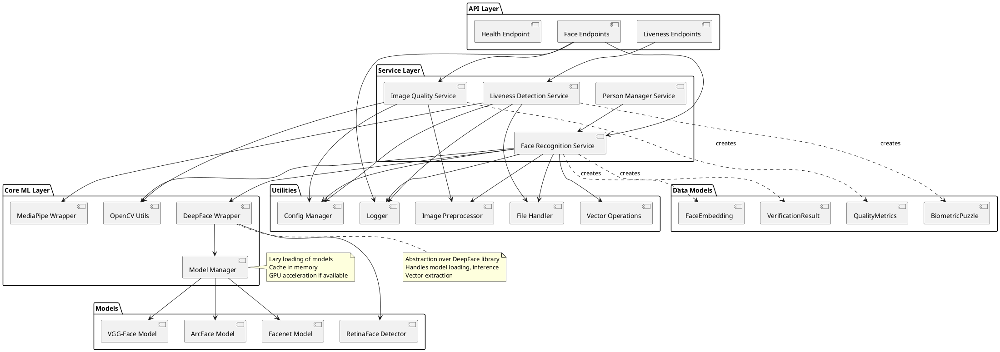

---

## 7. Deployment Diagrams

### 7.1 Production Kubernetes Deployment

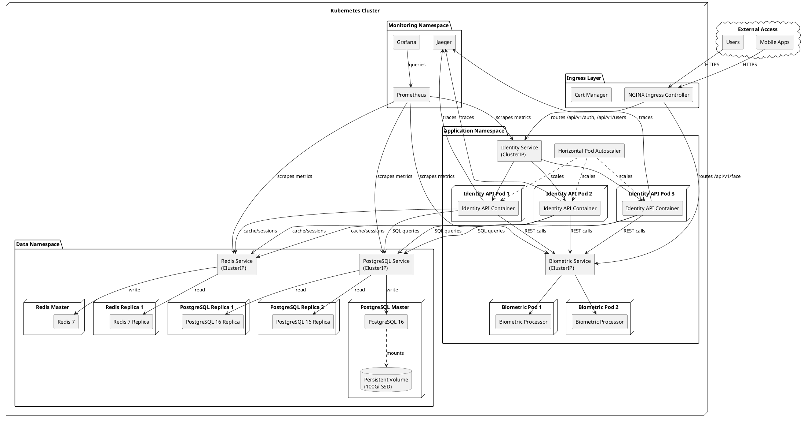

### 7.2 Development Environment Deployment

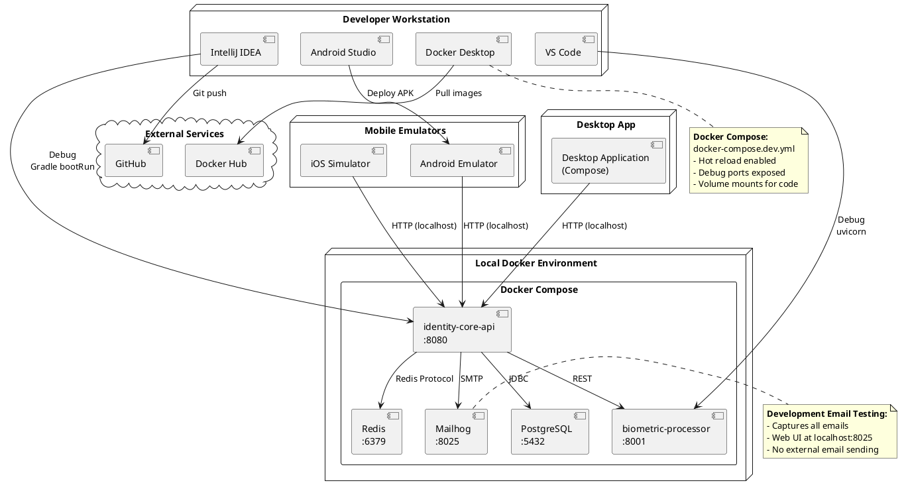

### 7.3 Multi-Region Production Deployment

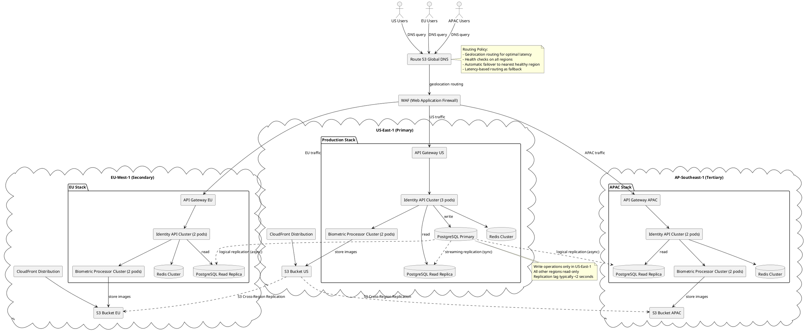

### 7.4 High Availability Deployment

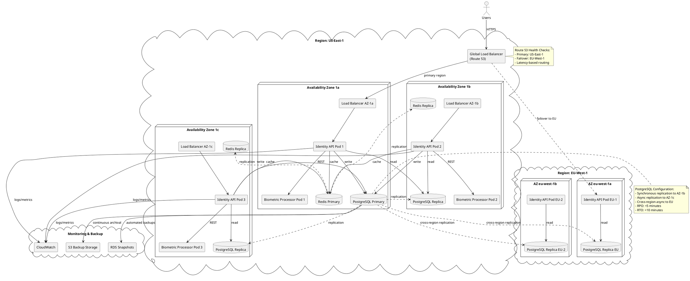

---

## 8. Use Case Diagrams

### 8.1 End User Use Cases

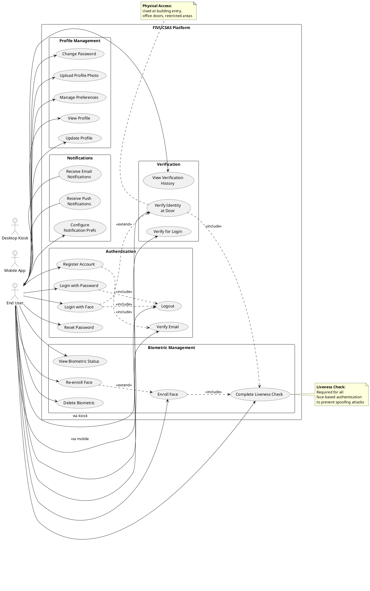

### 8.2 Tenant Admin Use Cases

```plantuml
@startuml tenant_admin_use_cases

left to right direction

actor "Tenant Admin" as admin
actor "System" as system

rectangle "FIVUCSAS Platform" {

    rectangle "User Management" {
        usecase "Create User" as UC1
        usecase "View All Users" as UC2
        usecase "Search Users" as UC3
        usecase "Update User" as UC4
        usecase "Deactivate User" as UC5
        usecase "Reactivate User" as UC6
        usecase "Delete User" as UC7
        usecase "Reset User Password" as UC8
        usecase "Unlock User Account" as UC9
    }

    rectangle "Role Management" {
        usecase "Create Role" as UC10
        usecase "Assign Role to User" as UC11
        usecase "Remove Role from User" as UC12
        usecase "Update Role Permissions" as UC13
        usecase "View Role Hierarchy" as UC14
    }

    rectangle "Biometric Management" {
        usecase "View User Biometrics" as UC15
        usecase "Force Biometric\nRe-enrollment" as UC16
        usecase "Delete User Biometric" as UC17
        usecase "View Biometric\nQuality Reports" as UC18
    }

    rectangle "Monitoring & Reports" {
        usecase "View Dashboard" as UC19
        usecase "Generate User Report" as UC20
        usecase "View Verification Logs" as UC21
        usecase "Export Audit Logs" as UC22
        usecase "View System Statistics" as UC23
        usecase "Monitor Active Sessions" as UC24
    }

    rectangle "Configuration" {
        usecase "Update Tenant Settings" as UC25
        usecase "Configure Security Policies" as UC26
        usecase "Manage API Keys" as UC27
        usecase "Configure Notifications" as UC28
        usecase "Set Verification Thresholds" as UC29
    }

    rectangle "Compliance" {
        usecase "Download GDPR\nData Export" as UC30
        usecase "Process Data\nDeletion Request" as UC31
        usecase "View Consent Records" as UC32
    }
}

' Admin to User Management
admin --> UC1
admin --> UC2
admin --> UC3
admin --> UC4
admin --> UC5
admin --> UC6
admin --> UC7
admin --> UC8
admin --> UC9

' Admin to Role Management
admin --> UC10
admin --> UC11
admin --> UC12
admin --> UC13
admin --> UC14

' Admin to Biometric Management
admin --> UC15
admin --> UC16
admin --> UC17
admin --> UC18

' Admin to Monitoring
admin --> UC19
admin --> UC20
admin --> UC21
admin --> UC22
admin --> UC23
admin --> UC24

' Admin to Configuration
admin --> UC25
admin --> UC26
admin --> UC27
admin --> UC28
admin --> UC29

' Admin to Compliance
admin --> UC30
admin --> UC31
admin --> UC32

' System actor
UC1 ..> UC8 : <<include>>
system --> UC24 : auto-cleanup
system --> UC21 : auto-log

' Include relationships
UC2 ..> UC3 : <<extend>>
UC4 ..> UC11 : <<include>>
UC20 ..> UC21 : <<include>>

note right of UC26
  **Security Policies:**
  - Password requirements
  - Lockout thresholds
  - Session timeout
  - MFA enforcement
  - Verification strictness
end note

note bottom of UC30
  **GDPR Compliance:**
  Admin can export all user
  data upon request.
  Must complete within 30 days.
end note

@enduml
```

### 8.3 System Admin Use Cases

```plantuml
@startuml system_admin_use_cases

left to right direction

actor "System Admin" as sysadmin
actor "DevOps" as devops

rectangle "FIVUCSAS Platform" {

    rectangle "Tenant Management" {
        usecase "Create Tenant" as UC1
        usecase "View All Tenants" as UC2
        usecase "Update Tenant Plan" as UC3
        usecase "Suspend Tenant" as UC4
        usecase "Activate Tenant" as UC5
        usecase "Delete Tenant" as UC6
        usecase "Manage Tenant Quotas" as UC7
    }

    rectangle "System Configuration" {
        usecase "Configure Global\nSecurity Settings" as UC8
        usecase "Manage Feature Flags" as UC9
        usecase "Update System\nParameters" as UC10
        usecase "Configure Rate Limits" as UC11
    }

    rectangle "Monitoring & Diagnostics" {
        usecase "View System Health" as UC12
        usecase "Monitor Service Metrics" as UC13
        usecase "View Error Logs" as UC14
        usecase "Analyze Performance" as UC15
        usecase "View Distributed Traces" as UC16
        usecase "Check Database Status" as UC17
    }

    rectangle "User Support" {
        usecase "Search Across Tenants" as UC18
        usecase "Unlock Any Account" as UC19
        usecase "Reset MFA" as UC20
        usecase "Investigate Security\nIncident" as UC21
        usecase "View User Activity" as UC22
    }

    rectangle "System Maintenance" {
        usecase "Run Database Migration" as UC23
        usecase "Clear Cache" as UC24
        usecase "Restart Services" as UC25
        usecase "Trigger Manual Backup" as UC26
        usecase "Cleanup Old Sessions" as UC27
    }

    rectangle "Model Management" {
        usecase "Update Biometric Models" as UC28
        usecase "Configure Model\nParameters" as UC29
        usecase "A/B Test Models" as UC30
        usecase "View Model Performance" as UC31
    }

    rectangle "Security & Compliance" {
        usecase "Review Audit Logs" as UC32
        usecase "Manage Admin Accounts" as UC33
        usecase "Configure IP Whitelist" as UC34
        usecase "Manage SSL Certificates" as UC35
        usecase "Review Security Alerts" as UC36
    }
}

' System Admin connections
sysadmin --> UC1
sysadmin --> UC2
sysadmin --> UC3
sysadmin --> UC4
sysadmin --> UC5
sysadmin --> UC6
sysadmin --> UC7
sysadmin --> UC8
sysadmin --> UC9
sysadmin --> UC10
sysadmin --> UC11
sysadmin --> UC12
sysadmin --> UC13
sysadmin --> UC14
sysadmin --> UC18
sysadmin --> UC19
sysadmin --> UC20
sysadmin --> UC21
sysadmin --> UC22
sysadmin --> UC28
sysadmin --> UC29
sysadmin --> UC30
sysadmin --> UC31
sysadmin --> UC32
sysadmin --> UC33
sysadmin --> UC34
sysadmin --> UC35
sysadmin --> UC36

' DevOps connections
devops --> UC12
devops --> UC13
devops --> UC14
devops --> UC15
devops --> UC16
devops --> UC17
devops --> UC23
devops --> UC24
devops --> UC25
devops --> UC26
devops --> UC27

' Include/Extend relationships
UC4 ..> UC6 : <<extend>>
UC3 ..> UC7 : <<include>>
UC21 ..> UC22 : <<include>>
UC21 ..> UC32 : <<include>>

note right of UC1
  **Tenant Creation:**
  - Provision isolated schema
  - Create admin account
  - Set initial quotas
  - Generate API credentials
end note

note bottom of UC23
  **Database Migrations:**
  Zero-downtime migrations
  using Flyway or Liquibase
  Automatic rollback on failure
end note

note right of UC30
  **A/B Testing:**
  Compare VGG-Face vs ArcFace
  Measure accuracy & performance
  Gradual rollout strategy
end note

@enduml
```

### 8.4 External System Integration Use Cases

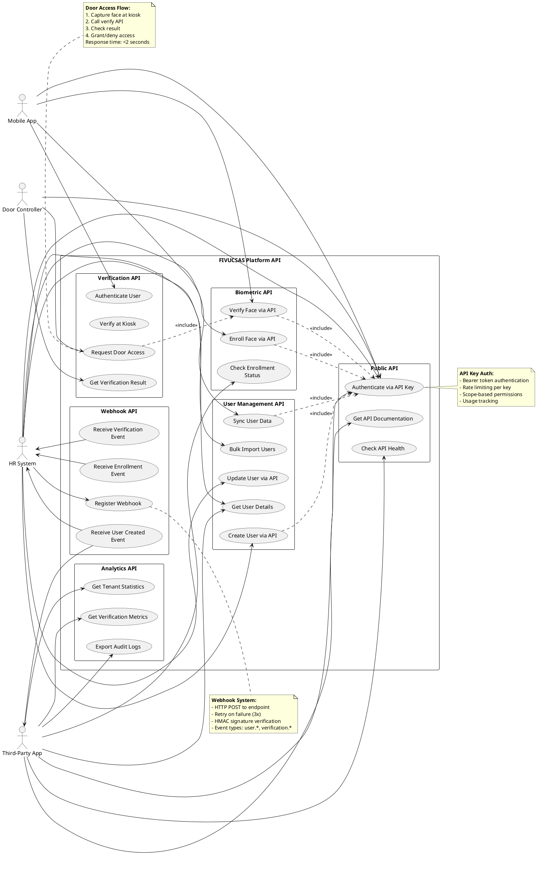

---

## 9. Additional Diagrams

### 9.1 Data Flow Diagram - Face Verification

```plantuml
@startuml data_flow_verification

!define RECTANGLE class

skinparam component {
    BackgroundColor<<external>> LightBlue
    BackgroundColor<<process>> LightGreen
    BackgroundColor<<datastore>> LightYellow
}

RECTANGLE "User" as user <<external>>
RECTANGLE "Mobile App" as app <<external>>
RECTANGLE "API Gateway" as gateway <<process>>
RECTANGLE "Identity API" as identity <<process>>
RECTANGLE "Biometric Processor" as biometric <<process>>
RECTANGLE "Database" as db <<datastore>>
RECTANGLE "Redis" as redis <<datastore>>

user -> app : 1.0 User face image
app -> gateway : 2.0 Verification request\n+ image bytes
gateway -> identity : 3.0 Authenticated request
identity -> redis : 4.0 Check rate limit
redis --> identity : 4.1 Limit status
identity -> db : 5.0 Query stored embedding
db --> identity : 5.1 Embedding vector (512-D)
identity -> biometric : 6.0 Image + stored embedding
biometric -> biometric : 7.0 Extract new embedding
biometric -> biometric : 8.0 Calculate distance
biometric --> identity : 9.0 Verification result\n{verified, confidence}
identity -> db : 10.0 Log verification attempt
identity -> redis : 11.0 Publish event
identity --> gateway : 12.0 Response DTO
gateway --> app : 13.0 JSON response
app --> user : 14.0 Display result

note right of biometric
  **Processing:**
  - Face detection
  - Embedding extraction (VGG-Face)
  - Cosine similarity calculation
  - Threshold comparison (0.30)
end note

note bottom of db
  **Data Stored:**
  - User metadata
  - Biometric embeddings (encrypted)
  - Verification logs
  - Audit trail
end note

@enduml
```

### 9.2 Network Architecture Diagram

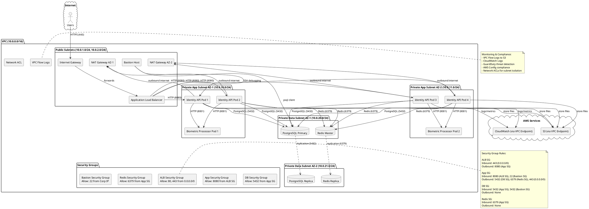

### 9.3 Security Architecture Diagram

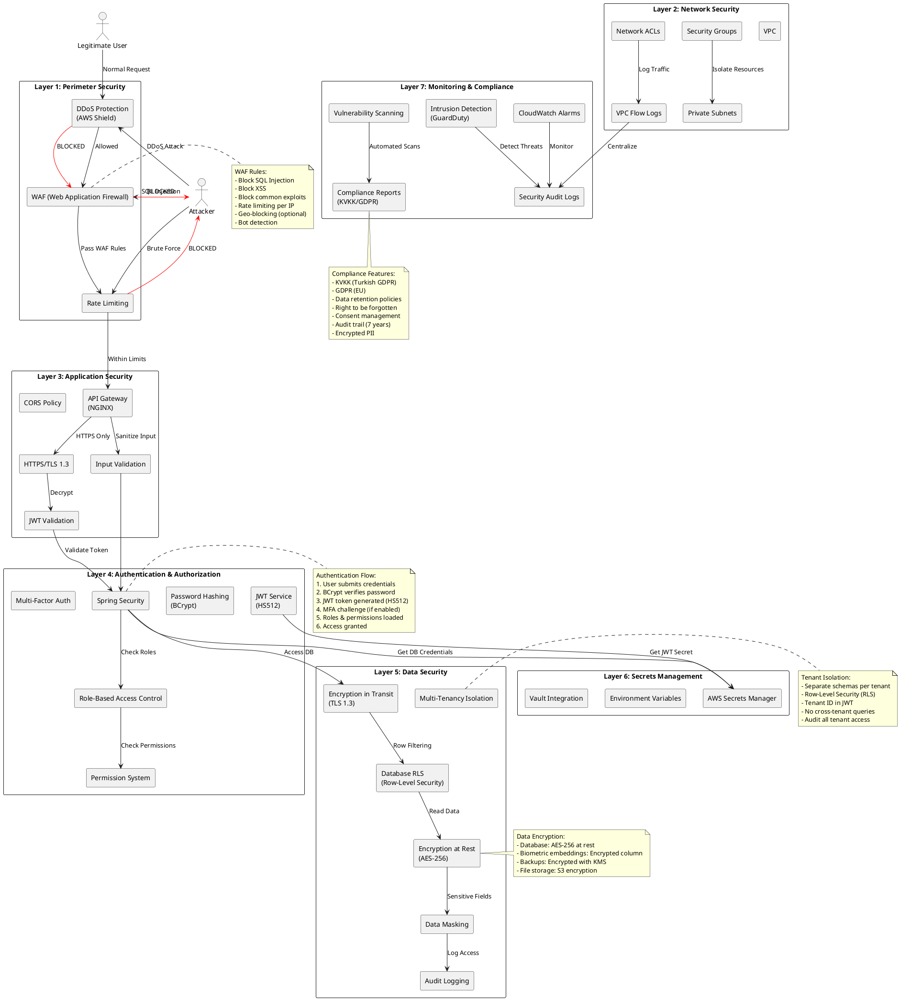

---

## 10. Summary & Usage Guide

### Diagram Categories

1. **Entity-Relationship Diagrams** - Database schema visualization
2. **Class Diagrams** - Object-oriented design and relationships
3. **Sequence Diagrams** - Interaction flows over time
4. **State Machine Diagrams** - Lifecycle and transitions
5. **Activity Diagrams** - Business process flows
6. **Component Diagrams** - System structure and dependencies
7. **Deployment Diagrams** - Infrastructure and deployment
8. **Use Case Diagrams** - Functional requirements
9. **Data Flow Diagrams** - Information flow
10. **Network/Security Diagrams** - Infrastructure and security

### How to Generate Diagrams

**Option 1: Online PlantUML Editor**
```
1. Visit: http://www.plantuml.com/plantuml/uml/
2. Copy diagram code
3. Paste into editor
4. View or download PNG/SVG
```

**Option 2: VS Code Extension**
```
1. Install "PlantUML" extension by jebbs
2. Create .puml file
3. Copy diagram code
4. Press Alt+D to preview
5. Right-click → Export to PNG/SVG
```

**Option 3: IntelliJ IDEA Plugin**
```
1. Install "PlantUML integration" plugin
2. Create .puml file
3. Copy diagram code
4. View in tool window
5. Export as needed
```

**Option 4: Command Line**
```bash
# Install PlantUML
brew install plantuml  # macOS
sudo apt install plantuml  # Ubuntu

# Generate diagram
plantuml diagram.puml

# Generate all diagrams in folder
plantuml *.puml
```

### Best Practices

1. **Update diagrams when architecture changes**
2. **Version control diagrams with code**
3. **Include diagrams in pull requests**
4. **Use diagrams in documentation**
5. **Review diagrams in architecture meetings**

---

**Total Diagrams in Collection: 30+**

All diagrams are ready for generation using PlantUML!
