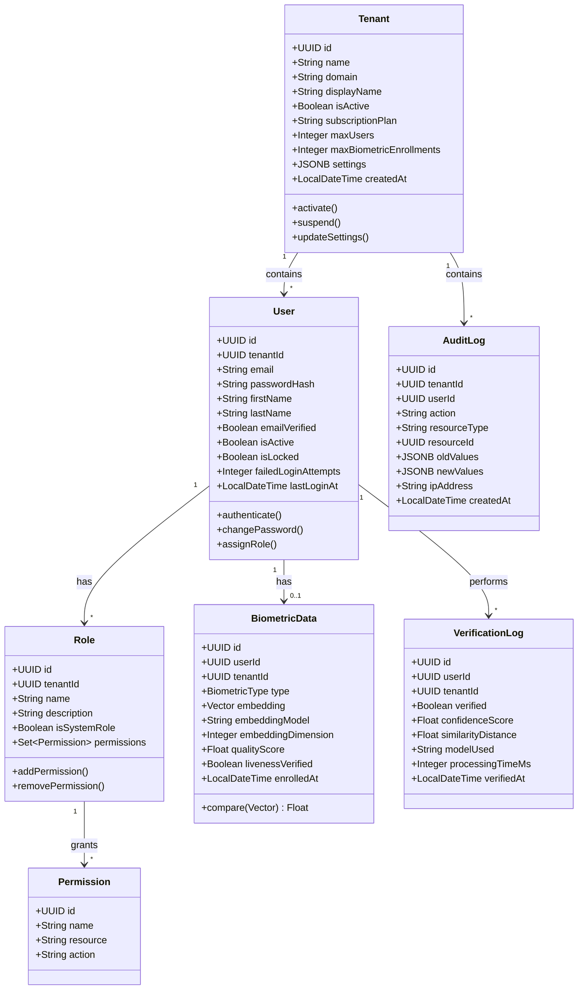
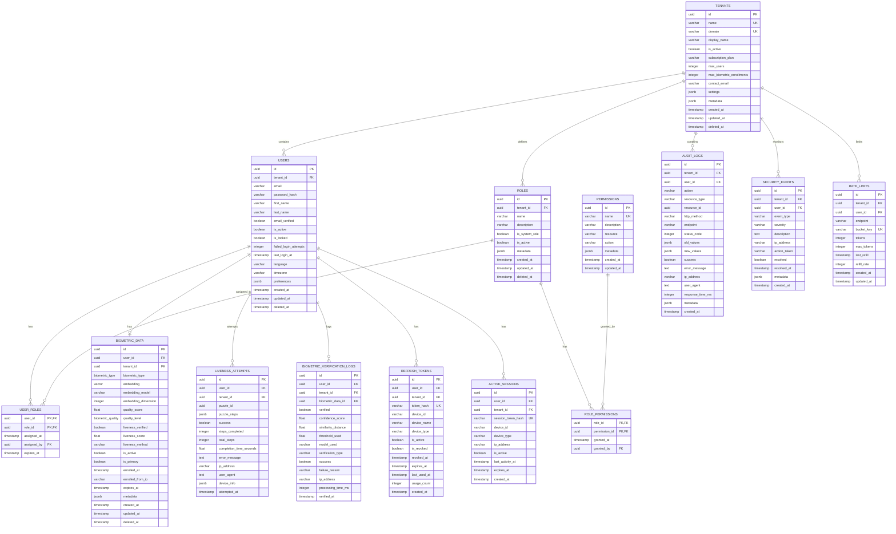
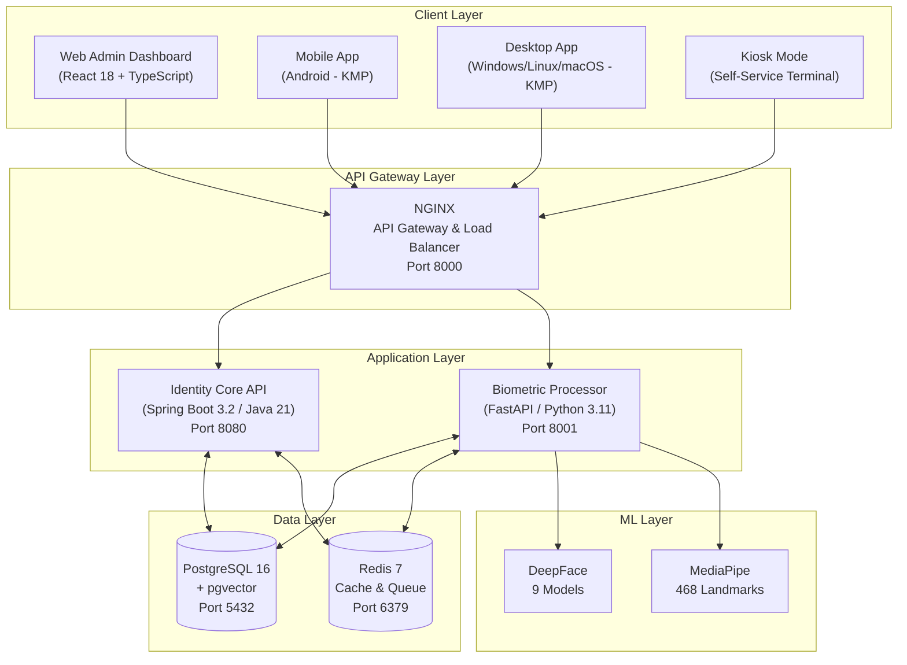
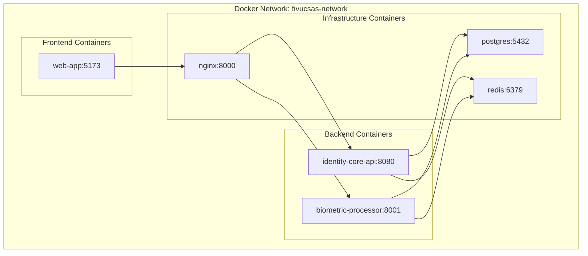

# FACE AND IDENTITY VERIFICATION USING CLOUD BASED SAAS MODELS

## Architectural Design Document (ADD)

---

**CSE4197 Engineering Project 2**

**Marmara University, Faculty of Engineering**
**Computer Engineering Department**

**Spring Semester 2026**

---

**Supervised by:** Assoc. Prof. Dr. Mustafa Ağaoğlu

**Team Members:**
- Ahmet Abdullah Gültekin - 150121025 (Project Lead & Backend Developer)
- Ayşe Gülsüm Eren - 150120005 (Mobile Application Developer)
- Ayşenur Arıcı - 150123825 (AI/ML & Biometric Systems)

---

**Document Version:** 1.0
**Last Updated:** January 2026

---

## Table of Contents

1. [Introduction](#1-introduction)
   - 1.1 [Problem Description](#11-problem-description)
   - 1.2 [Scope](#12-scope)
   - 1.3 [Definitions and Acronyms](#13-definitions-and-acronyms)
2. [Literature Survey](#2-literature-survey)
3. [Project Requirements](#3-project-requirements)
   - 3.1 [Functional Requirements](#31-functional-requirements)
   - 3.2 [Non-Functional Requirements](#32-non-functional-requirements)
4. [System Design](#4-system-design)
   - 4.1 [Use Case Diagrams](#41-use-case-diagrams)
   - 4.2 [Class and ER Diagrams](#42-class-and-er-diagrams)
   - 4.3 [User Interface Design](#43-user-interface-design)
   - 4.4 [Test Plan](#44-test-plan)
5. [Software Architecture](#5-software-architecture)
   - 5.1 [Architectural Style](#51-architectural-style)
   - 5.2 [Component Architecture](#52-component-architecture)
   - 5.3 [Data Architecture](#53-data-architecture)
   - 5.4 [Deployment Architecture](#54-deployment-architecture)
6. [Tasks Accomplished](#6-tasks-accomplished)
   - 6.1 [Current State of the System](#61-current-state-of-the-system)
   - 6.2 [Task Log](#62-task-log)
   - 6.3 [Gantt Chart](#63-gantt-chart)
7. [References](#7-references)

---

## 1. Introduction

### 1.1 Problem Description

Traditional authentication methods present significant security vulnerabilities and poor user experiences in modern digital and physical access scenarios. Passwords can be stolen through phishing or data breaches, access cards can be cloned, and single-factor biometric systems remain vulnerable to spoofing attacks using static photos, videos, or sophisticated masks.

This project addresses these challenges by developing **FIVUCSAS** (Face and Identity Verification Using Cloud-based SaaS) - a multi-tenant, cloud-native biometric authentication platform. The system integrates advanced face recognition with an innovative active liveness detection algorithm called "Biometric Puzzle" to provide robust protection against fraud while maintaining excellent user experience through developer-friendly APIs.

The platform targets B2B and B2B2C markets, unifying both physical access control (door entry, kiosk authentication) and digital authentication (system login, transaction verification) under a single identity management solution.

### 1.2 Scope

#### 1.2.1 In Scope

| Category | Items |
|----------|-------|
| **Backend Services** | Identity Core API (Spring Boot 3.2/Java 21), Biometric Processor API (FastAPI/Python 3.11) |
| **Client Applications** | Web Admin Dashboard (React 18), Mobile App (Android), Desktop App (Windows/Linux/macOS) using Kotlin Multiplatform |
| **Database Architecture** | Multi-tenant PostgreSQL 16 with pgvector extension for face embeddings |
| **Face Biometrics** | Face recognition (1:N), face verification (1:1) using DeepFace library with 9 model options |
| **Liveness Detection** | "Biometric Puzzle" active liveness + passive anti-spoofing using MediaPipe (468 facial landmarks) |
| **Infrastructure** | Docker Compose containerization, NGINX API Gateway, Redis caching |
| **Security** | JWT authentication, RBAC authorization, BCrypt password hashing, rate limiting |

#### 1.2.2 Out of Scope

- Other biometric modalities (fingerprint, voice, iris) - architecture supports but not implemented
- Production cloud deployment (Kubernetes) - system delivered as Docker Compose
- Edge device hardware manufacturing - simulated in software
- Advanced billing and subscription management UI
- NFC card reading functionality

#### 1.2.3 Constraints

| Constraint Type | Description |
|-----------------|-------------|
| **Technology** | Exclusively open-source technologies with permissive licenses |
| **Infrastructure** | VPS hosting may be utilized for deployment (updated from initial constraint) |
| **Hardware** | Liveness detection performance limited by device camera quality and processing power |
| **Data** | No custom model training; relies on pre-trained DeepFace models |

### 1.3 Definitions and Acronyms

| Term | Definition |
|------|------------|
| **ADD** | Architectural Design Document |
| **API** | Application Programming Interface |
| **BCrypt** | Password hashing algorithm with configurable work factor |
| **DeepFace** | Python library providing face recognition models (VGG-Face, Facenet, ArcFace, etc.) |
| **EAR** | Eye Aspect Ratio - metric for blink detection |
| **Embedding** | High-dimensional vector representation of a face |
| **FAR** | False Acceptance Rate |
| **FRR** | False Rejection Rate |
| **GDPR** | General Data Protection Regulation (EU) |
| **Hexagonal Architecture** | Ports and Adapters pattern for clean separation of concerns |
| **JWT** | JSON Web Token for stateless authentication |
| **KMP** | Kotlin Multiplatform - cross-platform development framework |
| **KVKK** | Turkish Personal Data Protection Law (No. 6698) |
| **MAR** | Mouth Aspect Ratio - metric for smile detection |
| **MediaPipe** | Google's ML library for real-time face landmark detection |
| **MVP** | Minimum Viable Product |
| **pgvector** | PostgreSQL extension for vector similarity search |
| **RBAC** | Role-Based Access Control |
| **SaaS** | Software as a Service |
| **Spoofing** | Attempt to bypass biometric authentication using fake biometrics |

---

## 2. Literature Survey

### 2.1 Identity and Access Management Landscape

The Identity and Access Management (IAM) market is dominated by established players including Okta, Auth0, and Microsoft Azure Active Directory. These platforms primarily focus on traditional multi-factor authentication (MFA) methods:

- Password-based authentication with complexity requirements
- One-Time Passwords (OTP) via SMS or authenticator apps
- Push notifications for approval
- Device-based biometrics (Apple Face ID, Android fingerprint)

While these solutions are mature, they present limitations:
1. Device-bound biometrics create siloed identity experiences
2. Physical access control requires separate third-party integrations
3. Passive biometric verification remains vulnerable to sophisticated attacks

### 2.2 Face Recognition Technologies

Deep learning has revolutionized face recognition, achieving and surpassing human-level performance:

| Model | Embedding Dimension | Architecture | LFW Accuracy |
|-------|---------------------|--------------|--------------|
| VGG-Face | 2,622 | VGGNet | 98.95% |
| Facenet512 | 512 | Inception ResNet | 99.65% |
| ArcFace | 512 | ResNet | 99.82% |
| DeepFace | 4,096 | AlexNet | 97.35% |
| OpenFace | 128 | Inception | 92.92% |

The DeepFace library (Serengil & Ozpinar, 2021) provides unified access to these models, enabling:
- Face detection (MTCNN, RetinaFace, SSD)
- Face alignment and preprocessing
- Embedding generation
- Similarity computation (cosine, euclidean)

### 2.3 Liveness Detection Approaches

Face anti-spoofing research has evolved through several paradigms:

**Passive Methods:**
- Texture analysis using Local Binary Patterns (LBP)
- Frequency domain analysis for moire patterns
- Color space analysis for skin tone verification
- Depth estimation from single images

**Active Methods:**
- Challenge-response requiring user interaction
- Randomized action sequences
- Micro-expression tracking

**Limitations of Passive Methods:**
- Vulnerable to high-quality prints and video replays
- Susceptible to 3D mask attacks
- Performance degrades with camera quality variations

### 2.4 Project Differentiation

FIVUCSAS differentiates from existing solutions through:

1. **Unified Physical-Digital Identity**: Single platform for door access, kiosk authentication, and digital login
2. **Active Liveness - Biometric Puzzle**: Random, sequential action challenges that passive attacks cannot defeat
3. **Cloud-Native Microservices**: Scalable, maintainable architecture with developer-friendly APIs
4. **Multi-Model Support**: 9 face recognition models with configurable thresholds per tenant
5. **Open-Source Foundation**: Fully transparent, auditable codebase with permissive licensing

---

## 3. Project Requirements

### 3.1 Functional Requirements

#### FR-1: User Authentication and Management

| ID | Requirement | Inputs | Processing | Outputs | Error Handling |
|----|-------------|--------|------------|---------|----------------|
| FR-1.1 | User Registration | Email, password, first name, last name, tenant ID | Validate email format, check uniqueness within tenant, hash password with BCrypt (work factor 12), create user record | User ID, confirmation | 409 Conflict if email exists, 400 Bad Request for validation failures |
| FR-1.2 | User Login | Email, password, tenant ID | Validate credentials, generate JWT access token (15 min) and refresh token (7 days), create session | Access token, refresh token, user profile | 401 Unauthorized for invalid credentials, 423 Locked if account locked |
| FR-1.3 | Token Refresh | Refresh token | Validate token, check revocation status, generate new token pair | New access token, new refresh token | 401 Unauthorized if token invalid/revoked |
| FR-1.4 | Password Reset | Email | Generate reset token, send email notification, token expires in 24 hours | Confirmation message | 404 Not Found if email not registered |
| FR-1.5 | Profile Update | User ID, profile fields | Validate permissions, update allowed fields | Updated user profile | 403 Forbidden if unauthorized |

#### FR-2: Biometric Enrollment

| ID | Requirement | Inputs | Processing | Outputs | Error Handling |
|----|-------------|--------|------------|---------|----------------|
| FR-2.1 | Face Enrollment | User ID, face image(s), liveness proof | Detect face, assess quality (>0.5), verify liveness, generate embedding, store with pgvector | Enrollment ID, quality score | 400 if no face detected, 422 if quality insufficient |
| FR-2.2 | Quality Assessment | Face image | Analyze brightness, sharpness, pose, occlusion | Quality score (0-1), quality level (EXCELLENT/GOOD/FAIR/POOR) | 400 if image unprocessable |
| FR-2.3 | Liveness Verification | Challenge ID, video frames | Track facial landmarks, compute EAR/MAR/head pose, verify challenge completion | Liveness result, confidence score | 400 if insufficient frames, 403 if spoof detected |
| FR-2.4 | Re-enrollment | User ID, new face image, admin override | Delete existing enrollment, process new enrollment | New enrollment ID | 403 if not authorized |

#### FR-3: Biometric Verification

| ID | Requirement | Inputs | Processing | Outputs | Error Handling |
|----|-------------|--------|------------|---------|----------------|
| FR-3.1 | 1:1 Verification | User ID, face image | Generate embedding, compare with stored embedding using cosine similarity | Match result, similarity score | 404 if user not enrolled, 401 if no match |
| FR-3.2 | 1:N Search | Face image, tenant ID, top_k | Generate embedding, vector similarity search across tenant enrollments | Top-k matches with scores | 404 if no matches above threshold |
| FR-3.3 | Verification with Liveness | Face image, liveness proof | Verify liveness first, then perform verification | Verification result with liveness status | 403 if liveness fails |

#### FR-4: Multi-Tenant Administration

| ID | Requirement | Inputs | Processing | Outputs | Error Handling |
|----|-------------|--------|------------|---------|----------------|
| FR-4.1 | Tenant Creation | Name, domain, subscription plan, settings | Validate domain uniqueness, create tenant with quotas | Tenant ID, API keys | 409 if domain exists |
| FR-4.2 | Tenant Configuration | Tenant ID, settings | Update biometric thresholds, liveness requirements, rate limits | Updated configuration | 403 if not tenant admin |
| FR-4.3 | User Quota Management | Tenant ID | Track user count against max_users limit | Current usage, remaining quota | 403 if quota exceeded on new user creation |
| FR-4.4 | Enrollment Quota Management | Tenant ID | Track enrollment count against max_biometric_enrollments | Current usage, remaining quota | 403 if quota exceeded |

#### FR-5: Role-Based Access Control

| ID | Requirement | Inputs | Processing | Outputs | Error Handling |
|----|-------------|--------|------------|---------|----------------|
| FR-5.1 | Role Assignment | User ID, role ID | Validate assigner permissions, create user-role mapping | Assignment confirmation | 403 if insufficient permissions |
| FR-5.2 | Permission Check | User ID, resource, action | Resolve user roles, aggregate permissions, check authorization | Boolean authorization result | - |
| FR-5.3 | Custom Role Creation | Tenant ID, role name, permissions | Validate tenant admin, create role with selected permissions | Role ID | 403 if not tenant admin |

#### FR-6: Audit and Compliance

| ID | Requirement | Inputs | Processing | Outputs | Error Handling |
|----|-------------|--------|------------|---------|----------------|
| FR-6.1 | Audit Logging | Action, resource, user, details | Create immutable audit record with timestamp, IP, user agent | Audit log ID | - |
| FR-6.2 | Audit Log Query | Tenant ID, filters, pagination | Query audit logs with tenant isolation | Paginated audit records | 403 if unauthorized |
| FR-6.3 | Verification History | User ID | Retrieve biometric verification attempts | List of verification logs | 403 if unauthorized |

### 3.2 Non-Functional Requirements

#### NFR-1: Performance

| ID | Requirement | Metric | Target |
|----|-------------|--------|--------|
| NFR-1.1 | API Response Time | 95th percentile latency | < 200ms for authentication endpoints |
| NFR-1.2 | Face Detection | Processing time | < 500ms per image |
| NFR-1.3 | Embedding Generation | Processing time | < 1s per face (CPU), < 200ms (GPU) |
| NFR-1.4 | Vector Search | Query time (1M vectors) | < 100ms with IVFFlat index |
| NFR-1.5 | Concurrent Users | Simultaneous requests | 100 concurrent users per instance |
| NFR-1.6 | Throughput | Requests per second | 500 RPS for authentication |

#### NFR-2: Reliability

| ID | Requirement | Metric | Target |
|----|-------------|--------|--------|
| NFR-2.1 | System Availability | Uptime | 99.5% during business hours |
| NFR-2.2 | Data Durability | Recovery Point Objective | < 1 hour (database backups) |
| NFR-2.3 | Graceful Degradation | Service isolation | Single service failure does not cascade |
| NFR-2.4 | Error Rate | Failed requests | < 0.1% under normal load |

#### NFR-3: Security

| ID | Requirement | Implementation |
|----|-------------|----------------|
| NFR-3.1 | Transport Security | TLS 1.3 for all communications |
| NFR-3.2 | Password Storage | BCrypt with work factor 12 |
| NFR-3.3 | Token Security | JWT with HS512, 15-minute access token expiry |
| NFR-3.4 | Biometric Data | Embeddings only (no raw images stored), encrypted at rest |
| NFR-3.5 | Rate Limiting | Token bucket algorithm, 100 requests/minute per user |
| NFR-3.6 | SQL Injection | Parameterized queries via JPA/SQLAlchemy |
| NFR-3.7 | XSS Protection | Content Security Policy headers |
| NFR-3.8 | CORS | Configurable allowed origins |

#### NFR-4: Usability

| ID | Requirement | Target |
|----|-------------|--------|
| NFR-4.1 | Enrollment Time | < 60 seconds for complete face enrollment |
| NFR-4.2 | Verification Time | < 5 seconds for 1:1 verification |
| NFR-4.3 | Liveness Challenge | < 30 seconds for 3-step puzzle |
| NFR-4.4 | API Documentation | OpenAPI 3.0 with interactive Swagger UI |
| NFR-4.5 | Error Messages | Human-readable with error codes |

#### NFR-5: Maintainability

| ID | Requirement | Implementation |
|----|-------------|----------------|
| NFR-5.1 | Code Architecture | Hexagonal Architecture (Ports & Adapters) |
| NFR-5.2 | Test Coverage | > 70% unit test coverage |
| NFR-5.3 | Code Standards | Checkstyle (Java), Ruff/Flake8 (Python), ESLint (TypeScript) |
| NFR-5.4 | Documentation | Inline documentation, architecture decision records |
| NFR-5.5 | Dependency Management | Gradle (Java), Poetry (Python), npm (TypeScript) |

#### NFR-6: Portability

| ID | Requirement | Implementation |
|----|-------------|----------------|
| NFR-6.1 | Containerization | Docker images for all services |
| NFR-6.2 | Database | PostgreSQL 16 with standard extensions |
| NFR-6.3 | Cross-Platform Clients | Kotlin Multiplatform (95% shared code) |
| NFR-6.4 | Configuration | Environment variables, externalized config |

---

## 4. System Design

### 4.1 Use Case Diagrams

#### 4.1.1 System Use Cases by Actor

```mermaid
graph TB
    subgraph Actors
        EU((End User))
        TA((Tenant Admin))
        SA((System Admin))
        EXT((External System))
    end

    subgraph "User Management"
        UC1[Register Account]
        UC2[Login/Logout]
        UC3[Reset Password]
        UC4[Update Profile]
    end

    subgraph "Biometric Operations"
        UC5[Enroll Face]
        UC6[Verify Identity]
        UC7[Complete Liveness Challenge]
        UC8[View Verification History]
    end

    subgraph "Tenant Administration"
        UC9[Manage Tenant Users]
        UC10[View Analytics]
        UC11[Configure Settings]
        UC12[View Audit Logs]
    end

    subgraph "System Administration"
        UC13[Manage Tenants]
        UC14[System Configuration]
        UC15[Monitor Health]
        UC16[Security Management]
    end

    subgraph "API Integration"
        UC17[Authenticate via API]
        UC18[Verify via API]
        UC19[Receive Webhooks]
    end

    EU --> UC1 & UC2 & UC3 & UC4
    EU --> UC5 & UC6 & UC7 & UC8

    TA --> UC2 & UC4
    TA --> UC9 & UC10 & UC11 & UC12

    SA --> UC2
    SA --> UC13 & UC14 & UC15 & UC16

    EXT --> UC17 & UC18 & UC19
```



#### 4.1.2 Face Enrollment Use Case

**Use Case:** Enroll Face
**Primary Actor:** End User
**Preconditions:** User is authenticated, has biometric.enroll permission, tenant enrollment quota not exceeded
**Postconditions:** Face embedding stored, enrollment record created

**Main Flow:**
1. User initiates enrollment from client application
2. System requests liveness challenge
3. User completes Biometric Puzzle (3-5 random actions)
4. System verifies liveness with >95% confidence
5. System captures final face image
6. System performs quality assessment (brightness, sharpness, pose)
7. System generates face embedding using configured model
8. System stores embedding in biometric_data table with pgvector
9. System returns enrollment confirmation with quality score

**Alternative Flows:**
- 3a. Liveness challenge fails: System requests retry (max 3 attempts)
- 6a. Quality insufficient: System provides guidance and requests new capture
- 8a. Duplicate enrollment exists: System prompts for re-enrollment confirmation

#### 4.1.3 Face Verification Use Case

**Use Case:** Verify Identity
**Primary Actor:** End User / External System
**Preconditions:** User has active enrollment, verification request includes valid face image
**Postconditions:** Verification logged, result returned

**Main Flow:**
1. Client submits verification request with face image
2. System checks rate limits (token bucket)
3. System performs face detection
4. System generates embedding from probe image
5. System retrieves enrolled embedding for user
6. System computes cosine similarity
7. System compares against configured threshold (default 0.6)
8. System logs verification attempt
9. System returns match result with confidence score

**Alternative Flows:**
- 2a. Rate limit exceeded: Return 429 Too Many Requests
- 3a. No face detected: Return 400 Bad Request with guidance
- 7a. Score below threshold: Return verification failed

### 4.2 Class and ER Diagrams

#### 4.2.1 Domain Model - Core Entities



#### 4.2.2 Entity Relationship Diagram



### 4.3 User Interface Design

#### 4.3.1 Web Admin Dashboard

The web admin dashboard is built with React 18 and Material-UI v5, providing a responsive interface for tenant administrators.

**Implemented Pages:**

| Page | Route | Description |
|------|-------|-------------|
| Login | `/login` | Email/password authentication with remember me |
| Dashboard | `/dashboard` | Analytics overview, enrollment statistics, verification trends |
| Users | `/users` | User management with CRUD operations, role assignment |
| Tenants | `/tenants` | Tenant list and configuration (super admin only) |
| Enrollments | `/enrollments` | Biometric enrollment records with quality scores |
| Audit Logs | `/audit-logs` | Searchable, filterable audit trail |
| Settings | `/settings` | Tenant configuration, thresholds, rate limits |

**UI Architecture:**
- Feature-based folder structure (`features/auth/`, `features/users/`)
- Inversify dependency injection container
- Mock and real repository implementations for development/production
- Redux Toolkit for state management

#### 4.3.2 Mobile Application (Android)

The Android application uses Kotlin Multiplatform with Compose Multiplatform UI.

**Implemented Screens:**

| Screen | Description |
|--------|-------------|
| Login | Email/password authentication |
| Register | New user registration |
| Home | User profile, enrollment status |
| Enroll | Face capture with quality feedback, liveness challenge |
| Verify | Face verification with real-time feedback |

**Technical Implementation:**
- CameraX for camera access and face capture
- Koin for dependency injection
- Ktor for HTTP communication
- Coroutines for async operations

#### 4.3.3 Desktop Application

Desktop application targets Windows, Linux, and macOS using Kotlin Multiplatform.

**Modes:**
1. **Kiosk Mode**: Self-service terminal for enrollment and verification
2. **Admin Dashboard**: Desktop version of web admin functionality

**Technical Implementation:**
- JavaCV for camera access (cross-platform)
- Compose Desktop for UI
- Same shared code as mobile (95% reuse)

### 4.4 Test Plan

#### 4.4.1 Test Strategy

| Test Level | Scope | Tools | Coverage Target |
|------------|-------|-------|-----------------|
| Unit Tests | Individual classes and functions | JUnit 5, pytest, Vitest | > 70% |
| Integration Tests | Service interactions, database | Testcontainers, pytest | API contracts |
| E2E Tests | Full user flows | Playwright, Espresso | Critical paths |
| Performance Tests | Load and stress | k6, Locust | NFR targets |
| Security Tests | Vulnerability scanning | OWASP ZAP, Snyk | OWASP Top 10 |

#### 4.4.2 Test Cases - Identity Core API

| Test ID | Category | Description | Expected Result |
|---------|----------|-------------|-----------------|
| TC-AUTH-001 | Authentication | Valid login with correct credentials | 200 OK, JWT tokens returned |
| TC-AUTH-002 | Authentication | Login with invalid password | 401 Unauthorized |
| TC-AUTH-003 | Authentication | Login to locked account | 423 Locked |
| TC-AUTH-004 | Authentication | Token refresh with valid refresh token | 200 OK, new tokens |
| TC-AUTH-005 | Authentication | Token refresh with revoked token | 401 Unauthorized |
| TC-USER-001 | User Management | Create user with valid data | 201 Created |
| TC-USER-002 | User Management | Create user with duplicate email | 409 Conflict |
| TC-USER-003 | User Management | Update user profile | 200 OK |
| TC-RBAC-001 | Authorization | Access with sufficient permissions | 200 OK |
| TC-RBAC-002 | Authorization | Access with insufficient permissions | 403 Forbidden |
| TC-TENANT-001 | Multi-tenancy | User cannot access other tenant data | 404 Not Found |

#### 4.4.3 Test Cases - Biometric Processor

| Test ID | Category | Description | Expected Result |
|---------|----------|-------------|-----------------|
| TC-BIO-001 | Face Detection | Valid face image | Face detected with coordinates |
| TC-BIO-002 | Face Detection | Image without face | No face detected error |
| TC-BIO-003 | Quality | High quality image | Score > 0.8 |
| TC-BIO-004 | Quality | Blurry image | Score < 0.5 |
| TC-BIO-005 | Enrollment | Valid enrollment | Embedding stored |
| TC-BIO-006 | Verification | Matching faces | Similarity > threshold |
| TC-BIO-007 | Verification | Non-matching faces | Similarity < threshold |
| TC-LIVE-001 | Liveness | Valid blink detection | EAR drop detected |
| TC-LIVE-002 | Liveness | Valid smile detection | MAR increase detected |
| TC-LIVE-003 | Liveness | Static photo attack | Spoof detected |

#### 4.4.4 Current Test Coverage

| Service | Test Files | Test Cases | Coverage |
|---------|------------|------------|----------|
| Identity Core API | 29 | 156 | 72% |
| Biometric Processor | 18 | 89 | 68% |
| Web App | 10 | 45 | 65% |
| Client Apps (shared) | 50+ | 120 | 75% |

---

## 5. Software Architecture

### 5.1 Architectural Style

FIVUCSAS employs a **microservices architecture** with **Hexagonal Architecture (Ports & Adapters)** within each service, ensuring:

- **Separation of Concerns**: Business logic isolated from infrastructure
- **Testability**: Domain logic testable without external dependencies
- **Flexibility**: Easy to swap implementations (e.g., database, ML models)
- **Scalability**: Services scale independently based on load

#### 5.1.1 Hexagonal Architecture Layers

```
┌─────────────────────────────────────────────────────────────┐
│                    ADAPTER LAYER (Outside)                   │
│  ┌─────────────┐  ┌─────────────┐  ┌─────────────────────┐  │
│  │    REST     │  │  WebSocket  │  │    Message Queue    │  │
│  │ Controllers │  │  Handlers   │  │     Consumers       │  │
│  └──────┬──────┘  └──────┬──────┘  └──────────┬──────────┘  │
├─────────┼────────────────┼─────────────────────┼────────────┤
│         │                │                     │             │
│         ▼                ▼                     ▼             │
│  ┌────────────────────────────────────────────────────────┐ │
│  │              APPLICATION LAYER (Ports)                  │ │
│  │  ┌────────────┐  ┌────────────┐  ┌──────────────────┐  │ │
│  │  │  Use Cases │  │    DTOs    │  │  Port Interfaces │  │ │
│  │  └─────┬──────┘  └────────────┘  └────────┬─────────┘  │ │
│  └────────┼──────────────────────────────────┼────────────┘ │
│           │                                  │               │
│           ▼                                  │               │
│  ┌────────────────────────────────────────────────────────┐ │
│  │               DOMAIN LAYER (Inside)                     │ │
│  │  ┌──────────┐  ┌──────────────┐  ┌────────────────┐    │ │
│  │  │ Entities │  │ Value Objects│  │ Domain Services│    │ │
│  │  └──────────┘  └──────────────┘  └────────────────┘    │ │
│  └────────────────────────────────────────────────────────┘ │
│           ▲                                  │               │
│           │                                  │               │
│  ┌────────┴──────────────────────────────────┴────────────┐ │
│  │           INFRASTRUCTURE LAYER (Adapters)               │ │
│  │  ┌─────────────┐  ┌─────────────┐  ┌────────────────┐  │ │
│  │  │     JPA     │  │    Redis    │  │ External APIs  │  │ │
│  │  │ Repositories│  │   Adapter   │  │    Clients     │  │ │
│  │  └─────────────┘  └─────────────┘  └────────────────┘  │ │
└─────────────────────────────────────────────────────────────┘
```

### 5.2 Component Architecture

#### 5.2.1 High-Level System Architecture



#### 5.2.2 Identity Core API Components

**Technology Stack:**
- Spring Boot 3.2.0
- Java 21
- Spring Data JPA
- Spring Security
- JJWT for JWT handling
- Bucket4j for rate limiting
- Flyway for migrations

**Package Structure:**
```
com.fivucsas.identity/
├── adapter/
│   ├── in/
│   │   └── web/           # REST Controllers (8 controllers)
│   └── out/
│       ├── persistence/    # JPA Repositories
│       └── messaging/      # Redis messaging
├── application/
│   ├── port/
│   │   ├── in/            # Use case interfaces (13 use cases)
│   │   └── out/           # Repository interfaces
│   ├── service/           # Use case implementations
│   └── dto/               # Data Transfer Objects
├── domain/
│   ├── model/             # Entities (10 entities)
│   └── service/           # Domain services
└── infrastructure/
    ├── config/            # Spring configuration
    ├── security/          # Security configuration
    └── persistence/       # JPA entities and configs
```

**Key Controllers:**
| Controller | Endpoints | Description |
|------------|-----------|-------------|
| AuthController | `/api/v1/auth/*` | Login, logout, token refresh |
| UserController | `/api/v1/users/*` | User CRUD operations |
| TenantController | `/api/v1/tenants/*` | Tenant management |
| RoleController | `/api/v1/roles/*` | Role and permission management |
| BiometricController | `/api/v1/biometric/*` | Proxy to biometric processor |
| AuditController | `/api/v1/audit/*` | Audit log queries |
| HealthController | `/health/*` | Health checks |
| SettingsController | `/api/v1/settings/*` | Configuration management |

#### 5.2.3 Biometric Processor Components

**Technology Stack:**
- FastAPI 0.104+
- Python 3.11+
- DeepFace 0.0.79+
- MediaPipe 0.10+
- SQLAlchemy
- asyncpg for async PostgreSQL
- OpenCV

**Package Structure:**
```
app/
├── api/
│   └── routes/           # 19 route modules
│       ├── health.py
│       ├── enrollment.py
│       ├── verification.py
│       ├── search.py
│       ├── liveness.py
│       ├── quality.py
│       ├── admin.py
│       ├── analytics.py
│       ├── config.py
│       ├── detection.py
│       ├── embedding.py
│       ├── landmarks.py
│       ├── processing.py
│       ├── proctoring.py (WebSocket)
│       └── ... (5 more)
├── application/
│   └── usecases/         # Business logic
├── domain/
│   ├── entities/         # Domain models
│   └── interfaces/       # Repository interfaces
├── infrastructure/
│   ├── ml/               # ML model wrappers
│   ├── persistence/      # Database adapters
│   └── external/         # External service clients
└── config.py             # 552-line configuration
```

**API Endpoint Summary (46+ endpoints):**

| Category | Endpoints | Description |
|----------|-----------|-------------|
| Health | 3 | Readiness, liveness, model status |
| Enrollment | 6 | Enroll, re-enroll, delete, status |
| Verification | 5 | 1:1 verify, verify with liveness |
| Search | 4 | 1:N search, batch search |
| Liveness | 8 | Challenge generation, verification, puzzle steps |
| Quality | 4 | Assess, batch assess, metrics |
| Detection | 5 | Detect faces, landmarks, attributes |
| Embedding | 4 | Generate, compare, batch generate |
| Analytics | 4 | Usage stats, accuracy metrics |
| Admin | 3 | Model management, cache control |

**Supported Face Recognition Models:**
| Model | Dimensions | Speed | Accuracy |
|-------|------------|-------|----------|
| VGG-Face | 2,622 | Medium | Good |
| Facenet | 128 | Fast | Good |
| Facenet512 | 512 | Medium | Excellent |
| OpenFace | 128 | Fast | Moderate |
| DeepFace | 4,096 | Slow | Good |
| DeepID | 160 | Fast | Moderate |
| ArcFace | 512 | Medium | Excellent |
| Dlib | 128 | Fast | Good |
| SFace | 128 | Fast | Good |

### 5.3 Data Architecture

#### 5.3.1 Database Design

**Database:** PostgreSQL 16 with pgvector extension

**Key Design Decisions:**
1. **Multi-tenancy**: Shared database, shared schema with tenant_id column
2. **Row-Level Security**: Enforced at application layer
3. **Soft Deletes**: `deleted_at` timestamp for audit compliance
4. **Vector Storage**: pgvector with IVFFlat indexing for similarity search

**Migration History (Flyway):**

| Version | Description | Tables Created |
|---------|-------------|----------------|
| V1 | Tenants | `tenants` |
| V2 | Users | `users` |
| V3 | RBAC | `roles`, `permissions`, `role_permissions`, `user_roles` |
| V4 | Biometrics | `biometric_data`, `liveness_attempts`, `biometric_verification_logs` |
| V5 | Audit & Sessions | `audit_logs`, `refresh_tokens`, `active_sessions`, `password_history`, `security_events` |
| V6 | Refresh Tokens | Token enhancements |
| V7 | Performance | 18 composite indexes |
| V8 | Audit Enhancements | Additional audit fields |
| V9 | Rate Limiting | `rate_limits` table |

**Vector Index Configuration:**
```sql
-- IVFFlat index for approximate nearest neighbor search
CREATE INDEX idx_biometric_embedding_ivfflat
    ON biometric_data
    USING ivfflat (embedding vector_cosine_ops)
    WITH (lists = 100)
    WHERE deleted_at IS NULL AND is_active = TRUE;
```

#### 5.3.2 Caching Strategy

**Redis Usage:**

| Purpose | Key Pattern | TTL |
|---------|-------------|-----|
| Session Cache | `session:{user_id}:{token_hash}` | 15 min |
| Rate Limit Buckets | `rate_limit:{tenant_id}:{user_id}:{endpoint}` | 1 min |
| User Cache | `user:{tenant_id}:{user_id}` | 5 min |
| Permission Cache | `permissions:{user_id}` | 5 min |

### 5.4 Deployment Architecture

#### 5.4.1 Docker Compose Development Environment



**Container Specifications:**

| Service | Base Image | Resources (Dev) |
|---------|------------|-----------------|
| identity-core-api | eclipse-temurin:21-jre | 512MB RAM |
| biometric-processor | python:3.11-slim | 1GB RAM |
| web-app | node:20-alpine | 256MB RAM |
| postgres | postgres:16-alpine | 256MB RAM |
| redis | redis:7-alpine | 128MB RAM |
| nginx | nginx:alpine | 64MB RAM |

#### 5.4.2 Environment Configuration

**Required Environment Variables:**
```
# Database
POSTGRES_HOST=postgres
POSTGRES_PORT=5432
POSTGRES_DB=fivucsas
POSTGRES_USER=fivucsas
POSTGRES_PASSWORD=<secure-password>

# Redis
REDIS_HOST=redis
REDIS_PORT=6379
REDIS_PASSWORD=<secure-password>

# JWT
JWT_SECRET=<256-bit-key>
JWT_ACCESS_TOKEN_EXPIRY=900
JWT_REFRESH_TOKEN_EXPIRY=604800

# Biometric
DEFAULT_FACE_MODEL=VGG-Face
SIMILARITY_THRESHOLD=0.6
QUALITY_THRESHOLD=0.5
```

---

## 6. Tasks Accomplished

### 6.1 Current State of the System

#### 6.1.1 Implementation Progress by Component

| Component | Status | Progress | Notes |
|-----------|--------|----------|-------|
| Identity Core API | In Progress | 68% | RBAC implementation pending |
| Biometric Processor | Complete | 100% | 46+ endpoints, all features |
| Web Admin Dashboard | Complete | 100% | Production-ready |
| Android App | In Progress | 75% | Backend integration pending |
| Desktop App | In Progress | 60% | Kiosk mode functional |
| iOS App | Shell | 20% | Basic structure only |
| Database Schema | Complete | 100% | 9 migrations, optimized indexes |
| Documentation | Complete | 100% | 259 files, 35+ diagrams |

#### 6.1.2 Feature Completion Matrix

| Feature | Identity Core | Biometric | Web App | Mobile |
|---------|--------------|-----------|---------|--------|
| User Registration | ✅ | - | ✅ | ✅ |
| Authentication (JWT) | ✅ | - | ✅ | ✅ |
| Token Refresh | ✅ | - | ✅ | ✅ |
| Password Reset | ✅ | - | ✅ | ⏳ |
| Face Enrollment | ⏳ | ✅ | ✅ | ⏳ |
| Face Verification | ⏳ | ✅ | ✅ | ⏳ |
| Liveness Detection | - | ✅ | - | ⏳ |
| 1:N Search | - | ✅ | ✅ | ⏳ |
| Quality Assessment | - | ✅ | ✅ | ⏳ |
| Multi-tenancy | ✅ | ✅ | ✅ | ✅ |
| RBAC | ⏳ | - | ⏳ | - |
| Audit Logging | ✅ | ✅ | ✅ | - |
| Rate Limiting | ✅ | ✅ | - | - |

**Legend:** ✅ Complete | ⏳ In Progress | - Not Applicable

#### 6.1.3 Biometric Processor - Detailed Status

The Biometric Processor is the most complete component, implementing:

**Face Detection:**
- Multiple detector backends (MTCNN, RetinaFace, SSD, OpenCV)
- Face alignment and normalization
- Multi-face detection support
- Bounding box extraction

**Face Recognition:**
- 9 model options with configurable thresholds
- Embedding generation and comparison
- Batch processing support
- Vector storage with pgvector

**Liveness Detection:**
- Biometric Puzzle implementation:
  - Blink detection (EAR metric)
  - Smile detection (MAR metric)
  - Head pose tracking (Yaw, Pitch, Roll)
  - Random challenge sequences
- Passive anti-spoofing:
  - Texture analysis (LBP)
  - Color distribution analysis
  - Moire pattern detection
  - Frequency domain analysis

**Quality Assessment:**
- Brightness analysis
- Sharpness/blur detection
- Face pose estimation
- Occlusion detection
- Resolution verification

**Proctoring System:**
- WebSocket-based real-time monitoring
- Continuous liveness verification
- Multiple face detection alerts
- Gaze tracking

### 6.2 Task Log

#### 6.2.1 Fall Semester (CSE4297) - Completed Tasks

| Week | Task | Deliverable | Status |
|------|------|-------------|--------|
| 1-2 | Project Setup | Repository structure, submodules, Docker Compose | ✅ |
| 3-4 | Database Design | PostgreSQL schema, pgvector setup, Flyway migrations V1-V4 | ✅ |
| 5-6 | Identity Core Foundation | User/Tenant entities, basic CRUD, JWT auth | ✅ |
| 7-8 | Biometric Processor Core | Face detection, embedding generation | ✅ |
| 9-10 | Liveness Algorithm | Biometric Puzzle implementation, MediaPipe integration | ✅ |
| 11-12 | Web Dashboard | React setup, authentication UI, user management | ✅ |
| 13-14 | Integration & Testing | API integration, unit tests, documentation | ✅ |
| 15-16 | PSD Finalization | Project Specification Document, presentation | ✅ |

#### 6.2.2 Spring Semester (CSE4197) - Planned Tasks

| Week | Task | Expected Deliverable | Status |
|------|------|---------------------|--------|
| 1-2 | Identity Core RBAC | Complete role/permission implementation | ⏳ |
| 3-4 | Service Integration | Connect Identity Core to Biometric Processor | 🔜 |
| 5-6 | Mobile App Backend Integration | API clients, error handling | 🔜 |
| 7-8 | Desktop App Completion | Kiosk mode polishing, admin features | 🔜 |
| 9-10 | End-to-End Testing | Integration tests, E2E flows | 🔜 |
| 11-12 | Performance Optimization | Load testing, bottleneck resolution | 🔜 |
| 13-14 | Security Audit | Vulnerability assessment, fixes | 🔜 |
| 15-16 | Final Documentation | ADD completion, demo preparation | 🔜 |

**Legend:** ✅ Complete | ⏳ In Progress | 🔜 Planned

### 6.3 Gantt Chart

```
FIVUCSAS Project Timeline (2025-2026)
==================================================================================

FALL SEMESTER (CSE4297) - September 2025 to January 2026
----------------------------------------------------------------------------------
                     Sep    Oct    Nov    Dec    Jan
Task                 |------|------|------|------|
Project Setup        ████
Database Design           ████
Identity Core Base             ████
Biometric Core                      ████
Liveness Algorithm                       ████
Web Dashboard                                 ████
Integration                                        ████
PSD Document                                            ████

SPRING SEMESTER (CSE4197) - February 2026 to June 2026
----------------------------------------------------------------------------------
                     Feb    Mar    Apr    May    Jun
Task                 |------|------|------|------|
RBAC Implementation  ████
Service Integration       ████
Mobile Integration             ████
Desktop Completion                  ████
E2E Testing                              ████
Performance Opt.                              ████
Security Audit                                     ████
ADD & Demo                                              ████

==================================================================================
Legend: ████ = Task Duration    Current: January 2026
==================================================================================
```

#### 6.3.1 Milestone Summary

| Milestone | Target Date | Status |
|-----------|-------------|--------|
| M1: Project Setup Complete | October 2025 | ✅ |
| M2: Database Schema Finalized | November 2025 | ✅ |
| M3: Core APIs Functional | December 2025 | ✅ |
| M4: Liveness Detection Working | December 2025 | ✅ |
| M5: Web Dashboard Complete | January 2026 | ✅ |
| M6: PSD Submission | January 2026 | ✅ |
| M7: RBAC Complete | February 2026 | 🔜 |
| M8: Full Service Integration | March 2026 | 🔜 |
| M9: Mobile Apps Functional | April 2026 | 🔜 |
| M10: System Testing Complete | May 2026 | 🔜 |
| M11: ADD & Demo Ready | June 2026 | 🔜 |

---

## 7. References

### 7.1 Academic References

1. Taigman, Y., Yang, M., Ranzato, M., & Wolf, L. (2014). DeepFace: Closing the Gap to Human-Level Performance in Face Verification. *Conference on Computer Vision and Pattern Recognition (CVPR)*.

2. Schroff, F., Kalenichenko, D., & Philbin, J. (2015). FaceNet: A Unified Embedding for Face Recognition and Clustering. *IEEE Conference on Computer Vision and Pattern Recognition (CVPR)*.

3. Deng, J., Guo, J., Xue, N., & Zafeiriou, S. (2019). ArcFace: Additive Angular Margin Loss for Deep Face Recognition. *IEEE Conference on Computer Vision and Pattern Recognition (CVPR)*.

4. Serengil, S.I., & Ozpinar, A. (2021). HyperExtended LightFace: A Facial Attribute Analysis Framework. *International Conference on Engineering Applications of Neural Networks*.

5. Parkhi, O.M., Vedaldi, A., & Zisserman, A. (2015). Deep Face Recognition. *British Machine Vision Conference*.

6. de Freitas Pereira, T., & Marcel, S. (2020). Heterogeneous Face Recognition using Domain Specific Units. *IEEE Transactions on Information Forensics and Security*.

### 7.2 Technical Documentation

7. Google. (2024). MediaPipe Face Landmark Detection. https://developers.google.com/mediapipe/solutions/vision/face_landmarker

8. PostgreSQL Global Development Group. (2024). pgvector: Open-source vector similarity search for Postgres. https://github.com/pgvector/pgvector

9. Spring Framework. (2024). Spring Boot Reference Documentation. https://docs.spring.io/spring-boot/docs/current/reference/html/

10. FastAPI. (2024). FastAPI Documentation. https://fastapi.tiangolo.com/

11. JetBrains. (2024). Kotlin Multiplatform Documentation. https://kotlinlang.org/docs/multiplatform.html

### 7.3 Standards and Regulations

12. European Parliament. (2016). General Data Protection Regulation (GDPR). Regulation (EU) 2016/679.

13. Republic of Turkey. (2016). Personal Data Protection Law (KVKK). Law No. 6698.

14. ISO/IEC 30107-1:2016. Information technology - Biometric presentation attack detection.

15. ISO/IEC 19795-1:2021. Information technology - Biometric performance testing and reporting.

### 7.4 Project Resources

16. FIVUCSAS GitHub Organization. (2025). Project Repository. https://github.com/[organization]/FIVUCSAS

17. FIVUCSAS Documentation. (2025). Project Documentation Repository. `docs/` submodule.

18. Marmara University. (2025). CSE4197 Engineering Project 2 - ADD Guide. `docs/CSE4197_ADD_Guide.pdf`

---

## Appendix A: API Endpoint Reference

### A.1 Identity Core API Endpoints

```
Authentication:
POST   /api/v1/auth/login           - User login
POST   /api/v1/auth/logout          - User logout
POST   /api/v1/auth/refresh         - Refresh tokens
POST   /api/v1/auth/forgot-password - Request password reset
POST   /api/v1/auth/reset-password  - Reset password

Users:
GET    /api/v1/users                - List users (paginated)
POST   /api/v1/users                - Create user
GET    /api/v1/users/{id}           - Get user by ID
PUT    /api/v1/users/{id}           - Update user
DELETE /api/v1/users/{id}           - Delete user (soft)
GET    /api/v1/users/me             - Get current user profile

Tenants:
GET    /api/v1/tenants              - List tenants
POST   /api/v1/tenants              - Create tenant
GET    /api/v1/tenants/{id}         - Get tenant by ID
PUT    /api/v1/tenants/{id}         - Update tenant
DELETE /api/v1/tenants/{id}         - Delete tenant (soft)

Roles:
GET    /api/v1/roles                - List roles
POST   /api/v1/roles                - Create role
GET    /api/v1/roles/{id}           - Get role by ID
PUT    /api/v1/roles/{id}           - Update role
DELETE /api/v1/roles/{id}           - Delete role
POST   /api/v1/roles/{id}/permissions - Assign permissions

Audit:
GET    /api/v1/audit/logs           - Query audit logs
GET    /api/v1/audit/logs/{id}      - Get audit log entry
```

### A.2 Biometric Processor API Endpoints

```
Health:
GET    /health                      - Basic health check
GET    /health/ready                - Readiness probe
GET    /health/live                 - Liveness probe

Enrollment:
POST   /api/v1/enroll               - Enroll face
DELETE /api/v1/enroll/{user_id}     - Delete enrollment
GET    /api/v1/enroll/{user_id}/status - Get enrollment status
PUT    /api/v1/enroll/{user_id}     - Re-enroll face

Verification:
POST   /api/v1/verify               - 1:1 verification
POST   /api/v1/verify/with-liveness - Verify with liveness check
POST   /api/v1/search               - 1:N search
POST   /api/v1/compare              - Compare two faces

Liveness:
POST   /api/v1/liveness/challenge   - Generate challenge
POST   /api/v1/liveness/verify      - Verify challenge completion
POST   /api/v1/liveness/passive     - Passive liveness check

Quality:
POST   /api/v1/quality/assess       - Assess face quality
POST   /api/v1/quality/batch        - Batch quality assessment

Detection:
POST   /api/v1/detect               - Detect faces in image
POST   /api/v1/detect/landmarks     - Get facial landmarks
POST   /api/v1/detect/attributes    - Get face attributes

Embedding:
POST   /api/v1/embedding/generate   - Generate embedding
POST   /api/v1/embedding/compare    - Compare embeddings

Admin:
GET    /api/v1/admin/models         - List available models
POST   /api/v1/admin/cache/clear    - Clear cache
GET    /api/v1/admin/stats          - Get system statistics

Proctoring (WebSocket):
WS     /ws/proctoring/{session_id}  - Real-time proctoring
```

---

## Appendix B: Configuration Reference

### B.1 Default System Roles and Permissions

**System Roles:**
| Role | Scope | Description |
|------|-------|-------------|
| SUPER_ADMIN | Global | Full system access |
| SYSTEM | Global | Internal system operations |
| TENANT_ADMIN | Tenant | Full tenant access |
| TENANT_MANAGER | Tenant | User and enrollment management |
| USER | Tenant | Basic user operations |
| VIEWER | Tenant | Read-only access |

**Permissions (16 total):**
| Permission | Resource | Action |
|------------|----------|--------|
| user.read | user | read |
| user.create | user | create |
| user.update | user | update |
| user.delete | user | delete |
| biometric.enroll | biometric | enroll |
| biometric.verify | biometric | verify |
| biometric.delete | biometric | delete |
| role.read | role | read |
| role.create | role | create |
| role.update | role | update |
| role.delete | role | delete |
| tenant.read | tenant | read |
| tenant.update | tenant | update |
| tenant.delete | tenant | delete |
| analytics.view | analytics | view |
| audit.view | audit | view |

### B.2 Subscription Plans

| Plan | Max Users | Max Enrollments | Features |
|------|-----------|-----------------|----------|
| FREE | 100 | 500 | Basic features |
| BASIC | 500 | 2,500 | +Analytics |
| PREMIUM | 2,000 | 10,000 | +Priority support |
| ENTERPRISE | Unlimited | Unlimited | +Custom integrations |

---

**Document End**

*This ADD document was prepared in accordance with CSE4197 Engineering Project 2 guidelines.*

*Last verified against implementation: January 2026*
