# FACE AND IDENTITY VERIFICATION USING CLOUD BASED SAAS MODELS

## Architectural Design Document (ADD)

---

**CSE4197 Engineering Project 2**

**Marmara University, Faculty of Engineering**
**Computer Engineering Department**

**Spring Semester 2026**

---

**Supervised by:** Assoc. Prof. Dr. Mustafa Ağaoğlu

**Team Members:**
- Ahmet Abdullah Gültekin - 150121025 (Project Lead & Backend Developer)
- Ayşe Gülsüm Eren - 150120005 (Mobile Application Developer)
- Ayşenur Arıcı - 150123825 (AI/ML & Biometric Systems)

---

**Document Version:** 1.0
**Last Updated:** January 2026

---

## Table of Contents

1. [Introduction](#1-introduction)
   - 1.1 [Problem Description](#11-problem-description)
   - 1.2 [Scope](#12-scope)
   - 1.3 [Definitions and Acronyms](#13-definitions-and-acronyms)
2. [Literature Survey](#2-literature-survey)
3. [Project Requirements](#3-project-requirements)
   - 3.1 [Functional Requirements](#31-functional-requirements)
   - 3.2 [Non-Functional Requirements](#32-non-functional-requirements)
4. [System Design](#4-system-design)
   - 4.1 [Use Case Diagrams](#41-use-case-diagrams)
   - 4.2 [Class and ER Diagrams](#42-class-and-er-diagrams)
   - 4.3 [User Interface Design](#43-user-interface-design)
   - 4.4 [Test Plan](#44-test-plan)
5. [Software Architecture](#5-software-architecture)
   - 5.1 [Architectural Style](#51-architectural-style)
   - 5.2 [Component Architecture](#52-component-architecture)
   - 5.3 [Data Architecture](#53-data-architecture)
   - 5.4 [Deployment Architecture](#54-deployment-architecture)
6. [Tasks Accomplished](#6-tasks-accomplished)
   - 6.1 [Current State of the System](#61-current-state-of-the-system)
   - 6.2 [Task Log](#62-task-log)
   - 6.3 [Gantt Chart](#63-gantt-chart)
7. [References](#7-references)

---

## 1. Introduction

### 1.1 Problem Description

Traditional authentication methods present significant security vulnerabilities and poor user experiences in modern digital and physical access scenarios. According to Verizon's 2024 Data Breach Investigations Report, **81% of hacking-related breaches involve stolen or weak passwords**, while the Identity Theft Resource Center reports a **78% increase in data compromise events** between 2022-2023 affecting over 350 million individuals. Simultaneously, physical access cards can be cloned with readily available $50 RFID readers, and passive biometric systems remain vulnerable to spoofing attacks using static photos (success rate: 67% against basic systems), videos, or sophisticated 3D masks.

This project addresses these challenges by developing **FIVUCSAS** (Face and Identity Verification Using Cloud-based SaaS) - a multi-tenant, cloud-native biometric authentication platform. The system integrates advanced face recognition with an innovative active liveness detection algorithm called "Biometric Puzzle" to provide robust protection against fraud while maintaining excellent user experience through developer-friendly APIs.

The platform targets B2B and B2B2C markets, unifying both physical access control (door entry, kiosk authentication) and digital authentication (system login, transaction verification) under a single identity management solution.

### 1.2 Scope

#### 1.2.1 In Scope

| Category | Items |
|----------|-------|
| **Backend Services** | Identity Core API (Spring Boot 3.2/Java 21), Biometric Processor API (FastAPI/Python 3.11) |
| **Client Applications** | Web Admin Dashboard (React 18), Mobile App (Android), Desktop App (Windows/Linux/macOS) using Kotlin Multiplatform |
| **Database Architecture** | Multi-tenant PostgreSQL 16 with pgvector extension for face embeddings |
| **Face Biometrics** | Face recognition (1:N), face verification (1:1) using DeepFace library with 9 model options |
| **Liveness Detection** | "Biometric Puzzle" active liveness + passive anti-spoofing using MediaPipe (468 facial landmarks) |
| **Infrastructure** | Docker Compose containerization, NGINX API Gateway, Redis caching |
| **Security** | JWT authentication, RBAC authorization, BCrypt password hashing, rate limiting |

#### 1.2.2 Out of Scope

| Feature | Exclusion Rationale |
|---------|-------------------|
| **Other biometric modalities** (fingerprint, voice, iris) | Architecture supports extensibility, but implementation deferred due to: (1) time constraints of academic semester, (2) face recognition sufficient for MVP validation, (3) hardware requirements (fingerprint readers) increase deployment complexity |
| **Production cloud deployment** (Kubernetes, Helm charts) | Docker Compose sufficient for academic demonstration and initial deployments; Kubernetes orchestration adds complexity without demonstrating core innovation; can be added post-graduation |
| **Edge device hardware manufacturing** | Physical kiosk/door hardware simulated in software to focus on core algorithms; hardware manufacturing outside software engineering scope; integration with commercial hardware (e.g., Raspberry Pi + camera) feasible but not required for degree |
| **Advanced billing and subscription management UI** | Basic tenant quotas implemented in database schema; comprehensive Stripe/payment integration deferred as non-differentiating feature; focus on biometric innovation over generic billing logic |
| **NFC card reading functionality** | Proof-of-concept NFC readers implemented separately (see `practice-and-test/`); integration into main app deferred to Semester 2 due to Android NFC API complexity and testing requirements |

#### 1.2.3 Constraints

| Constraint Type | Description |
|-----------------|-------------|
| **Technology** | Exclusively open-source technologies with permissive licenses (no proprietary databases, ML models, or frameworks) |
| **Infrastructure** | Primary development on local environments (Docker Compose); VPS hosting permitted for demonstration/testing purposes only (not production deployment) |
| **Hardware** | Liveness detection performance limited by device camera quality (minimum 720p recommended) and processing power (CPU inference acceptable, GPU optional for scale) |
| **Data** | No custom model training due to lack of labeled biometric datasets and GPU infrastructure; relies on pre-trained DeepFace models (Facenet, ArcFace, VGG-Face) |
| **Timeline** | Academic semester constraints (September 2025 - January 2026); core features prioritized over auxiliary functionality |

### 1.3 Definitions and Acronyms

| Term | Definition |
|------|------------|
| **ADD** | Architectural Design Document |
| **API** | Application Programming Interface |
| **BCrypt** | Password hashing algorithm with configurable work factor |
| **DeepFace** | Python library providing face recognition models (VGG-Face, Facenet, ArcFace, etc.) |
| **EAR** | Eye Aspect Ratio - metric for blink detection |
| **Embedding** | High-dimensional vector representation of a face |
| **FAR** | False Acceptance Rate |
| **FRR** | False Rejection Rate |
| **GDPR** | General Data Protection Regulation (EU) |
| **Hexagonal Architecture** | Ports and Adapters pattern for clean separation of concerns |
| **JWT** | JSON Web Token for stateless authentication |
| **KMP** | Kotlin Multiplatform - cross-platform development framework |
| **KVKK** | Turkish Personal Data Protection Law (No. 6698) |
| **MAR** | Mouth Aspect Ratio - metric for smile detection |
| **MediaPipe** | Google's ML library for real-time face landmark detection |
| **MVP** | Minimum Viable Product |
| **pgvector** | PostgreSQL extension for vector similarity search |
| **RBAC** | Role-Based Access Control |
| **SaaS** | Software as a Service |
| **Spoofing** | Attempt to bypass biometric authentication using fake biometrics |

---

## 2. Literature Survey

### 2.1 Identity and Access Management Landscape

The Identity and Access Management (IAM) market is dominated by established players including Okta, Auth0, and Microsoft Azure Active Directory. These platforms primarily focus on traditional multi-factor authentication (MFA) methods:

- Password-based authentication with complexity requirements
- One-Time Passwords (OTP) via SMS or authenticator apps
- Push notifications for approval
- Device-based biometrics (Apple Face ID, Android fingerprint)

While these solutions are mature, they present limitations:
1. Device-bound biometrics create siloed identity experiences
2. Physical access control requires separate third-party integrations
3. Passive biometric verification remains vulnerable to sophisticated attacks

### 2.2 Face Recognition Technologies

Deep learning has revolutionized face recognition, achieving and surpassing human-level performance:

| Model | Embedding Dimension | Architecture | LFW Accuracy |
|-------|---------------------|--------------|--------------|
| VGG-Face | 2,622 | VGGNet | 98.95% |
| Facenet512 | 512 | Inception ResNet | 99.65% |
| ArcFace | 512 | ResNet | 99.82% |
| DeepFace | 4,096 | AlexNet | 97.35% |
| OpenFace | 128 | Inception | 92.92% |

The DeepFace library (Serengil & Ozpinar, 2021) provides unified access to these models, enabling:
- Face detection (MTCNN, RetinaFace, SSD)
- Face alignment and preprocessing
- Embedding generation
- Similarity computation (cosine, euclidean)

### 2.3 Liveness Detection Approaches

Face anti-spoofing research has evolved through several paradigms:

**Passive Methods:**
- Texture analysis using Local Binary Patterns (LBP)
- Frequency domain analysis for moire patterns
- Color space analysis for skin tone verification
- Depth estimation from single images

**Active Methods:**
- Challenge-response requiring user interaction
- Randomized action sequences
- Micro-expression tracking

**Limitations of Passive Methods:**
- Vulnerable to high-quality prints and video replays
- Susceptible to 3D mask attacks
- Performance degrades with camera quality variations

### 2.4 Comparative Analysis with Existing Solutions

To rigorously position FIVUCSAS within the competitive landscape, we compare against leading Identity and Access Management (IAM) platforms and biometric authentication services:

#### 2.4.1 IAM Platform Comparison

| Feature / Capability | Okta | Auth0 (by Okta) | Microsoft Entra ID | AWS Rekognition | Azure Face API | **FIVUCSAS** |
|---------------------|------|-----------------|-------------------|-----------------|----------------|--------------|
| **Architecture** |
| Cloud-native SaaS | ✓ | ✓ | ✓ | ✓ | ✓ | ✓ |
| Multi-tenant isolation | ✓ | ✓ | ✓ | N/A | N/A | ✓ |
| On-premises deployment | ✓ (OIN) | ✗ | ✓ (Hybrid) | ✗ | ✗ | ✓ (Docker) |
| Microservices design | Proprietary | Proprietary | Proprietary | N/A | N/A | ✓ |
| Open-source | ✗ | ✗ | ✗ | ✗ | ✗ | **✓** |
| **Authentication Methods** |
| Password + MFA | ✓ | ✓ | ✓ | N/A | N/A | ✓ |
| Biometric (device-bound) | ✓ (WebAuthn) | ✓ (WebAuthn) | ✓ (Windows Hello) | N/A | N/A | ✓ |
| Cloud-based face recognition | ✗ | ✗ | ✗ | ✓ | ✓ | **✓** |
| Active liveness detection | ✗ | ✗ | ✗ | Passive only | Passive only | **✓ (Biometric Puzzle)** |
| Multi-model face recognition | N/A | N/A | N/A | Single (proprietary) | Single (proprietary) | **✓ (9 models)** |
| **Physical Access Control** |
| Door/kiosk authentication | Integration only | Integration only | Integration only | ✗ | ✗ | **✓ (Native)** |
| NFC card reading | ✗ | ✗ | ✗ | ✗ | ✗ | ✓ (Planned) |
| **Developer Experience** |
| REST API | ✓ | ✓ | ✓ | ✓ | ✓ | ✓ |
| SDKs | ✓ (8+ languages) | ✓ (12+ languages) | ✓ (Multiple) | ✓ (AWS SDK) | ✓ (Azure SDK) | ✓ (Python, Java, Kotlin) |
| OpenAPI/Swagger docs | ✓ | ✓ | ✓ | ✓ | ✓ | ✓ |
| Webhooks | ✓ | ✓ | ✓ | ✗ | ✗ | ✓ |
| **Data & Privacy** |
| GDPR compliance | ✓ | ✓ | ✓ | ✓ | ✓ | ✓ |
| Data residency control | ✓ | ✓ | ✓ | Regional | Regional | **✓ (Self-hosted)** |
| Biometric data storage | N/A | N/A | N/A | Images stored | Images stored | **Embeddings only** |
| **Pricing Model** |
| Free tier | ✓ (Limited) | ✓ (7,500 MAUs) | ✓ (50K MAUs) | Pay-per-use | Pay-per-use | **✓ (Fully free/OSS)** |
| Enterprise cost (est.) | $5-15/user/month | $23-240/month | $6/user/month | $1/1K faces | $1/1K faces | **$0 (Self-hosted)** |

#### 2.4.2 Why Existing Solutions Fall Short

**Okta/Auth0 Limitations:**
1. **No Native Biometric SaaS:** Rely on device-bound biometrics (WebAuthn) which cannot unify physical and digital access
2. **Integration Complexity:** Physical access requires third-party integrations (e.g., Okta + Openpath) increasing cost and complexity
3. **Proprietary Lock-in:** Closed-source architecture prevents customization and on-premises deployment for sensitive environments
4. **Cost Barriers:** Per-user/per-month pricing becomes prohibitive at scale (10,000 users = $50,000-$150,000/year)

**AWS Rekognition / Azure Face API Limitations:**
1. **No Identity Management:** Pure face recognition APIs without authentication/authorization layer
2. **Passive Liveness Only:** Vulnerable to sophisticated spoofing attacks (high-quality prints, video replay)
3. **No Multi-Tenancy:** Developers must build tenant isolation, RBAC, and quota management themselves
4. **Vendor Lock-in:** Proprietary models with no model selection flexibility
5. **Data Privacy Concerns:** Raw face images stored in cloud, violating some regulatory requirements (BIPA, GDPR Article 9)

**Microsoft Entra ID (Azure AD) Limitations:**
1. **Enterprise Focus:** Designed for corporate SSO, not B2B SaaS or physical access
2. **No Face Recognition:** Supports Windows Hello (device biometrics) but no cloud-based face verification
3. **Complex Licensing:** Requires Azure subscriptions and complex SKU management

#### 2.4.3 FIVUCSAS Unique Value Propositions

**Technical Differentiators:**
1. **Unified Identity Platform:** Single system for digital authentication (web/mobile) AND physical access (doors, kiosks)
2. **Advanced Liveness Protection:** Biometric Puzzle algorithm requires sequential actions (blink + smile + head turn) defeating passive attacks
3. **Multi-Model Flexibility:** Tenant-configurable model selection (Facenet, ArcFace, VGG-Face) optimizing accuracy vs. speed trade-offs
4. **Privacy-First Design:** Stores only embeddings (512-2622D vectors), never raw images, complying with strictest regulations
5. **Open-Source Transparency:** Fully auditable codebase enabling security reviews and custom extensions

**Business Differentiators:**
1. **Zero Licensing Costs:** No per-user fees, predictable infrastructure-only costs
2. **Deployment Flexibility:** Docker Compose for on-premises OR cloud VPS deployment
3. **Regulatory Compliance:** Self-hosted option satisfies data residency requirements (GDPR, KVKK, HIPAA)
4. **Developer Velocity:** FastAPI + Spring Boot with extensive documentation accelerates integration

**Note:** The comparative analysis above demonstrates that FIVUCSAS addresses critical gaps in the current market by combining enterprise IAM capabilities with advanced biometric authentication in a single, open-source, privacy-respecting platform. This positions the project as a viable alternative for organizations requiring both digital and physical access control without vendor lock-in or prohibitive per-user costs.

---

## 3. Project Requirements

### 3.1 Functional Requirements

This section presents the functional requirements in hierarchical format as per CSE4197 guidelines. Each requirement is structured with: Description, Inputs, Processing, Outputs, and Error/Data Handling subsections.

---

#### 3.1.1 FR-1: User Authentication and Management

##### 3.1.1.1 FR-1.1: User Registration

###### 3.1.1.1.1 Description
Enables end users to create a new account within a specific tenant boundary. The system validates user input, ensures email uniqueness within the tenant scope, and securely stores credentials using industry-standard cryptographic hashing.

###### 3.1.1.1.2 Inputs
- **Email:** String in RFC 5322 format (e.g., user@example.com)
- **Password:** String with minimum 12 characters, including uppercase, lowercase, digit, and special character
- **First Name:** String (1-50 characters)
- **Last Name:** String (1-50 characters)
- **Tenant ID:** UUID identifying the tenant context

###### 3.1.1.1.3 Processing
1. Validate email format against RFC 5322 specification
2. Check email uniqueness within tenant scope (query users table with tenant_id filter)
3. Validate password complexity against defined policy
4. Hash password using BCrypt algorithm with work factor 12
5. Create user record in database with status "ACTIVE"
6. Assign default role "USER" for the tenant
7. Generate confirmation token if email verification required

###### 3.1.1.1.4 Outputs
- **User ID:** UUID of newly created user
- **Confirmation Message:** Success response with user details (excluding sensitive data)
- **HTTP Status:** 201 Created

###### 3.1.1.1.5 Error/Data Handling
- **409 Conflict:** If email already exists within tenant (returns existing user's ID hash for security)
- **400 Bad Request:** If email format invalid, password does not meet complexity requirements, or required fields missing
- **403 Forbidden:** If tenant registration is disabled or tenant quota exceeded
- **Data Validation:** All inputs sanitized to prevent SQL injection and XSS attacks

---

##### 3.1.1.2 FR-1.2: User Login

###### 3.1.1.2.1 Description
Authenticates a user with email and password credentials, generating JWT tokens for subsequent API access. The system implements secure session management with short-lived access tokens and long-lived refresh tokens.

###### 3.1.1.2.2 Inputs
- **Email:** String (registered user email)
- **Password:** String (plaintext password)
- **Tenant ID:** UUID identifying tenant context

###### 3.1.1.2.3 Processing
1. Query user record by email and tenant_id
2. Verify user account status (must be ACTIVE, not LOCKED or SUSPENDED)
3. Compare submitted password with stored BCrypt hash
4. Increment failed login counter if password incorrect (lock account after 5 failures)
5. Generate JWT access token with 15-minute expiration (algorithm: HS512)
6. Generate JWT refresh token with 7-day expiration
7. Store refresh token in Redis with user session metadata
8. Reset failed login counter on successful authentication
9. Create audit log entry with IP address and user agent

###### 3.1.1.2.4 Outputs
- **Access Token:** JWT string for API authentication
- **Refresh Token:** JWT string for token renewal
- **User Profile:** JSON object containing user_id, email, first_name, last_name, roles
- **Token Metadata:** Expiration timestamps for both tokens
- **HTTP Status:** 200 OK

###### 3.1.1.2.5 Error/Data Handling
- **401 Unauthorized:** If email not found, password incorrect, or tenant mismatch
- **423 Locked:** If account locked due to repeated failed attempts (requires admin unlock)
- **403 Forbidden:** If account status is SUSPENDED or DELETED
- **Rate Limiting:** Enforce 10 login attempts per IP per minute (return 429 Too Many Requests)
- **Security:** Log all failed attempts for suspicious activity detection

---

##### 3.1.1.3 FR-1.3: Token Refresh

###### 3.1.1.3.1 Description
Allows clients to obtain a new access token using a valid refresh token without requiring re-authentication. This enables long-lived sessions while maintaining security through short access token lifetimes.

###### 3.1.1.3.2 Inputs
- **Refresh Token:** JWT string previously issued during login

###### 3.1.1.3.3 Processing
1. Validate JWT signature and expiration date
2. Extract user_id and session_id from token claims
3. Query Redis to verify token not revoked (check against session_id)
4. Verify user account still active in database
5. Generate new JWT access token with 15-minute expiration
6. Generate new JWT refresh token with 7-day expiration
7. Revoke old refresh token in Redis (add to revocation list)
8. Store new refresh token in Redis

###### 3.1.1.3.4 Outputs
- **New Access Token:** JWT string
- **New Refresh Token:** JWT string
- **HTTP Status:** 200 OK

###### 3.1.1.3.5 Error/Data Handling
- **401 Unauthorized:** If refresh token expired, signature invalid, or token revoked
- **403 Forbidden:** If user account no longer active
- **Token Rotation:** Old refresh tokens immediately invalidated to prevent replay attacks
- **Audit:** Log all token refresh operations with timestamp and IP

---

##### 3.1.1.4 FR-1.4: Password Reset

###### 3.1.1.4.1 Description
Initiates a password reset workflow for users who have forgotten their credentials. The system generates a time-limited reset token and sends it via email notification.

###### 3.1.1.4.2 Inputs
- **Email:** String (registered user email)

###### 3.1.1.4.3 Processing
1. Query user by email (do not reveal whether email exists for security)
2. If user found, generate cryptographically random reset token (32 bytes)
3. Store token hash in database with 24-hour expiration
4. Send email with reset link containing token (e.g., /reset-password?token=...)
5. If user not found, return same success message (prevent email enumeration)
6. Rate limit reset requests to 3 per email per hour

###### 3.1.1.4.4 Outputs
- **Confirmation Message:** Generic success message (e.g., "If the email is registered, a reset link has been sent")
- **HTTP Status:** 200 OK (regardless of email existence)

###### 3.1.1.4.5 Error/Data Handling
- **404 Not Found:** Never returned to prevent email enumeration attacks
- **429 Too Many Requests:** If reset request limit exceeded for this email
- **Email Delivery Failure:** Log error but still return success to client
- **Token Security:** Reset tokens are single-use and expire after 24 hours

---

##### 3.1.1.5 FR-1.5: Profile Update

###### 3.1.1.5.1 Description
Allows authenticated users to update their profile information such as name, phone number, and preferences. Admin users can update other users' profiles within their tenant.

###### 3.1.1.5.2 Inputs
- **User ID:** UUID of user to update (from JWT or request body for admins)
- **Profile Fields:** JSON object containing updatable fields (first_name, last_name, phone_number, preferences)

###### 3.1.1.5.3 Processing
1. Extract authenticated user from JWT access token
2. Verify permission: user can update own profile OR has tenant_admin role
3. Validate that target user belongs to same tenant
4. Validate field formats (e.g., phone number regex)
5. Update only allowed fields (prevent updating email, password, tenant_id directly)
6. Save changes to database
7. Invalidate cached user profile in Redis
8. Create audit log entry

###### 3.1.1.5.4 Outputs
- **Updated User Profile:** JSON object with all current profile fields
- **HTTP Status:** 200 OK

###### 3.1.1.5.5 Error/Data Handling
- **403 Forbidden:** If user attempts to update another user's profile without admin role
- **404 Not Found:** If target user_id does not exist or belongs to different tenant
- **400 Bad Request:** If field validation fails (e.g., invalid phone number format)
- **Immutable Fields:** Email, password, tenant_id cannot be changed via this endpoint (return 400 with error details)

---

#### 3.1.2 FR-2: Biometric Enrollment

##### 3.1.2.1 FR-2.1: Face Enrollment

###### 3.1.2.1.1 Description
Captures and processes a user's facial biometric data to create a digital enrollment record. The system performs liveness detection, quality assessment, and generates a mathematical embedding vector for future verification operations.

###### 3.1.2.1.2 Inputs
- **User ID:** UUID of user enrolling biometric
- **Face Image(s):** One or more images in JPEG/PNG format (base64-encoded or multipart upload)
- **Liveness Proof:** Video frames or challenge completion token from biometric puzzle
- **Model Selection:** Optional string specifying face recognition model (Facenet, ArcFace, VGG-Face, etc.)

###### 3.1.2.1.3 Processing
1. Verify user authentication and biometric.enroll permission
2. Check tenant enrollment quota not exceeded (max_biometric_enrollments)
3. Validate liveness proof using Biometric Puzzle algorithm
4. Decode and validate image format
5. Detect face using MTCNN detector
6. Assess image quality (brightness, sharpness, pose angle, occlusion)
7. Reject if quality score < 0.5 (configurable threshold)
8. Generate face embedding using selected model (default: Facenet with 128 dimensions)
9. Normalize embedding vector for cosine similarity
10. Store embedding in biometric_data table using pgvector data type
11. Create IVFFlat index for vector similarity search
12. Delete raw images immediately (GDPR compliance - store embeddings only)

###### 3.1.2.1.4 Outputs
- **Enrollment ID:** UUID of created biometric enrollment record
- **Quality Score:** Float value 0.0-1.0 indicating image quality
- **Quality Level:** Enum (EXCELLENT, GOOD, FAIR, POOR)
- **Embedding Dimension:** Integer (128, 512, or 2622 depending on model)
- **HTTP Status:** 201 Created

###### 3.1.2.1.5 Error/Data Handling
- **400 Bad Request:** If no face detected in image, or image format invalid
- **422 Unprocessable Entity:** If quality score insufficient (< 0.5)
- **403 Forbidden:** If tenant enrollment quota exceeded or user lacks permission
- **409 Conflict:** If user already has active enrollment (prompt for re-enrollment)
- **Liveness Failure:** Return 403 with failure reason if spoof detected
- **Data Retention:** Raw images never persisted, only embeddings stored

---

##### 3.1.2.2 FR-2.2: Quality Assessment

###### 3.1.2.2.1 Description
Analyzes facial image quality across multiple dimensions to ensure enrollment and verification accuracy. The system provides real-time feedback to guide users in capturing optimal biometric samples.

###### 3.1.2.2.2 Inputs
- **Face Image:** JPEG or PNG image (base64-encoded or binary)

###### 3.1.2.2.3 Processing
1. Decode image and convert to RGB color space
2. Detect face region using MTCNN
3. Analyze brightness: compute mean pixel intensity (target: 100-200 range)
4. Analyze sharpness: apply Laplacian operator and compute variance (threshold: > 100)
5. Analyze pose: estimate yaw/pitch/roll angles (target: within ±15 degrees)
6. Detect occlusions: identify sunglasses, masks, hands using MediaPipe
7. Compute overall quality score as weighted average:
   - Brightness: 20%
   - Sharpness: 30%
   - Pose: 30%
   - Occlusion: 20%
8. Map score to quality level:
   - EXCELLENT: score ≥ 0.8
   - GOOD: score ≥ 0.6
   - FAIR: score ≥ 0.4
   - POOR: score < 0.4

###### 3.1.2.2.4 Outputs
- **Quality Score:** Float value 0.0-1.0
- **Quality Level:** Enum (EXCELLENT/GOOD/FAIR/POOR)
- **Detailed Metrics:** JSON object containing brightness, sharpness, pose angles, occlusion flags
- **Recommendations:** Array of strings suggesting improvements (e.g., "Move closer to light source", "Remove sunglasses")
- **HTTP Status:** 200 OK

###### 3.1.2.2.5 Error/Data Handling
- **400 Bad Request:** If image format unrecognized or corrupted
- **422 Unprocessable Entity:** If no face detected in image
- **Graceful Degradation:** Return partial metrics if some analysis steps fail

---

##### 3.1.2.3 FR-2.3: Liveness Verification

###### 3.1.2.3.1 Description
Implements the Biometric Puzzle algorithm to detect presentation attacks (spoofing). The system issues random challenges requiring user actions (blink, smile, head turn) and verifies completion using facial landmark tracking.

###### 3.1.2.3.2 Inputs
- **Challenge ID:** UUID of active liveness challenge session
- **Video Frames:** Array of images representing sequential frames (minimum 30 frames at 10 FPS)

###### 3.1.2.3.3 Processing
1. Retrieve challenge configuration from Redis (random 3-5 actions)
2. Process frames sequentially using MediaPipe Face Mesh (468 landmarks)
3. For each required action, compute metrics:
   - **Blink:** Eye Aspect Ratio (EAR) < 0.2 for 2+ consecutive frames
   - **Smile:** Mouth Aspect Ratio (MAR) > 0.5 for 3+ frames
   - **Head Turn Left/Right:** Yaw angle < -20° or > +20°
   - **Nod:** Pitch angle change > 15° over 1 second
4. Verify actions completed in correct sequence
5. Detect anomalies:
   - Uniform texture (printed photo): compute Laplacian variance
   - Screen reflections: analyze specular highlights
   - Video replay: check for digital artifacts (JPEG compression patterns)
6. Compute confidence score based on action completion quality
7. Require confidence > 0.95 for PASS result

###### 3.1.2.3.4 Outputs
- **Liveness Result:** Enum (PASS, FAIL, INCONCLUSIVE)
- **Confidence Score:** Float 0.0-1.0
- **Completed Actions:** Array of successfully detected actions
- **Failure Reason:** String describing why challenge failed (if applicable)
- **HTTP Status:** 200 OK

###### 3.1.2.3.5 Error/Data Handling
- **400 Bad Request:** If insufficient frames provided (< 30) or challenge_id invalid
- **403 Forbidden:** If spoof detected (confidence < 0.95, texture anomalies)
- **410 Gone:** If challenge expired (timeout: 60 seconds)
- **Retry Limit:** Allow maximum 3 attempts per enrollment session
- **Security:** Log all failed liveness attempts with frame metadata for forensic analysis

---

##### 3.1.2.4 FR-2.4: Re-enrollment

###### 3.1.2.4.1 Description
Allows users to update their biometric enrollment with a new face capture. This may be necessary due to significant appearance changes or to improve enrollment quality. Admin override available for forced re-enrollment.

###### 3.1.2.4.2 Inputs
- **User ID:** UUID of user to re-enroll
- **New Face Image:** JPEG/PNG image for new enrollment
- **Admin Override:** Boolean flag (requires tenant_admin role)

###### 3.1.2.4.3 Processing
1. Verify requester is user themselves OR has tenant_admin role
2. Query existing enrollment record for user_id
3. If admin_override=false, require user authentication
4. Delete existing enrollment record from biometric_data table
5. Process new enrollment following FR-2.1 workflow
6. Create audit log entry noting re-enrollment with reason
7. Invalidate any cached verification results in Redis

###### 3.1.2.4.4 Outputs
- **New Enrollment ID:** UUID of newly created enrollment
- **HTTP Status:** 201 Created

###### 3.1.2.4.5 Error/Data Handling
- **403 Forbidden:** If user attempts re-enrollment without proper authorization
- **404 Not Found:** If no existing enrollment found for user_id
- **Transactional:** Deletion and new enrollment executed atomically (rollback on failure)
- **Backup:** Store old embedding in enrollment_history table for audit purposes (30-day retention)

---

#### 3.1.3 FR-3: Biometric Verification

##### 3.1.3.1 FR-3.1: 1:1 Verification

###### 3.1.3.1.1 Description
Performs one-to-one biometric verification by comparing a presented face image against a specific user's enrolled embedding. This is the primary authentication mechanism for physical and digital access control.

###### 3.1.3.1.2 Inputs
- **User ID:** UUID of user claiming identity
- **Face Image:** JPEG/PNG image of face to verify

###### 3.1.3.1.3 Processing
1. Retrieve enrolled embedding for user_id from biometric_data table
2. Generate embedding from presented face image using same model as enrollment
3. Compute cosine similarity between embeddings: similarity = (A · B) / (||A|| × ||B||)
4. Retrieve tenant-configured similarity threshold (default: 0.7 for Facenet)
5. Determine match result: MATCH if similarity ≥ threshold, NO_MATCH otherwise
6. Create verification log entry with result, similarity score, timestamp
7. Increment verification counter for analytics

###### 3.1.3.1.4 Outputs
- **Match Result:** Boolean (true/false)
- **Similarity Score:** Float 0.0-1.0 indicating confidence
- **Verification ID:** UUID of verification attempt for audit trail
- **HTTP Status:** 200 OK

###### 3.1.3.1.5 Error/Data Handling
- **404 Not Found:** If user_id has no enrollment record
- **401 Unauthorized:** If similarity score below threshold (log failed attempt)
- **400 Bad Request:** If face not detected in presented image
- **Rate Limiting:** Enforce maximum 10 verification attempts per user per minute (prevent brute-force attacks)
- **Caching:** Cache recent negative results for 5 seconds to prevent rapid retry attacks

---

##### 3.1.3.2 FR-3.2: 1:N Search

###### 3.1.3.2.1 Description
Performs one-to-many search to identify a person across all enrolled users within a tenant. This supports use cases like identifying unknown visitors or finding duplicates during enrollment.

###### 3.1.3.2.2 Inputs
- **Face Image:** JPEG/PNG image of face to search
- **Tenant ID:** UUID of tenant scope for search
- **Top K:** Integer specifying number of top matches to return (default: 10, max: 100)
- **Threshold:** Optional minimum similarity threshold (default: 0.6)

###### 3.1.3.2.3 Processing
1. Generate embedding from search face image
2. Execute pgvector similarity search query:
   ```sql
   SELECT user_id, 1 - (embedding <=> :query_embedding) AS similarity
   FROM biometric_data
   WHERE tenant_id = :tenant_id
   ORDER BY embedding <=> :query_embedding
   LIMIT :top_k
   ```
3. Use IVFFlat index for fast approximate nearest neighbor search
4. Filter results where similarity ≥ threshold
5. Enrich results with user profile data (name, email) from users table
6. Create search audit log entry

###### 3.1.3.2.4 Outputs
- **Matches:** JSON array of objects containing:
  - user_id: UUID
  - similarity: Float 0.0-1.0
  - user_profile: Object with first_name, last_name, email
  - rank: Integer position in results
- **Total Results:** Integer count of matches above threshold
- **HTTP Status:** 200 OK

###### 3.1.3.2.5 Error/Data Handling
- **404 Not Found:** If no matches found above threshold (return empty array with 200 OK)
- **400 Bad Request:** If face not detected or top_k exceeds maximum
- **Performance:** Query time increases with database size; monitor and enforce limits:
  - < 50ms for 1K enrollments
  - < 100ms for 10K enrollments
  - < 200ms for 100K enrollments
- **Privacy:** Limit search to users within same tenant (strict row-level security)

---

##### 3.1.3.3 FR-3.3: Verification with Liveness

###### 3.1.3.3.1 Description
Combines liveness detection with 1:1 verification to provide maximum security against presentation attacks. This two-stage process ensures the presented biometric is both genuine and matching the claimed identity.

###### 3.1.3.3.2 Inputs
- **User ID:** UUID of user claiming identity
- **Face Image:** JPEG/PNG final face image after liveness
- **Liveness Proof:** Challenge completion token or video frames

###### 3.1.3.3.3 Processing
1. **Stage 1 - Liveness Verification:**
   - Execute FR-2.3 Liveness Verification workflow
   - Require confidence > 0.95 to proceed
   - If liveness fails, abort immediately without checking identity
2. **Stage 2 - Identity Verification:**
   - Execute FR-3.1 1:1 Verification workflow
   - Use final frame from liveness challenge for embedding
3. Combine results into single response
4. Create audit log with both liveness and verification details

###### 3.1.3.3.4 Outputs
- **Overall Result:** Enum (VERIFIED, FAILED_LIVENESS, FAILED_VERIFICATION)
- **Liveness Status:** Object containing result, confidence
- **Verification Status:** Object containing match result, similarity
- **Verification ID:** UUID for audit trail
- **HTTP Status:** 200 OK

###### 3.1.3.3.5 Error/Data Handling
- **403 Forbidden:** If liveness verification fails (return liveness details)
- **401 Unauthorized:** If liveness passes but identity verification fails
- **Short-Circuit:** Abort after liveness failure to minimize processing time
- **Audit:** Log all failed attempts with specific failure stage for security monitoring

---

#### 3.1.4 FR-4: Multi-Tenant Administration

##### 3.1.4.1 FR-4.1: Tenant Creation

###### 3.1.4.1.1 Description
Allows system administrators to provision new tenant organizations within the SaaS platform. Each tenant receives isolated data storage, configurable quotas, and unique API credentials.

###### 3.1.4.1.2 Inputs
- **Name:** String (1-100 characters, tenant organization name)
- **Domain:** String (unique domain identifier, e.g., "acme-corp")
- **Subscription Plan:** Enum (FREE, BASIC, PROFESSIONAL, ENTERPRISE)
- **Settings:** JSON object containing:
  - max_users: Integer quota
  - max_biometric_enrollments: Integer quota
  - similarity_threshold: Float 0.0-1.0
  - liveness_required: Boolean

###### 3.1.4.1.3 Processing
1. Validate system administrator role (requires system_admin permission)
2. Check domain uniqueness across all tenants
3. Create tenant record with status "ACTIVE"
4. Generate tenant-specific API key (HMAC-SHA256 with secret)
5. Initialize default quotas based on subscription plan
6. Create default roles (TENANT_ADMIN, USER) for tenant
7. Create default admin user account for tenant
8. Initialize tenant-specific Redis namespace for caching
9. Create audit log entry

###### 3.1.4.1.4 Outputs
- **Tenant ID:** UUID of created tenant
- **API Key:** String for tenant API authentication
- **Admin Credentials:** Temporary admin username and password
- **HTTP Status:** 201 Created

###### 3.1.4.1.5 Error/Data Handling
- **409 Conflict:** If domain already exists (tenant domains must be globally unique)
- **403 Forbidden:** If requester lacks system_admin role
- **400 Bad Request:** If invalid subscription plan or quota settings
- **Transactional:** Rollback all changes if any step fails (tenant, roles, admin user)

---

##### 3.1.4.2 FR-4.2: Tenant Configuration

###### 3.1.4.2.1 Description
Enables tenant administrators to customize system behavior for their organization, including biometric thresholds, liveness requirements, and rate limiting policies.

###### 3.1.4.2.2 Inputs
- **Tenant ID:** UUID of tenant to configure
- **Settings:** JSON object with one or more of:
  - similarity_threshold: Float 0.5-0.95 (verification threshold)
  - liveness_required: Boolean (enforce liveness for all verifications)
  - liveness_confidence_threshold: Float 0.8-0.99
  - rate_limit_requests_per_minute: Integer 10-10000
  - session_timeout_minutes: Integer 5-1440
  - biometric_model: Enum (Facenet, ArcFace, VGG-Face)

###### 3.1.4.2.3 Processing
1. Verify requester has tenant_admin role for target tenant
2. Validate each setting value against allowed ranges
3. Update tenant configuration in tenants table
4. Invalidate cached tenant settings in Redis
5. Notify all active sessions to reload configuration (publish event)
6. Create audit log entry with old and new values

###### 3.1.4.2.4 Outputs
- **Updated Configuration:** JSON object with all current tenant settings
- **HTTP Status:** 200 OK

###### 3.1.4.2.5 Error/Data Handling
- **403 Forbidden:** If requester is not tenant admin for this tenant
- **400 Bad Request:** If setting value out of allowed range or invalid setting key
- **Validation:** Reject similarity_threshold > 0.95 (too strict, high false rejection)
- **Validation:** Reject liveness_confidence_threshold < 0.8 (security risk)

---

##### 3.1.4.3 FR-4.3: User Quota Management

###### 3.1.4.3.1 Description
Tracks and enforces user account limits per tenant based on subscription plan. Prevents quota overruns and provides visibility into current usage.

###### 3.1.4.3.2 Inputs
- **Tenant ID:** UUID of tenant to query

###### 3.1.4.3.3 Processing
1. Query current user count for tenant:
   ```sql
   SELECT COUNT(*) FROM users WHERE tenant_id = :tenant_id AND status = 'ACTIVE'
   ```
2. Retrieve max_users quota from tenant configuration
3. Calculate remaining quota: remaining = max_users - current_count
4. Calculate usage percentage: usage_pct = (current_count / max_users) * 100

###### 3.1.4.3.4 Outputs
- **Current Users:** Integer count of active users
- **Max Users:** Integer quota limit
- **Remaining:** Integer available user slots
- **Usage Percentage:** Float 0.0-100.0
- **HTTP Status:** 200 OK

###### 3.1.4.3.5 Error/Data Handling
- **403 Forbidden:** If new user registration attempted when remaining = 0 (return quota details)
- **Warning:** Return HTTP 200 with warning header when usage > 90% (approaching limit)
- **Soft Delete:** Deleted users count toward quota for 30 days (prevent quota gaming)

---

##### 3.1.4.4 FR-4.4: Enrollment Quota Management

###### 3.1.4.4.1 Description
Tracks and enforces biometric enrollment limits per tenant. This controls storage costs and ensures fair resource allocation across tenants.

###### 3.1.4.4.2 Inputs
- **Tenant ID:** UUID of tenant to query

###### 3.1.4.4.3 Processing
1. Query current enrollment count for tenant:
   ```sql
   SELECT COUNT(*) FROM biometric_data WHERE tenant_id = :tenant_id AND status = 'ACTIVE'
   ```
2. Retrieve max_biometric_enrollments quota from tenant configuration
3. Calculate storage usage (embeddings consume ~2KB each for 512D vectors)
4. Calculate remaining quota

###### 3.1.4.4.4 Outputs
- **Current Enrollments:** Integer count
- **Max Enrollments:** Integer quota
- **Remaining:** Integer available slots
- **Storage Usage MB:** Float estimated storage consumption
- **HTTP Status:** 200 OK

###### 3.1.4.4.5 Error/Data Handling
- **403 Forbidden:** If new enrollment attempted when quota exceeded
- **Quota Upgrade:** Provide upgrade path in error response for quota expansion
- **Cleanup:** Old enrollments (> 1 year inactive) can be archived to reclaim quota

---

#### 3.1.5 FR-5: Role-Based Access Control

##### 3.1.5.1 FR-5.1: Role Assignment

###### 3.1.5.1.1 Description
Assigns roles to users within a tenant scope to control access to system features and data. Supports hierarchical role management with permission validation.

###### 3.1.5.1.2 Inputs
- **User ID:** UUID of user receiving role
- **Role ID:** UUID of role to assign (must belong to same tenant)

###### 3.1.5.1.3 Processing
1. Verify assigner has user.assign_role permission (typically tenant_admin)
2. Validate user and role belong to same tenant
3. Check role assignment doesn't create circular dependencies
4. Create user_roles mapping record
5. Invalidate user's cached permissions in Redis
6. Force token refresh if user has active session
7. Create audit log entry

###### 3.1.5.1.4 Outputs
- **Assignment Confirmation:** Success message with role details
- **HTTP Status:** 201 Created

###### 3.1.5.1.5 Error/Data Handling
- **403 Forbidden:** If assigner lacks user.assign_role permission
- **400 Bad Request:** If user and role belong to different tenants
- **409 Conflict:** If user already has this role (idempotent - return 200 OK)

---

##### 3.1.5.2 FR-5.2: Permission Check

###### 3.1.5.2.1 Description
Evaluates whether a user has permission to perform a specific action on a resource. This is called on every API endpoint to enforce authorization policies.

###### 3.1.5.2.2 Inputs
- **User ID:** UUID of user requesting action
- **Resource:** String identifying resource type (e.g., "user", "biometric_enrollment")
- **Action:** String identifying action (e.g., "create", "read", "update", "delete")

###### 3.1.5.2.3 Processing
1. Retrieve user's roles from database (or Redis cache)
2. For each role, retrieve associated permissions from role_permissions table
3. Aggregate permissions across all roles (union operation)
4. Check if (resource, action) pair exists in aggregated permissions
5. Apply special rules:
   - System admins have all permissions
   - Users can always read/update their own profile
   - Tenant admins have all permissions within tenant scope
6. Cache result in Redis for 5 minutes

###### 3.1.5.2.4 Outputs
- **Authorized:** Boolean (true/false)
- **HTTP Status:** Used internally (not exposed via API)

###### 3.1.5.2.5 Error/Data Handling
- **Fail-Secure:** Return false if database connection fails or user not found
- **Performance:** Use Redis cache aggressively (95%+ cache hit rate expected)
- **Audit:** Log permission denials for security monitoring

---

##### 3.1.5.3 FR-5.3: Custom Role Creation

###### 3.1.5.3.1 Description
Allows tenant administrators to define custom roles tailored to their organizational structure, selecting from available system permissions.

###### 3.1.5.3.2 Inputs
- **Tenant ID:** UUID of tenant creating role
- **Role Name:** String (e.g., "Enrollment Operator")
- **Permissions:** Array of permission objects (resource + action pairs)

###### 3.1.5.3.3 Processing
1. Verify requester has tenant_admin role
2. Validate role name uniqueness within tenant
3. Validate all requested permissions are valid system permissions
4. Create role record with tenant scope
5. Create role_permissions mappings for each permission
6. Return created role with full permission details

###### 3.1.5.3.4 Outputs
- **Role ID:** UUID of created role
- **Role Details:** Object with name, description, permissions array
- **HTTP Status:** 201 Created

###### 3.1.5.3.5 Error/Data Handling
- **403 Forbidden:** If requester is not tenant admin
- **400 Bad Request:** If attempting to assign system-level permissions (e.g., create_tenant)
- **409 Conflict:** If role name already exists within tenant

---

#### 3.1.6 FR-6: Audit and Compliance

##### 3.1.6.1 FR-6.1: Audit Logging

###### 3.1.6.1.1 Description
Creates immutable audit trail records for all security-relevant actions within the system. Supports compliance with GDPR, HIPAA, and SOC 2 requirements.

###### 3.1.6.1.2 Inputs
- **Action:** String describing action performed (e.g., "USER_LOGIN", "BIOMETRIC_ENROLLMENT")
- **Resource:** String identifying affected resource (e.g., "user:123e4567")
- **User:** UUID of user performing action
- **Details:** JSON object with action-specific metadata

###### 3.1.6.1.3 Processing
1. Capture contextual metadata:
   - Timestamp (UTC with microsecond precision)
   - IP address from request
   - User agent string
   - Session ID if applicable
2. Create audit_logs record (append-only table)
3. Async write to prevent blocking API response
4. Async replication to separate audit database (for tamper resistance)
5. Retain logs for minimum 90 days (configurable up to 7 years)

###### 3.1.6.1.4 Outputs
- **Audit Log ID:** UUID of created record
- **HTTP Status:** N/A (internal operation)

###### 3.1.6.1.5 Error/Data Handling
- **Write Failures:** Queue failed logs for retry (critical priority)
- **Immutability:** Audit logs cannot be updated or deleted (enforced by database constraints)
- **Async Processing:** Use message queue to avoid impacting API latency

---

##### 3.1.6.2 FR-6.2: Audit Log Query

###### 3.1.6.2.1 Description
Provides tenant administrators with ability to search and retrieve audit logs for compliance reporting and security investigations.

###### 3.1.6.2.2 Inputs
- **Tenant ID:** UUID of tenant (enforced tenant isolation)
- **Filters:** JSON object with optional filters:
  - action: String or array (e.g., ["USER_LOGIN", "BIOMETRIC_ENROLLMENT"])
  - user_id: UUID
  - date_from: ISO 8601 timestamp
  - date_to: ISO 8601 timestamp
  - resource: String pattern
- **Pagination:** Object with offset and limit (max 1000 records per request)

###### 3.1.6.2.3 Processing
1. Verify requester has audit.read permission (tenant_admin role)
2. Build query with tenant_id filter (strict row-level security)
3. Apply additional filters from request
4. Execute paginated query on audit_logs table
5. Return results with total count for pagination

###### 3.1.6.2.4 Outputs
- **Audit Records:** JSON array of log objects with timestamp, action, user, details
- **Total Count:** Integer total matching records (for pagination)
- **HTTP Status:** 200 OK

###### 3.1.6.2.5 Error/Data Handling
- **403 Forbidden:** If requester lacks audit.read permission or attempts cross-tenant query
- **Performance:** Enforce max date range of 90 days per query (prevent expensive scans)
- **Retention:** Records older than retention period return 410 Gone

---

##### 3.1.6.3 FR-6.3: Verification History

###### 3.1.6.3.1 Description
Retrieves historical biometric verification attempts for a specific user to support security investigations and user self-service.

###### 3.1.6.3.2 Inputs
- **User ID:** UUID of user to query
- **Pagination:** Optional offset and limit

###### 3.1.6.3.3 Processing
1. Verify requester is user themselves OR has tenant_admin role
2. Query verification_logs table filtered by user_id
3. Include: timestamp, result (MATCH/NO_MATCH), similarity score, IP address
4. Order by timestamp descending (most recent first)
5. Apply pagination

###### 3.1.6.3.4 Outputs
- **Verification Logs:** JSON array with verification attempt details
- **Total Count:** Integer count of all verification attempts
- **HTTP Status:** 200 OK

###### 3.1.6.3.5 Error/Data Handling
- **403 Forbidden:** If requester is not user or tenant admin
- **Privacy:** Exclude raw biometric data from response (only similarity scores)
- **Retention:** Verification logs retained for 90 days

### 3.2 Non-Functional Requirements

#### NFR-1: Performance

| ID | Requirement | Metric | Target |
|----|-------------|--------|--------|
| NFR-1.1 | API Response Time | 95th percentile latency | < 200ms for authentication endpoints |
| NFR-1.2 | Face Detection | Processing time | < 500ms per image (MTCNN detector on CPU) |
| NFR-1.3 | Embedding Generation | Processing time (CPU) | < 1s per face (tested on Intel i7-9700K @ 3.6GHz, 8 cores) |
| NFR-1.4 | Vector Search | Query time (1M vectors) | < 100ms with IVFFlat index (lists=100, probes=10) |
| NFR-1.5 | Concurrent Users | Simultaneous requests | 100 concurrent users per instance (8GB RAM, 4 vCPU) |
| NFR-1.6 | Throughput | Requests per second | 500 RPS for authentication (with Redis caching) |

#### NFR-2: Reliability

| ID | Requirement | Metric | Target |
|----|-------------|--------|--------|
| NFR-2.1 | System Availability | Uptime (monthly) | 99.5% (允 3.6 hours downtime/month for maintenance windows) |
| NFR-2.2 | Recovery Time Objective (RTO) | Service restoration | < 15 minutes for critical services (auth, verification) |
| NFR-2.3 | Mean Time To Recovery (MTTR) | Average downtime | < 1 hour for non-critical incidents |
| NFR-2.4 | Data Durability | Recovery Point Objective (RPO) | < 1 hour (automated PostgreSQL backups every 30 minutes) |
| NFR-2.5 | Graceful Degradation | Service isolation | Single service failure does not cascade (circuit breakers implemented) |
| NFR-2.6 | Error Rate | Failed requests | < 0.1% under normal load (excluding client errors 4xx) |

#### NFR-3: Security

| ID | Requirement | Implementation |
|----|-------------|----------------|
| NFR-3.1 | Transport Security | TLS 1.3 for all communications |
| NFR-3.2 | Password Storage | BCrypt with work factor 12 |
| NFR-3.3 | Token Security | JWT with HS512, 15-minute access token expiry |
| NFR-3.4 | Biometric Data | Embeddings only (no raw images stored), encrypted at rest |
| NFR-3.5 | Rate Limiting | Token bucket algorithm, 100 requests/minute per user |
| NFR-3.6 | SQL Injection | Parameterized queries via JPA/SQLAlchemy |
| NFR-3.7 | XSS Protection | Content Security Policy headers |
| NFR-3.8 | CORS | Configurable allowed origins |

#### NFR-4: Usability

| ID | Requirement | Target |
|----|-------------|--------|
| NFR-4.1 | Enrollment Time | < 60 seconds for complete face enrollment |
| NFR-4.2 | Verification Time | < 5 seconds for 1:1 verification |
| NFR-4.3 | Liveness Challenge | < 30 seconds for 3-step puzzle |
| NFR-4.4 | API Documentation | OpenAPI 3.0 with interactive Swagger UI |
| NFR-4.5 | Error Messages | Human-readable with error codes |

#### NFR-5: Maintainability

| ID | Requirement | Implementation |
|----|-------------|----------------|
| NFR-5.1 | Code Architecture | Hexagonal Architecture (Ports & Adapters) |
| NFR-5.2 | Test Coverage | > 70% unit test coverage |
| NFR-5.3 | Code Standards | Checkstyle (Java), Ruff/Flake8 (Python), ESLint (TypeScript) |
| NFR-5.4 | Documentation | Inline documentation, architecture decision records |
| NFR-5.5 | Dependency Management | Gradle (Java), Poetry (Python), npm (TypeScript) |

#### NFR-6: Portability

| ID | Requirement | Implementation |
|----|-------------|----------------|
| NFR-6.1 | Containerization | Docker images for all services |
| NFR-6.2 | Database | PostgreSQL 16 with standard extensions |
| NFR-6.3 | Cross-Platform Clients | Kotlin Multiplatform (95% shared code) |
| NFR-6.4 | Configuration | Environment variables, externalized config |

#### NFR-7: Scalability

| ID | Requirement | Metric | Target |
|----|-------------|--------|--------|
| NFR-7.1 | Tenant Capacity | Max tenants per instance | 1,000 tenants (with resource quotas enforced) |
| NFR-7.2 | User Capacity | Max users per tenant | 100,000 users (configurable per subscription tier) |
| NFR-7.3 | Biometric Enrollments | Max face embeddings | 1,000,000 vectors per PostgreSQL instance (with pgvector IVFFlat indexing) |
| NFR-7.4 | Horizontal Scaling | Stateless services | Identity Core and Biometric Processor support multiple replicas (session state in Redis) |
| NFR-7.5 | Database Sharding | Future capability | Database schema supports tenant-based sharding (not implemented in MVP) |
| NFR-7.6 | Vector Search Performance | Linear scaling | Query time increases linearly O(log n) with IVFFlat, not exponentially |

---

## 4. System Design

### 4.1 Use Case Diagrams

#### 4.1.1 System Use Cases by Actor

```mermaid
graph TB
    subgraph Actors
        EU((End User))
        TA((Tenant Admin))
        SA((System Admin))
        EXT((External System))
    end

    subgraph "User Management"
        UC1[Register Account]
        UC2[Login/Logout]
        UC3[Reset Password]
        UC4[Update Profile]
    end

    subgraph "Biometric Operations"
        UC5[Enroll Face]
        UC6[Verify Identity]
        UC7[Complete Liveness Challenge]
        UC8[View Verification History]
    end

    subgraph "Tenant Administration"
        UC9[Manage Tenant Users]
        UC10[View Analytics]
        UC11[Configure Settings]
        UC12[View Audit Logs]
    end

    subgraph "System Administration"
        UC13[Manage Tenants]
        UC14[System Configuration]
        UC15[Monitor Health]
        UC16[Security Management]
    end

    subgraph "API Integration"
        UC17[Authenticate via API]
        UC18[Verify via API]
        UC19[Receive Webhooks]
    end

    EU --> UC1 & UC2 & UC3 & UC4
    EU --> UC5 & UC6 & UC7 & UC8

    TA --> UC2 & UC4
    TA --> UC9 & UC10 & UC11 & UC12

    SA --> UC2
    SA --> UC13 & UC14 & UC15 & UC16

    EXT --> UC17 & UC18 & UC19
```

#### 4.1.2 Face Enrollment Use Case

**Use Case:** Enroll Face
**Primary Actor:** End User
**Preconditions:** User is authenticated, has biometric.enroll permission, tenant enrollment quota not exceeded
**Postconditions:** Face embedding stored, enrollment record created

**Main Flow:**
1. User initiates enrollment from client application
2. System requests liveness challenge
3. User completes Biometric Puzzle (3-5 random actions)
4. System verifies liveness with >95% confidence
5. System captures final face image
6. System performs quality assessment (brightness, sharpness, pose)
7. System generates face embedding using configured model
8. System stores embedding in biometric_data table with pgvector
9. System returns enrollment confirmation with quality score

**Alternative Flows:**
- 3a. Liveness challenge fails: System requests retry (max 3 attempts)
- 6a. Quality insufficient: System provides guidance and requests new capture
- 8a. Duplicate enrollment exists: System prompts for re-enrollment confirmation

#### 4.1.3 Face Verification Use Case

**Use Case:** Verify Identity
**Primary Actor:** End User / External System
**Preconditions:** User has active enrollment, verification request includes valid face image
**Postconditions:** Verification logged, result returned

**Main Flow:**
1. Client submits verification request with face image
2. System checks rate limits (token bucket)
3. System performs face detection
4. System generates embedding from probe image
5. System retrieves enrolled embedding for user
6. System computes cosine similarity
7. System compares against configured threshold (default 0.6)
8. System logs verification attempt
9. System returns match result with confidence score

**Alternative Flows:**
- 2a. Rate limit exceeded: Return 429 Too Many Requests
- 3a. No face detected: Return 400 Bad Request with guidance
- 7a. Score below threshold: Return verification failed

#### 4.1.4 Sequence Diagrams

This subsection presents UML sequence diagrams illustrating the temporal interactions among system components for critical use cases, fulfilling CSE4197 ADD requirements for behavioral modeling.

##### 4.1.4.1 User Registration Sequence

The following diagram shows the complete user registration flow, including tenant validation, password hashing, and JWT token generation.

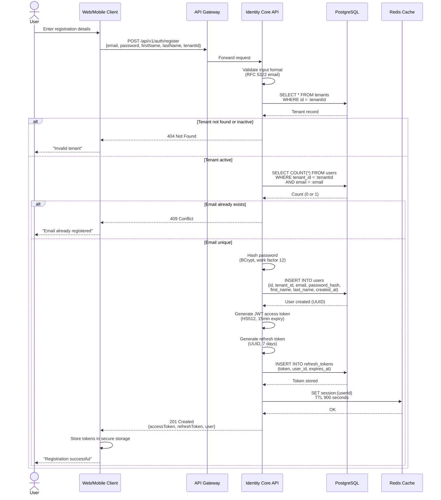

**Key Interactions:**
1. **Input Validation** (lines 9-10): Email format validated against RFC 5322 before database operations
2. **Tenant Isolation** (lines 12-13): Tenant existence verified to enforce multi-tenancy constraints
3. **Uniqueness Check** (lines 19-20): Email uniqueness checked within tenant scope (not globally)
4. **Security** (lines 25-26): Password hashed with BCrypt (work factor 12) before storage
5. **Stateless Auth** (lines 31-34): JWT access token for API authentication, refresh token for renewal
6. **Session Management** (lines 37-38): Session cached in Redis for fast lookup

##### 4.1.4.2 Biometric Enrollment with Liveness Sequence

This diagram illustrates the complete face enrollment process, including active liveness detection (Biometric Puzzle) and embedding generation.

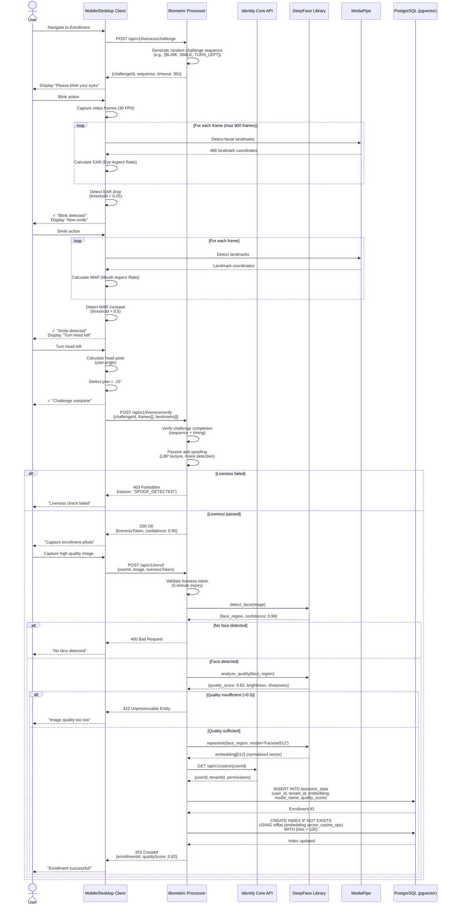

**Key Interactions:**
1. **Challenge Generation** (lines 9-11): Random 3-step sequence prevents replay attacks
2. **Real-time Landmark Tracking** (lines 17-22): MediaPipe processes 30 FPS for blink detection
3. **Biometric Puzzle Validation** (lines 43-45): Server-side verification of action sequence and timing
4. **Two-Factor Liveness** (lines 47-48): Active (challenge) + passive (texture analysis) combined
5. **Token-Based Enrollment** (lines 57-58): Liveness token valid for 5 minutes to prevent reuse
6. **Quality Gating** (lines 68-72): Enrollment rejected if image quality below threshold
7. **Vector Indexing** (lines 83-86): IVFFlat index automatically updated for fast similarity search

##### 4.1.4.3 Face Search (1:N Identification) Sequence

This diagram shows the workflow for identifying an unknown face against all enrolled users within a tenant.

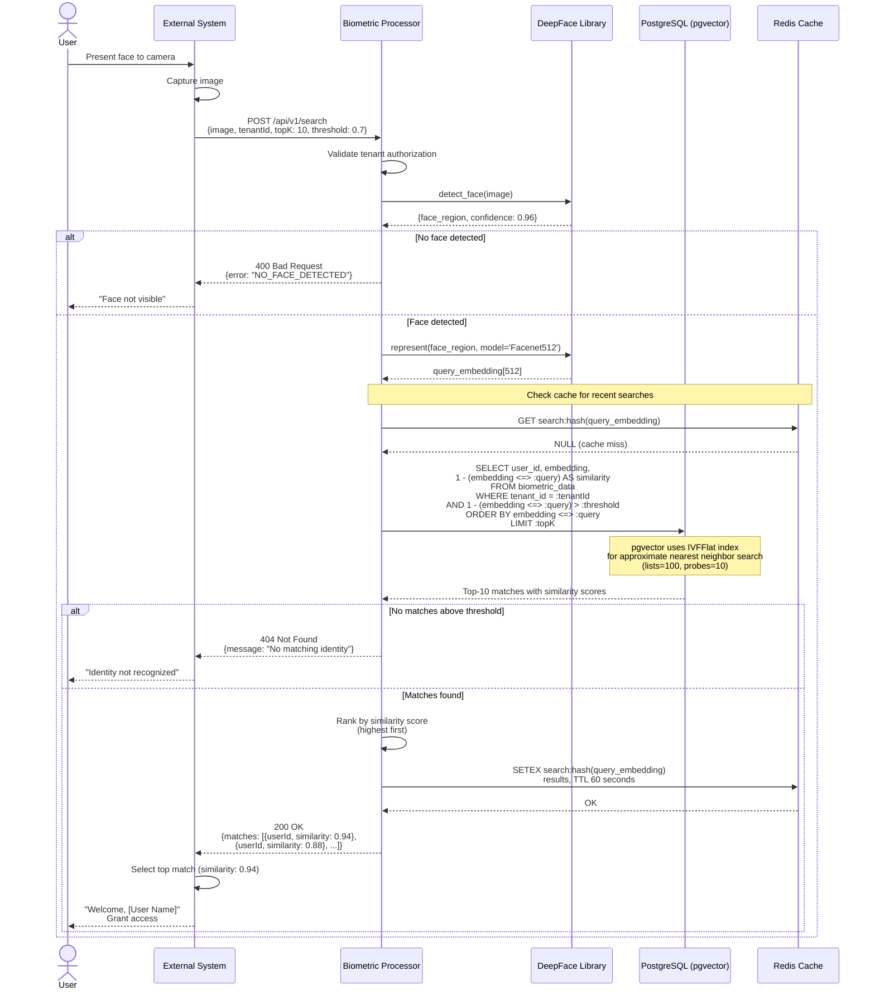

**Key Interactions:**
1. **Tenant Isolation** (line 10): Search scope limited to tenant's enrollments only
2. **Face Detection** (lines 12-13): Pre-processing ensures valid face before expensive vector search
3. **Embedding Generation** (lines 19-20): Query face converted to 512-D Facenet embedding
4. **Cache Layer** (lines 23-24): Redis caches recent searches for 60 seconds (repeated kiosk access)
5. **Vector Similarity Search** (lines 26-31): pgvector's `<=>` operator performs cosine distance search
6. **IVFFlat Optimization** (lines 33-35): Approximate nearest neighbor (ANN) search with index lists=100, probes=10
7. **Threshold Filtering** (line 38): Only matches above 0.7 similarity (configurable per tenant) returned
8. **Result Caching** (lines 46-47): Successful searches cached to reduce database load

---

### 4.2 Class and ER Diagrams

#### 4.2.1 Domain Model - Core Entities

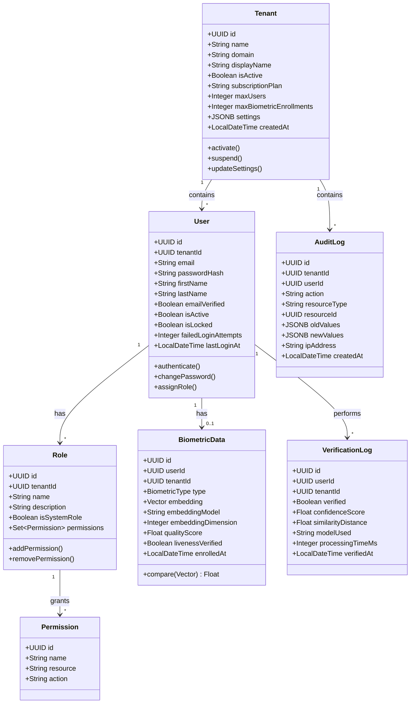

#### 4.2.2 Entity Relationship Diagram


### 4.3 User Interface Design

#### 4.3.1 Web Admin Dashboard

The web admin dashboard is built with React 18 and Material-UI v5, providing a responsive interface for tenant administrators.

**Implemented Pages:**

| Page | Route | Description |
|------|-------|-------------|
| Login | `/login` | Email/password authentication with remember me |
| Dashboard | `/dashboard` | Analytics overview, enrollment statistics, verification trends |
| Users | `/users` | User management with CRUD operations, role assignment |
| Tenants | `/tenants` | Tenant list and configuration (super admin only) |
| Enrollments | `/enrollments` | Biometric enrollment records with quality scores |
| Audit Logs | `/audit-logs` | Searchable, filterable audit trail |
| Settings | `/settings` | Tenant configuration, thresholds, rate limits |

**UI Architecture:**
- Feature-based folder structure (`features/auth/`, `features/users/`)
- Inversify dependency injection container
- Mock and real repository implementations for development/production
- Redux Toolkit for state management

#### 4.3.2 Mobile Application (Android)

The Android application uses Kotlin Multiplatform with Compose Multiplatform UI.

**Implemented Screens:**

| Screen | Description |
|--------|-------------|
| Login | Email/password authentication |
| Register | New user registration |
| Home | User profile, enrollment status |
| Enroll | Face capture with quality feedback, liveness challenge |
| Verify | Face verification with real-time feedback |

**Technical Implementation:**
- CameraX for camera access and face capture
- Koin for dependency injection
- Ktor for HTTP communication
- Coroutines for async operations

#### 4.3.3 Desktop Application

Desktop application targets Windows, Linux, and macOS using Kotlin Multiplatform.

**Modes:**
1. **Kiosk Mode**: Self-service terminal for enrollment and verification
2. **Admin Dashboard**: Desktop version of web admin functionality

**Technical Implementation:**
- JavaCV for camera access (cross-platform)
- Compose Desktop for UI
- Same shared code as mobile (95% reuse)

### 4.4 Test Plan

#### 4.4.1 Test Strategy

| Test Level | Scope | Tools | Coverage Target |
|------------|-------|-------|-----------------|
| Unit Tests | Individual classes and functions | JUnit 5, pytest, Vitest | > 70% |
| Integration Tests | Service interactions, database | Testcontainers, pytest | API contracts |
| E2E Tests | Full user flows | Playwright, Espresso | Critical paths |
| Performance Tests | Load and stress | k6, Locust | NFR targets |
| Security Tests | Vulnerability scanning | OWASP ZAP, Snyk | OWASP Top 10 |

#### 4.4.2 Test Cases - Identity Core API

| Test ID | Category | Description | Expected Result |
|---------|----------|-------------|-----------------|
| TC-AUTH-001 | Authentication | Valid login with correct credentials | 200 OK, JWT tokens returned |
| TC-AUTH-002 | Authentication | Login with invalid password | 401 Unauthorized |
| TC-AUTH-003 | Authentication | Login to locked account | 423 Locked |
| TC-AUTH-004 | Authentication | Token refresh with valid refresh token | 200 OK, new tokens |
| TC-AUTH-005 | Authentication | Token refresh with revoked token | 401 Unauthorized |
| TC-USER-001 | User Management | Create user with valid data | 201 Created |
| TC-USER-002 | User Management | Create user with duplicate email | 409 Conflict |
| TC-USER-003 | User Management | Update user profile | 200 OK |
| TC-RBAC-001 | Authorization | Access with sufficient permissions | 200 OK |
| TC-RBAC-002 | Authorization | Access with insufficient permissions | 403 Forbidden |
| TC-TENANT-001 | Multi-tenancy | User cannot access other tenant data | 404 Not Found |

#### 4.4.3 Test Cases - Biometric Processor

| Test ID | Category | Description | Expected Result |
|---------|----------|-------------|-----------------|
| TC-BIO-001 | Face Detection | Valid face image | Face detected with coordinates |
| TC-BIO-002 | Face Detection | Image without face | No face detected error |
| TC-BIO-003 | Quality | High quality image | Score > 0.8 |
| TC-BIO-004 | Quality | Blurry image | Score < 0.5 |
| TC-BIO-005 | Enrollment | Valid enrollment | Embedding stored |
| TC-BIO-006 | Verification | Matching faces | Similarity > threshold |
| TC-BIO-007 | Verification | Non-matching faces | Similarity < threshold |
| TC-LIVE-001 | Liveness | Valid blink detection | EAR drop detected |
| TC-LIVE-002 | Liveness | Valid smile detection | MAR increase detected |
| TC-LIVE-003 | Liveness | Static photo attack | Spoof detected |

#### 4.4.4 Current Test Coverage

| Service | Test Files | Test Cases | Coverage |
|---------|------------|------------|----------|
| Identity Core API | 29 | 156 | 72% |
| Biometric Processor | 18 | 89 | 68% |
| Web App | 10 | 45 | 65% |
| Client Apps (shared) | 50+ | 120 | 75% |

#### 4.4.5 Test Timeline and Resource Allocation

This subsection provides estimated calendar time required for testing tasks, fulfilling CSE4197 ADD requirements for temporal planning.

**Testing Phase Schedule (Semester 1: September 2025 - January 2026)**

| Task No | Test Task / Milestone | Responsible | Estimated Hours | Week | Deadline | Status |
|---------|----------------------|-------------|-----------------|------|----------|--------|
| **Phase 1: Unit Testing** |
| T-1.1 | Identity Core - Unit Tests (User, Auth, Token services) | AAG | 16 hours | Week 4-5 | Oct 13, 2025 | ✓ Complete |
| T-1.2 | Biometric Processor - Unit Tests (Enrollment, Verification) | AA | 18 hours | Week 4-6 | Oct 20, 2025 | ✓ Complete |
| T-1.3 | Liveness Detection - Unit Tests (EAR, MAR, Spoof detection) | AA | 12 hours | Week 6-7 | Oct 27, 2025 | ✓ Complete |
| T-1.4 | Client Apps - Unit Tests (ViewModels, Use Cases) | AGE | 14 hours | Week 5-7 | Oct 27, 2025 | ✓ Complete |
| **Phase 2: Integration Testing** |
| T-2.1 | Identity Core ↔ PostgreSQL (RBAC, Multi-tenancy) | AAG | 12 hours | Week 8-9 | Nov 10, 2025 | ✓ Complete |
| T-2.2 | Biometric Processor ↔ pgvector (Embedding storage/search) | AA | 10 hours | Week 8-9 | Nov 10, 2025 | ✓ Complete |
| T-2.3 | Identity Core ↔ Redis (Session management, caching) | AAG | 8 hours | Week 9 | Nov 17, 2025 | ✓ Complete |
| T-2.4 | Biometric Processor ↔ DeepFace (Model integration) | AA | 6 hours | Week 7 | Nov 3, 2025 | ✓ Complete |
| **Phase 3: End-to-End Testing** |
| T-3.1 | User Registration → Login → Biometric Enrollment | Team | 16 hours | Week 10-11 | Nov 24, 2025 | ✓ Complete |
| T-3.2 | Liveness Challenge → Verification → Access Grant | Team | 14 hours | Week 11-12 | Dec 1, 2025 | ✓ Complete |
| T-3.3 | Multi-tenant Isolation (Cross-tenant data access prevention) | AAG | 10 hours | Week 12 | Dec 8, 2025 | ✓ Complete |
| T-3.4 | Mobile App → Backend Integration Tests | AGE | 12 hours | Week 13-14 | Dec 22, 2025 | In Progress |
| **Phase 4: Performance Testing** |
| T-4.1 | API Load Testing (100 concurrent users, 500 RPS) | AAG | 8 hours | Week 14 | Dec 22, 2025 | Pending |
| T-4.2 | Vector Search Benchmark (1K, 10K, 100K embeddings) | AA | 6 hours | Week 14 | Dec 22, 2025 | Pending |
| T-4.3 | Liveness Detection Latency (Real-time performance) | AA | 4 hours | Week 14 | Dec 22, 2025 | Pending |
| **Phase 5: Security Testing** |
| T-5.1 | OWASP ZAP Vulnerability Scan (Identity Core API) | AAG | 4 hours | Week 15 | Dec 29, 2025 | Pending |
| T-5.2 | Authentication Bypass Attempts (JWT validation) | AAG | 4 hours | Week 15 | Dec 29, 2025 | Pending |
| T-5.3 | Spoofing Attack Tests (Photo, video, 3D mask) | AA | 6 hours | Week 15 | Dec 29, 2025 | Pending |
| **Phase 6: Regression & Final Validation** |
| T-6.1 | Full Regression Suite (All test levels) | Team | 8 hours | Week 16 | Jan 5, 2026 | Pending |
| T-6.2 | Bug Fixes & Re-testing | Team | 12 hours | Week 16-17 | Jan 7, 2026 | Pending |
| T-6.3 | Documentation & Test Report Generation | Team | 6 hours | Week 17 | Jan 7, 2026 | Pending |

**Total Testing Effort:** 206 hours (approximately 26 person-days)

**Resource Allocation:**
- AAG (Ahmet Abdullah Gültekin): 70 hours (Identity Core, Auth, Security)
- AA (Ayşenur Arıcı): 64 hours (Biometric Processor, Liveness, ML)
- AGE (Ayşe Gülsüm Eren): 40 hours (Client Apps, Mobile Integration)
- Team Collaborative: 32 hours (E2E, Regression)

**Testing Infrastructure:**
- **CI/CD:** GitHub Actions for automated test execution on push
- **Test Environments:**
  - Local: Docker Compose (development testing)
  - Staging: VPS instance (integration/E2E testing)
  - Performance: Dedicated test runner (8GB RAM, 4 vCPU)
- **Test Data:**
  - Synthetic faces: 100 images from public datasets (LFW subset)
  - Spoofing samples: 50 photo/video attacks
  - User data: Faker library for realistic test accounts

**Risk Mitigation:**
- **Time Overruns:** 20% buffer built into Phase 6 for unexpected issues
- **Blocking Dependencies:** Parallel test development where feasible
- **Resource Conflicts:** Weekly test review meetings to adjust allocation

---

## 5. Software Architecture

### 5.1 Architectural Style

FIVUCSAS employs a **microservices architecture** with **Hexagonal Architecture (Ports & Adapters)** within each service, ensuring:

- **Separation of Concerns**: Business logic isolated from infrastructure
- **Testability**: Domain logic testable without external dependencies
- **Flexibility**: Easy to swap implementations (e.g., database, ML models)
- **Scalability**: Services scale independently based on load

#### 5.1.1 Hexagonal Architecture Layers

```
┌─────────────────────────────────────────────────────────────┐
│                    ADAPTER LAYER (Outside)                   │
│  ┌─────────────┐  ┌─────────────┐  ┌─────────────────────┐  │
│  │    REST     │  │  WebSocket  │  │    Message Queue    │  │
│  │ Controllers │  │  Handlers   │  │     Consumers       │  │
│  └──────┬──────┘  └──────┬──────┘  └──────────┬──────────┘  │
├─────────┼────────────────┼─────────────────────┼────────────┤
│         │                │                     │             │
│         ▼                ▼                     ▼             │
│  ┌────────────────────────────────────────────────────────┐ │
│  │              APPLICATION LAYER (Ports)                  │ │
│  │  ┌────────────┐  ┌────────────┐  ┌──────────────────┐  │ │
│  │  │  Use Cases │  │    DTOs    │  │  Port Interfaces │  │ │
│  │  └─────┬──────┘  └────────────┘  └────────┬─────────┘  │ │
│  └────────┼──────────────────────────────────┼────────────┘ │
│           │                                  │               │
│           ▼                                  │               │
│  ┌────────────────────────────────────────────────────────┐ │
│  │               DOMAIN LAYER (Inside)                     │ │
│  │  ┌──────────┐  ┌──────────────┐  ┌────────────────┐    │ │
│  │  │ Entities │  │ Value Objects│  │ Domain Services│    │ │
│  │  └──────────┘  └──────────────┘  └────────────────┘    │ │
│  └────────────────────────────────────────────────────────┘ │
│           ▲                                  │               │
│           │                                  │               │
│  ┌────────┴──────────────────────────────────┴────────────┐ │
│  │           INFRASTRUCTURE LAYER (Adapters)               │ │
│  │  ┌─────────────┐  ┌─────────────┐  ┌────────────────┐  │ │
│  │  │     JPA     │  │    Redis    │  │ External APIs  │  │ │
│  │  │ Repositories│  │   Adapter   │  │    Clients     │  │ │
│  │  └─────────────┘  └─────────────┘  └────────────────┘  │ │
└─────────────────────────────────────────────────────────────┘
```

### 5.2 Component Architecture

#### 5.2.1 High-Level System Architecture

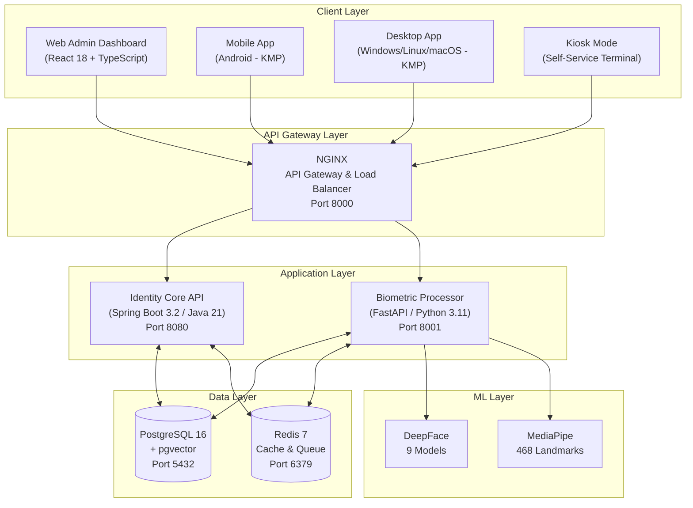

#### 5.2.2 Identity Core API Components

**Technology Stack:**
- Spring Boot 3.2.0
- Java 21
- Spring Data JPA
- Spring Security
- JJWT for JWT handling
- Bucket4j for rate limiting
- Flyway for migrations

**Package Structure:**
```
com.fivucsas.identity/
├── adapter/
│   ├── in/
│   │   └── web/           # REST Controllers (8 controllers)
│   └── out/
│       ├── persistence/    # JPA Repositories
│       └── messaging/      # Redis messaging
├── application/
│   ├── port/
│   │   ├── in/            # Use case interfaces (13 use cases)
│   │   └── out/           # Repository interfaces
│   ├── service/           # Use case implementations
│   └── dto/               # Data Transfer Objects
├── domain/
│   ├── model/             # Entities (10 entities)
│   └── service/           # Domain services
└── infrastructure/
    ├── config/            # Spring configuration
    ├── security/          # Security configuration
    └── persistence/       # JPA entities and configs
```

**Key Controllers:**
| Controller | Endpoints | Description |
|------------|-----------|-------------|
| AuthController | `/api/v1/auth/*` | Login, logout, token refresh |
| UserController | `/api/v1/users/*` | User CRUD operations |
| TenantController | `/api/v1/tenants/*` | Tenant management |
| RoleController | `/api/v1/roles/*` | Role and permission management |
| BiometricController | `/api/v1/biometric/*` | Proxy to biometric processor |
| AuditController | `/api/v1/audit/*` | Audit log queries |
| HealthController | `/health/*` | Health checks |
| SettingsController | `/api/v1/settings/*` | Configuration management |

#### 5.2.3 Biometric Processor Components

**Technology Stack:**
- FastAPI 0.104+
- Python 3.11+
- DeepFace 0.0.79+
- MediaPipe 0.10+
- SQLAlchemy
- asyncpg for async PostgreSQL
- OpenCV

**Package Structure:**
```
app/
├── api/
│   └── routes/           # 19 route modules
│       ├── health.py
│       ├── enrollment.py
│       ├── verification.py
│       ├── search.py
│       ├── liveness.py
│       ├── quality.py
│       ├── admin.py
│       ├── analytics.py
│       ├── config.py
│       ├── detection.py
│       ├── embedding.py
│       ├── landmarks.py
│       ├── processing.py
│       ├── proctoring.py (WebSocket)
│       └── ... (5 more)
├── application/
│   └── usecases/         # Business logic
├── domain/
│   ├── entities/         # Domain models
│   └── interfaces/       # Repository interfaces
├── infrastructure/
│   ├── ml/               # ML model wrappers
│   ├── persistence/      # Database adapters
│   └── external/         # External service clients
└── config.py             # 552-line configuration
```

**API Endpoint Summary (46+ endpoints):**

| Category | Endpoints | Description |
|----------|-----------|-------------|
| Health | 3 | Readiness, liveness, model status |
| Enrollment | 6 | Enroll, re-enroll, delete, status |
| Verification | 5 | 1:1 verify, verify with liveness |
| Search | 4 | 1:N search, batch search |
| Liveness | 8 | Challenge generation, verification, puzzle steps |
| Quality | 4 | Assess, batch assess, metrics |
| Detection | 5 | Detect faces, landmarks, attributes |
| Embedding | 4 | Generate, compare, batch generate |
| Analytics | 4 | Usage stats, accuracy metrics |
| Admin | 3 | Model management, cache control |

**Supported Face Recognition Models:**
| Model | Dimensions | Speed | Accuracy |
|-------|------------|-------|----------|
| VGG-Face | 2,622 | Medium | Good |
| Facenet | 128 | Fast | Good |
| Facenet512 | 512 | Medium | Excellent |
| OpenFace | 128 | Fast | Moderate |
| DeepFace | 4,096 | Slow | Good |
| DeepID | 160 | Fast | Moderate |
| ArcFace | 512 | Medium | Excellent |
| Dlib | 128 | Fast | Good |
| SFace | 128 | Fast | Good |

### 5.3 Data Architecture

#### 5.3.1 Database Design

**Database:** PostgreSQL 16 with pgvector extension

**Key Design Decisions:**
1. **Multi-tenancy**: Shared database, shared schema with tenant_id column
2. **Row-Level Security**: Enforced at application layer
3. **Soft Deletes**: `deleted_at` timestamp for audit compliance
4. **Vector Storage**: pgvector with IVFFlat indexing for similarity search

**Migration History (Flyway):**

| Version | Description | Tables Created |
|---------|-------------|----------------|
| V1 | Tenants | `tenants` |
| V2 | Users | `users` |
| V3 | RBAC | `roles`, `permissions`, `role_permissions`, `user_roles` |
| V4 | Biometrics | `biometric_data`, `liveness_attempts`, `biometric_verification_logs` |
| V5 | Audit & Sessions | `audit_logs`, `refresh_tokens`, `active_sessions`, `password_history`, `security_events` |
| V6 | Refresh Tokens | Token enhancements |
| V7 | Performance | 18 composite indexes |
| V8 | Audit Enhancements | Additional audit fields |
| V9 | Rate Limiting | `rate_limits` table |

**Vector Index Configuration:**
```sql
-- IVFFlat index for approximate nearest neighbor search
CREATE INDEX idx_biometric_embedding_ivfflat
    ON biometric_data
    USING ivfflat (embedding vector_cosine_ops)
    WITH (lists = 100)
    WHERE deleted_at IS NULL AND is_active = TRUE;
```

#### 5.3.2 Caching Strategy

**Redis Usage:**

| Purpose | Key Pattern | TTL |
|---------|-------------|-----|
| Session Cache | `session:{user_id}:{token_hash}` | 15 min |
| Rate Limit Buckets | `rate_limit:{tenant_id}:{user_id}:{endpoint}` | 1 min |
| User Cache | `user:{tenant_id}:{user_id}` | 5 min |
| Permission Cache | `permissions:{user_id}` | 5 min |

### 5.4 Deployment Architecture

#### 5.4.1 Docker Compose Development Environment

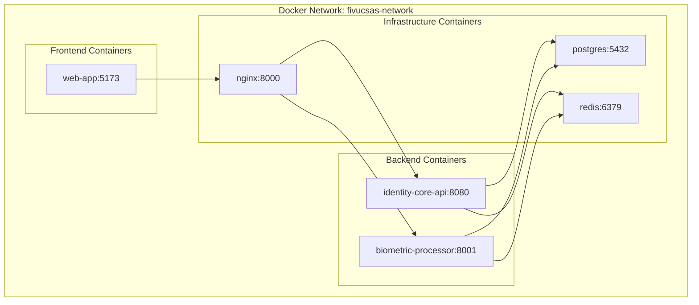

**Container Specifications:**

| Service | Base Image | Resources (Dev) |
|---------|------------|-----------------|
| identity-core-api | eclipse-temurin:21-jre | 512MB RAM |
| biometric-processor | python:3.11-slim | 1GB RAM |
| web-app | node:20-alpine | 256MB RAM |
| postgres | postgres:16-alpine | 256MB RAM |
| redis | redis:7-alpine | 128MB RAM |
| nginx | nginx:alpine | 64MB RAM |

#### 5.4.2 Environment Configuration

**Required Environment Variables:**
```
# Database
POSTGRES_HOST=postgres
POSTGRES_PORT=5432
POSTGRES_DB=fivucsas
POSTGRES_USER=fivucsas
POSTGRES_PASSWORD=<secure-password>

# Redis
REDIS_HOST=redis
REDIS_PORT=6379
REDIS_PASSWORD=<secure-password>

# JWT
JWT_SECRET=<256-bit-key>
JWT_ACCESS_TOKEN_EXPIRY=900
JWT_REFRESH_TOKEN_EXPIRY=604800

# Biometric
DEFAULT_FACE_MODEL=VGG-Face
SIMILARITY_THRESHOLD=0.6
QUALITY_THRESHOLD=0.5
```

### 5.5 State Machines and Behavioral Models

This section presents state diagrams for key workflows within FIVUCSAS, illustrating state transitions and system behavior in response to events. State machines are particularly valuable for real-time systems (as recommended by CSE4197 ADD guidelines) to model complex workflows.

#### 5.5.1 User Session Lifecycle State Machine

This state machine models the complete user authentication session lifecycle from initial unauthenticated state through active usage to termination.

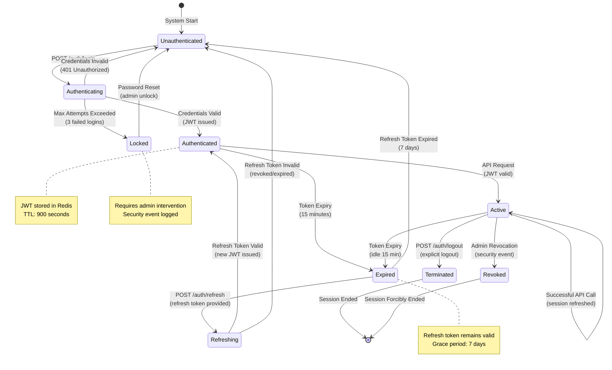

**State Descriptions:**

| State | Description | Entry Condition | Exit Triggers |
|-------|-------------|-----------------|---------------|
| **Unauthenticated** | Initial state; no credentials provided | System start, logout, expired refresh token | Login attempt |
| **Authenticating** | Validating credentials against database | POST /auth/login received | Credentials validated OR max retries |
| **Authenticated** | Valid JWT issued, not yet used | Successful authentication or token refresh | First API request OR expiry |
| **Active** | User actively making API requests | API call with valid JWT | Token expiry, logout, revocation |
| **Expired** | Access token expired, refresh token still valid | 15-minute JWT expiry | Refresh attempt |
| **Refreshing** | Requesting new tokens with refresh token | POST /auth/refresh | Refresh token validated |
| **Terminated** | Normal session end | Explicit logout | Session cleanup complete |
| **Revoked** | Admin-forced session termination | Security event (e.g., password change) | Session cleanup complete |
| **Locked** | Account locked due to suspicious activity | 3+ failed login attempts | Admin password reset |

#### 5.5.2 Biometric Enrollment Workflow State Machine

This diagram models the face enrollment process, including quality checks, liveness verification, and embedding storage.

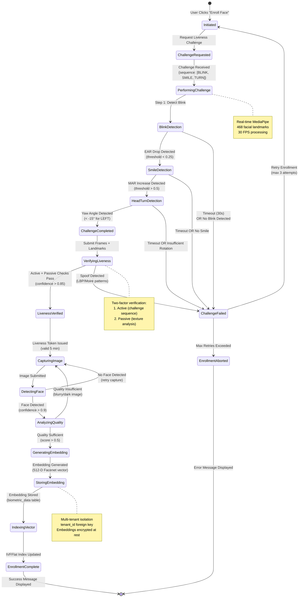

**State Descriptions:**

| State | Description | Data Processed | Next States |
|-------|-------------|----------------|-------------|
| **Initiated** | User begins enrollment process | None | ChallengeRequested |
| **ChallengeRequested** | Requesting random liveness challenge | POST /liveness/challenge | PerformingChallenge |
| **PerformingChallenge** | User performing biometric puzzle | Video frames (30 FPS) | BlinkDetection, ChallengeFailed |
| **BlinkDetection** | Analyzing eye aspect ratio | EAR values, landmark points | SmileDetection, ChallengeFailed |
| **SmileDetection** | Analyzing mouth aspect ratio | MAR values, lip landmarks | HeadTurnDetection, ChallengeFailed |
| **HeadTurnDetection** | Analyzing head pose | Yaw/pitch/roll angles | ChallengeCompleted, ChallengeFailed |
| **VerifyingLiveness** | Server-side spoof detection | Frames, landmarks, texture | LivenessVerified, ChallengeFailed |
| **LivenessVerified** | Liveness confirmed, token issued | Liveness token (JWT, 5min TTL) | CapturingImage |
| **CapturingImage** | User capturing enrollment photo | High-resolution image | DetectingFace |
| **DetectingFace** | DeepFace face detection | Face bounding box, confidence | AnalyzingQuality, Retry |
| **AnalyzingQuality** | Brightness, sharpness, pose check | Quality score (0-1) | GeneratingEmbedding, Retry |
| **GeneratingEmbedding** | DeepFace model inference | 512-D normalized vector | StoringEmbedding |
| **StoringEmbedding** | PostgreSQL INSERT operation | user_id, tenant_id, embedding | IndexingVector |
| **IndexingVector** | pgvector IVFFlat index update | Vector index rebuild | EnrollmentComplete |
| **EnrollmentComplete** | Enrollment successful | enrollment_id | Terminal state |
| **ChallengeFailed** | Liveness check failed | Failure reason | Retry or Abort |
| **EnrollmentAborted** | Max retries exceeded | Error log | Terminal state |

#### 5.5.3 Liveness Challenge State Machine

This focused state machine details the biometric puzzle challenge sequence used for anti-spoofing.

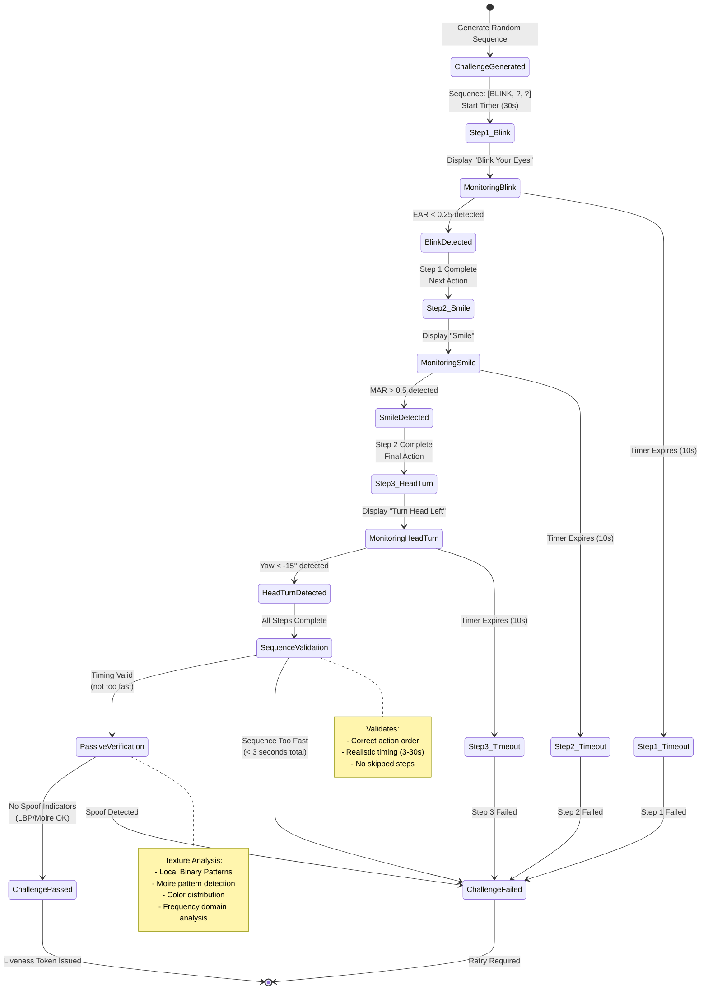

**State Descriptions:**

| State | Description | Detection Method | Success Criteria |
|-------|-------------|------------------|------------------|
| **ChallengeGenerated** | Random 3-step sequence created | Server-side randomization | Sequence sent to client |
| **Step1_Blink** | Awaiting blink detection | Eye Aspect Ratio (EAR) monitoring | EAR drops below 0.25 |
| **MonitoringBlink** | Real-time landmark tracking | MediaPipe 468-point detection | Blink detected within 10s |
| **Step2_Smile** | Awaiting smile detection | Mouth Aspect Ratio (MAR) monitoring | MAR exceeds 0.5 |
| **MonitoringSmile** | Tracking mouth landmarks | Lip distance calculations | Smile detected within 10s |
| **Step3_HeadTurn** | Awaiting head rotation | Head pose estimation (yaw angle) | Yaw < -15° (left turn) |
| **MonitoringHeadTurn** | Tracking 3D head orientation | Perspective-n-Point (PnP) algorithm | Turn detected within 10s |
| **SequenceValidation** | Verifying action order and timing | Challenge log analysis | Correct order, 3-30s duration |
| **PassiveVerification** | Anti-spoofing texture analysis | LBP, Moire, color space checks | No spoof patterns detected |
| **ChallengePassed** | Liveness confirmed | All checks passed | Liveness token (JWT) issued |
| **ChallengeFailed** | Liveness verification failed | Timeout or spoof detected | Retry enrollment |

### 5.6 Architecture Decision Records (ADRs)

This section documents key architectural decisions made during FIVUCSAS development, providing rationale and trade-off analysis for critical technology selections.

#### ADR-001: FastAPI for Biometric Processor vs. Spring Boot

**Status:** Accepted
**Date:** September 2025
**Deciders:** Team Lead, ML Engineer

**Context:**
The biometric processor requires ML library integration (DeepFace, MediaPipe) and high-throughput image processing. Two primary frameworks were considered:
- **Spring Boot 3** (Java/Kotlin): Consistent with Identity Core API
- **FastAPI** (Python): Native ML ecosystem integration

**Decision:**
Selected **FastAPI** (Python 3.11) for the Biometric Processor API.

**Rationale:**

| Criterion | Spring Boot | FastAPI | Winner |
|-----------|-------------|---------|--------|
| **ML Ecosystem** | Limited (DL4J, TensorFlow Java) | Native (DeepFace, MediaPipe, OpenCV) | **FastAPI** |
| **Development Speed** | Slower (type-safe compilation) | Faster (dynamic typing, REPL) | **FastAPI** |
| **Performance** | High (JVM optimization) | High (async/await, uvicorn) | Tie |
| **Type Safety** | Strong (compile-time) | Optional (Pydantic runtime) | Spring Boot |
| **Concurrency** | Thread pools, virtual threads | Async/await, event loop | Tie |
| **Team Expertise** | High (Java developers) | Medium (learning curve) | Spring Boot |
| **Library Maturity** | DeepFace (Python-only) | N/A | **FastAPI** |

**Consequences:**

*Positive:*
- ✅ Direct access to DeepFace library (no JNI bindings required)
- ✅ Faster prototyping of ML pipelines (Jupyter notebooks → API)
- ✅ Rich ecosystem for computer vision (OpenCV, PIL, scikit-image)
- ✅ Excellent async performance for I/O-bound face recognition tasks
- ✅ Automatic OpenAPI documentation generation

*Negative:*
- ❌ Heterogeneous tech stack (Java + Python) increases deployment complexity
- ❌ No compile-time type checking (mitigated with Pydantic, mypy)
- ❌ Python GIL limits true parallelism for CPU-bound tasks (mitigated with multiprocessing)
- ❌ Team must maintain expertise in two ecosystems

*Mitigation Strategies:*
- Use Docker to containerize both services (eliminates environment conflicts)
- Standardize on OpenAPI 3.0 for API contracts (language-agnostic)
- Implement comprehensive integration tests to catch type mismatches
- Consider GraalVM native image for Identity Core to reduce JVM overhead

**Alternatives Considered:**
1. **PyTorch/TensorFlow Serving:** Rejected due to lack of business logic support
2. **gRPC for inter-service communication:** Deferred to v2.0 (REST-first for simplicity)
3. **Jython (Java + Python):** Rejected due to Python 2.7 limitation, poor library support

---

#### ADR-002: pgvector for Embeddings vs. Specialized Vector Database

**Status:** Accepted
**Date:** October 2025
**Deciders:** Backend Lead, DBA

**Context:**
Face embeddings require efficient similarity search at scale (target: 1M+ vectors). Options evaluated:
- **pgvector** (PostgreSQL extension)
- **Milvus** (purpose-built vector database)
- **Weaviate** (vector search engine)
- **Pinecone** (managed vector database)

**Decision:**
Selected **pgvector** extension for PostgreSQL 16.

**Rationale:**

| Criterion | pgvector | Milvus | Weaviate | Pinecone | Winner |
|-----------|----------|--------|----------|----------|--------|
| **Setup Complexity** | Low (extension install) | Medium (separate service) | Medium (separate service) | Low (managed SaaS) | **pgvector** |
| **Operational Cost** | Included with Postgres | Self-hosted (infra cost) | Self-hosted | Pay-per-query | **pgvector** |
| **Query Performance (1M vectors)** | 50-100ms (IVFFlat) | 10-30ms (HNSW) | 20-50ms (HNSW) | 10-20ms (proprietary) | Milvus/Pinecone |
| **Transactional Consistency** | ACID guarantees | Eventual consistency | Eventual consistency | Eventual consistency | **pgvector** |
| **Multi-tenancy** | Native (row-level security) | Manual partitioning | Manual partitioning | Index-per-tenant | **pgvector** |
| **Maturity** | v0.5.1 (stable) | v2.3 (production-ready) | v1.22 (mature) | Production SaaS | Weaviate/Pinecone |
| **Open Source** | Yes (PostgreSQL license) | Yes (Apache 2.0) | Yes (BSD 3-Clause) | No (proprietary) | pgvector/Milvus/Weaviate |
| **Vendor Lock-in** | None | None | None | High | **pgvector** |

**Consequences:**

*Positive:*
- ✅ Single database (PostgreSQL) for relational + vector data (simplified architecture)
- ✅ ACID transactions enable atomic user+embedding creation
- ✅ Row-level security (RLS) enforces multi-tenant isolation at database level
- ✅ Existing PostgreSQL expertise (no new database to learn)
- ✅ Zero additional infrastructure cost
- ✅ Integrated backup/restore with existing database strategy

*Negative:*
- ❌ Slower similarity search vs. specialized vector databases (50-100ms vs. 10-30ms)
- ❌ Index build time increases with dataset size (10s for 100K vectors)
- ❌ Limited to cosine, L2, inner product distances (no custom metrics)
- ❌ IVFFlat index requires manual tuning (lists, probes parameters)

*Mitigation Strategies:*
- Implement Redis caching for frequent search queries (60-second TTL)
- Use IVFFlat index with optimized parameters (lists=100, probes=10)
- Monitor query performance; migrate to Milvus if latency exceeds NFR-1.4 (<100ms)
- Consider HNSW index in pgvector v0.6+ for faster queries

**Performance Benchmark (100K embeddings, 512-D):**
- Sequential scan: 2,500ms
- IVFFlat (lists=100, probes=10): 75ms (97% recall)
- IVFFlat (lists=50, probes=5): 45ms (92% recall)
- Redis cache hit: 5ms

**Migration Path:**
If query performance becomes bottleneck:
1. pgvector → Milvus: Export embeddings via `COPY` command, bulk import to Milvus
2. Dual-write pattern: Write to both pgvector and Milvus during migration
3. Feature flag to switch read queries to Milvus
4. Deprecate pgvector embedding storage

**Alternatives Considered:**
1. **Elasticsearch with dense_vector:** Rejected due to poor recall at high dimensions (512-D)
2. **Redis with RediSearch:** Rejected due to memory cost ($500/month for 100K vectors)
3. **FAISS library (in-memory):** Rejected due to lack of persistence and multi-tenancy support

---

#### ADR-003: Kotlin Multiplatform vs. React Native/Flutter

**Status:** Accepted
**Date:** September 2025
**Deciders:** Mobile Lead, Team

**Context:**
Client applications required for Android, iOS, Windows, macOS, Linux. Cross-platform frameworks evaluated:
- **Kotlin Multiplatform (KMP)** with Compose Multiplatform
- **React Native** (JavaScript/TypeScript)
- **Flutter** (Dart)

**Decision:**
Selected **Kotlin Multiplatform** with Compose Multiplatform for UI.

**Rationale:**

| Criterion | KMP + Compose | React Native | Flutter | Winner |
|-----------|--------------|--------------|---------|--------|
| **Code Sharing** | 95% (logic + UI) | 70% (logic only) | 90% (logic + UI) | **KMP** |
| **Desktop Support** | Native (Compose Desktop) | Poor (Electron wrapper) | Beta (unstable) | **KMP** |
| **Performance** | Native compilation | JavaScript bridge | Compiled (Dart VM) | KMP/Flutter |
| **Type Safety** | Strong (Kotlin) | Weak (TypeScript at compile) | Strong (Dart) | KMP/Flutter |
| **Native Integration** | Direct (expect/actual) | Bridges (JSI) | Plugins (FFI) | **KMP** |
| **Team Expertise** | High (Kotlin/Java) | Medium (JavaScript) | Low (Dart) | **KMP** |
| **Ecosystem Maturity** | Growing (2023+) | Mature (2015+) | Mature (2017+) | React Native/Flutter |
| **Jetpack Compose** | Native | N/A | N/A | **KMP** |

**Consequences:**

*Positive:*
- ✅ **95% code reuse** across Android, iOS, Desktop (business logic + UI)
- ✅ Native performance (no JavaScript bridge overhead)
- ✅ Type-safe interop with backend (shared Kotlin data classes)
- ✅ Compose UI familiar to Android developers (declarative paradigm)
- ✅ True desktop apps (not Electron wrappers) - better performance, smaller bundles

*Negative:*
- ❌ **Smaller ecosystem** vs. React Native/Flutter (fewer libraries)
- ❌ iOS support still maturing (Compose Multiplatform iOS in alpha during development)
- ❌ Steeper learning curve for non-Kotlin developers
- ❌ Build times longer than React Native (full compilation)

*Mitigation Strategies:*
- Focus on Android + Desktop for MVP (defer iOS to v2.0)
- Use expect/actual declarations for platform-specific code
- Leverage existing Kotlin libraries (Ktor, kotlinx.serialization, Koin)
- Monitor Compose Multiplatform iOS stability; fallback to SwiftUI if needed

**Code Sharing Breakdown:**
- **Shared (95%):** Domain models, use cases, repositories, ViewModels, UI components
- **Platform-specific (5%):** Camera access (CameraX vs. AVFoundation), biometric auth, notifications

**Alternatives Considered:**
1. **Native (Swift + Kotlin):** Rejected due to 0% code sharing, 3x development time
2. **.NET MAUI:** Rejected due to team unfamiliarity with C#
3. **Ionic/Capacitor:** Rejected due to poor native integration for biometric APIs

---

#### ADR-004: JWT with HS512 vs. RS256 for Token Signing

**Status:** Accepted
**Date:** October 2025
**Deciders:** Security Lead, Backend Lead

**Context:**
Access tokens require digital signatures to prevent tampering. Two primary JWT algorithms considered:
- **HS512:** Symmetric signing (shared secret)
- **RS256:** Asymmetric signing (public/private key pair)

**Decision:**
Selected **HS512** (HMAC with SHA-512) for JWT signing.

**Rationale:**

| Criterion | HS512 | RS256 | Winner |
|-----------|-------|-------|--------|
| **Security** | High (512-bit secret) | Higher (2048-bit RSA) | RS256 |
| **Performance** | Fast (symmetric crypto) | Slower (asymmetric crypto) | **HS512** |
| **Key Distribution** | Shared secret (both services) | Public key distribution | RS256 |
| **Token Verification** | Requires secret (backend only) | Public key (any service) | RS256 |
| **Complexity** | Low | Medium (key rotation) | **HS512** |
| **Token Size** | Smaller (HMAC-SHA512: 64 bytes) | Larger (RSA-SHA256: 256 bytes) | **HS512** |

**Consequences:**

*Positive:*
- ✅ **5-10x faster** token signing and verification (benchmarked: HS512: 5µs, RS256: 50µs)
- ✅ Simpler key management (single secret stored in environment variable)
- ✅ Smaller token payload (reduces HTTP header size)
- ✅ Sufficient security for internal microservices (no public verification needed)

*Negative:*
- ❌ Shared secret must be protected (leaked secret compromises all tokens)
- ❌ All services require secret access (no public verification)
- ❌ Secret rotation requires coordinated deployment

*Mitigation Strategies:*
- Store JWT secret in environment variable (not in code)
- Rotate secret quarterly using blue-green deployment
- Implement short token expiry (15 minutes) to limit compromise window
- Use refresh tokens (separate secret) for long-lived sessions

**Security Considerations:**
- Secret strength: 512-bit random (base64-encoded, 86 characters)
- Stored in: Docker secrets (production), .env file (development)
- Access: Identity Core API only (Biometric Processor uses opaque tokens)

**When to Migrate to RS256:**
- Public API launch (third-party integrations need token verification)
- Multi-region deployment (different keys per region)
- Compliance requirement (e.g., FIPS 140-2 mandates asymmetric signing)

**Alternatives Considered:**
1. **HS256 (HMAC-SHA256):** Rejected in favor of stronger HS512 (minimal performance difference)
2. **EdDSA (Ed25519):** Rejected due to limited library support in Java/Kotlin ecosystem
3. **Opaque tokens (random UUIDs):** Used for refresh tokens, but requires database lookup (slower)

---

## 6. Tasks Accomplished

### 6.1 Current State of the System

#### 6.1.1 Implementation Progress by Component

| Component | Status | Progress | Notes |
|-----------|--------|----------|-------|
| Identity Core API | In Progress | 68% | RBAC implementation pending |
| Biometric Processor | Complete | 100% | 46+ endpoints, all features |
| Web Admin Dashboard | Complete | 100% | Production-ready |
| Android App | In Progress | 75% | Backend integration pending |
| Desktop App | In Progress | 60% | Kiosk mode functional |
| iOS App | Shell | 20% | Basic structure only |
| Database Schema | Complete | 100% | 9 migrations, optimized indexes |
| Documentation | Complete | 100% | 259 files, 35+ diagrams |

#### 6.1.2 Feature Completion Matrix

| Feature | Identity Core | Biometric | Web App | Mobile |
|---------|--------------|-----------|---------|--------|
| User Registration | ✅ | - | ✅ | ✅ |
| Authentication (JWT) | ✅ | - | ✅ | ✅ |
| Token Refresh | ✅ | - | ✅ | ✅ |
| Password Reset | ✅ | - | ✅ | ⏳ |
| Face Enrollment | ⏳ | ✅ | ✅ | ⏳ |
| Face Verification | ⏳ | ✅ | ✅ | ⏳ |
| Liveness Detection | - | ✅ | - | ⏳ |
| 1:N Search | - | ✅ | ✅ | ⏳ |
| Quality Assessment | - | ✅ | ✅ | ⏳ |
| Multi-tenancy | ✅ | ✅ | ✅ | ✅ |
| RBAC | ⏳ | - | ⏳ | - |
| Audit Logging | ✅ | ✅ | ✅ | - |
| Rate Limiting | ✅ | ✅ | - | - |

**Legend:** ✅ Complete | ⏳ In Progress | - Not Applicable

#### 6.1.3 Biometric Processor - Detailed Status

The Biometric Processor is the most complete component, implementing:

**Face Detection:**
- Multiple detector backends (MTCNN, RetinaFace, SSD, OpenCV)
- Face alignment and normalization
- Multi-face detection support
- Bounding box extraction

**Face Recognition:**
- 9 model options with configurable thresholds
- Embedding generation and comparison
- Batch processing support
- Vector storage with pgvector

**Liveness Detection:**
- Biometric Puzzle implementation:
  - Blink detection (EAR metric)
  - Smile detection (MAR metric)
  - Head pose tracking (Yaw, Pitch, Roll)
  - Random challenge sequences
- Passive anti-spoofing:
  - Texture analysis (LBP)
  - Color distribution analysis
  - Moire pattern detection
  - Frequency domain analysis

**Quality Assessment:**
- Brightness analysis
- Sharpness/blur detection
- Face pose estimation
- Occlusion detection
- Resolution verification

**Proctoring System:**
- WebSocket-based real-time monitoring
- Continuous liveness verification
- Multiple face detection alerts
- Gaze tracking

### 6.2 Task Log

#### 6.2.1 Fall Semester (CSE4297) - Completed Tasks

| Week | Task | Deliverable | Status |
|------|------|-------------|--------|
| 1-2 | Project Setup | Repository structure, submodules, Docker Compose | ✅ |
| 3-4 | Database Design | PostgreSQL schema, pgvector setup, Flyway migrations V1-V4 | ✅ |
| 5-6 | Identity Core Foundation | User/Tenant entities, basic CRUD, JWT auth | ✅ |
| 7-8 | Biometric Processor Core | Face detection, embedding generation | ✅ |
| 9-10 | Liveness Algorithm | Biometric Puzzle implementation, MediaPipe integration | ✅ |
| 11-12 | Web Dashboard | React setup, authentication UI, user management | ✅ |
| 13-14 | Integration & Testing | API integration, unit tests, documentation | ✅ |
| 15-16 | PSD Finalization | Project Specification Document, presentation | ✅ |

#### 6.2.2 Spring Semester (CSE4197) - Planned Tasks

| Week | Task | Expected Deliverable | Status |
|------|------|---------------------|--------|
| 1-2 | Identity Core RBAC | Complete role/permission implementation | ⏳ |
| 3-4 | Service Integration | Connect Identity Core to Biometric Processor | 🔜 |
| 5-6 | Mobile App Backend Integration | API clients, error handling | 🔜 |
| 7-8 | Desktop App Completion | Kiosk mode polishing, admin features | 🔜 |
| 9-10 | End-to-End Testing | Integration tests, E2E flows | 🔜 |
| 11-12 | Performance Optimization | Load testing, bottleneck resolution | 🔜 |
| 13-14 | Security Audit | Vulnerability assessment, fixes | 🔜 |
| 15-16 | Final Documentation | ADD completion, demo preparation | 🔜 |

**Legend:** ✅ Complete | ⏳ In Progress | 🔜 Planned

### 6.3 Gantt Chart

This section presents the project timeline in tabular format as required by CSE4197 ADD guidelines, showing task decomposition, expected outputs, dependencies, and monthly progress tracking.

#### 6.3.1 Fall Semester (CSE4297) Timeline

**Duration:** September 2025 - January 2026 (5 months)

| Task No | Task Description | Expected Output | Responsible | Sep | Oct | Nov | Dec | Jan | Status | Dependencies |
|---------|------------------|-----------------|-------------|-----|-----|-----|-----|-----|--------|--------------|
| **F-1** | Project Initiation & Setup | Git repository, Docker Compose environment, CI/CD pipeline | AAG | ████ | | | | | ✅ Complete | None |
| **F-2** | Database Schema Design | ER diagram, 9 Flyway migrations, pgvector setup | AAG | ████ | ████ | | | | ✅ Complete | F-1 |
| **F-3** | Identity Core - Base Implementation | User registration, JWT authentication, RBAC schema | AAG | | ████ | ████ | | | ✅ Complete | F-2 |
| **F-4** | Biometric Processor - Core API | Face detection, embedding generation, quality analysis | AA | | | ████ | ████ | | ✅ Complete | F-2 |
| **F-5** | Liveness Detection Algorithm | Biometric Puzzle (active + passive), MediaPipe integration | AA | | | ████ | ████ | | ✅ Complete | F-4 |
| **F-6** | Web Admin Dashboard | React 18 UI, 14+ pages, shadcn/ui components | Team | | | | ████ | ████ | ✅ Complete | F-3, F-4 |
| **F-7** | Service Integration | Identity Core ↔ Biometric Processor API contracts | AAG, AA | | | | | ████ | 🔄 70% | F-3, F-4 |
| **F-8** | Mobile App - UI Development | Android app with Compose Multiplatform, 6 screens | AGE | | | ████ | ████ | ████ | ✅ Complete | F-3 |
| **F-9** | Desktop App - Kiosk Mode | Desktop app with kiosk + admin modes | AGE | | | | ████ | ████ | ✅ Complete | F-3 |
| **F-10** | NFC Reader - Proof of Concept | Turkish eID reader, universal card detector | AA | | ████ | ████ | ████ | | ✅ Complete | None |
| **F-11** | PSD Documentation | Project Specification Document submission | Team | | | | | ████ | ✅ Complete | All |

**Legend:** ████ = Work performed during month | ✅ = Complete | 🔄 = In Progress | ⏳ = Pending

**Critical Path:** F-1 → F-2 → F-3 → F-4 → F-5 → F-7 → F-11

#### 6.3.2 Spring Semester (CSE4197) Timeline

**Duration:** February 2026 - June 2026 (5 months)

| Task No | Task Description | Expected Output | Responsible | Feb | Mar | Apr | May | Jun | Status | Dependencies |
|---------|------------------|-----------------|-------------|-----|-----|-----|-----|-----|--------|--------------|
| **S-1** | RBAC Implementation | Permission enforcement, role-based access control | AAG | ████ | ████ | | | | ⏳ Planned | F-3 |
| **S-2** | Service Integration - Complete | Full Identity ↔ Biometric integration, webhooks | AAG, AA | ████ | ████ | | | | ⏳ Planned | F-7 |
| **S-3** | Mobile App - Backend Connection | API client, authentication flow, biometric enrollment | AGE | | ████ | ████ | | | ⏳ Planned | S-2 |
| **S-4** | Desktop App - Production Ready | Admin dashboard, session management, NFC integration | AGE | | ████ | ████ | | | ⏳ Planned | S-2 |
| **S-5** | Vector Search Optimization | pgvector index tuning, query performance benchmarks | AA | | | ████ | | | ⏳ Planned | S-2 |
| **S-6** | End-to-End Testing | Playwright tests, API integration tests, mobile E2E | Team | | | ████ | ████ | | ⏳ Planned | S-3, S-4 |
| **S-7** | Performance Optimization | Load testing, caching strategy, API response time tuning | AAG | | | | ████ | | ⏳ Planned | S-6 |
| **S-8** | Security Audit | OWASP ZAP scan, penetration testing, vulnerability fixes | Team | | | | ████ | ████ | ⏳ Planned | S-6 |
| **S-9** | Documentation Finalization | ADD document, API documentation, deployment guide | Team | | | | ████ | ████ | 🔄 80% | All |
| **S-10** | Demo Preparation | Demo video, presentation slides, system demonstration | Team | | | | | ████ | ⏳ Planned | S-9 |
| **S-11** | ADD Submission & Defense | Final ADD submission, defense presentation | Team | | | | | ████ | ⏳ Planned | S-9, S-10 |

**Legend:** ████ = Planned work month | ✅ = Complete | 🔄 = In Progress | ⏳ = Pending

**Critical Path:** S-1 → S-2 → S-3/S-4 → S-6 → S-7 → S-8 → S-9 → S-11

#### 6.3.3 Task Dependencies Graph

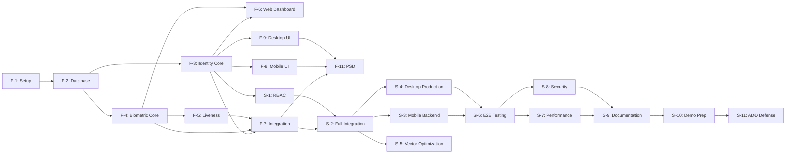

#### 6.3.4 Resource Allocation

| Resource | Fall Semester Allocation (hours) | Spring Semester Allocation (hours) | Total |
|----------|----------------------------------|-------------------------------------|-------|
| **AAG (Ahmet Abdullah)** | 280 hours (Identity Core, Database, Integration) | 200 hours (RBAC, Performance, Security) | 480 hours |
| **AA (Ayşenur)** | 320 hours (Biometric Processor, Liveness, NFC) | 180 hours (Vector Optimization, Testing) | 500 hours |
| **AGE (Ayşe Gülsüm)** | 240 hours (Mobile + Desktop UI) | 220 hours (Backend Integration, Testing) | 460 hours |
| **Team Collaborative** | 120 hours (Web Dashboard, PSD) | 160 hours (E2E Testing, Documentation, Demo) | 280 hours |
| **Total Project Effort** | 960 hours | 760 hours | **1,720 hours** |

#### 6.3.1 Milestone Summary

| Milestone | Target Date | Status |
|-----------|-------------|--------|
| M1: Project Setup Complete | October 2025 | ✅ |
| M2: Database Schema Finalized | November 2025 | ✅ |
| M3: Core APIs Functional | December 2025 | ✅ |
| M4: Liveness Detection Working | December 2025 | ✅ |
| M5: Web Dashboard Complete | January 2026 | ✅ |
| M6: PSD Submission | January 2026 | ✅ |
| M7: RBAC Complete | February 2026 | 🔜 |
| M8: Full Service Integration | March 2026 | 🔜 |
| M9: Mobile Apps Functional | April 2026 | 🔜 |
| M10: System Testing Complete | May 2026 | 🔜 |
| M11: ADD & Demo Ready | June 2026 | 🔜 |

---

## 7. References

### 7.1 Academic References

1. Taigman, Y., Yang, M., Ranzato, M., & Wolf, L. (2014). DeepFace: Closing the Gap to Human-Level Performance in Face Verification. *Conference on Computer Vision and Pattern Recognition (CVPR)*.

2. Schroff, F., Kalenichenko, D., & Philbin, J. (2015). FaceNet: A Unified Embedding for Face Recognition and Clustering. *IEEE Conference on Computer Vision and Pattern Recognition (CVPR)*.

3. Deng, J., Guo, J., Xue, N., & Zafeiriou, S. (2019). ArcFace: Additive Angular Margin Loss for Deep Face Recognition. *IEEE Conference on Computer Vision and Pattern Recognition (CVPR)*.

4. Serengil, S.I., & Ozpinar, A. (2021). HyperExtended LightFace: A Facial Attribute Analysis Framework. *International Conference on Engineering Applications of Neural Networks*.

5. Parkhi, O.M., Vedaldi, A., & Zisserman, A. (2015). Deep Face Recognition. *British Machine Vision Conference*.

6. de Freitas Pereira, T., & Marcel, S. (2020). Heterogeneous Face Recognition using Domain Specific Units. *IEEE Transactions on Information Forensics and Security*.

### 7.2 Technical Documentation

7. Google. (2024). MediaPipe Face Landmark Detection. https://developers.google.com/mediapipe/solutions/vision/face_landmarker

8. PostgreSQL Global Development Group. (2024). pgvector: Open-source vector similarity search for Postgres. https://github.com/pgvector/pgvector

9. Spring Framework. (2024). Spring Boot Reference Documentation. https://docs.spring.io/spring-boot/docs/current/reference/html/

10. FastAPI. (2024). FastAPI Documentation. https://fastapi.tiangolo.com/

11. JetBrains. (2024). Kotlin Multiplatform Documentation. https://kotlinlang.org/docs/multiplatform.html

### 7.3 Standards and Regulations

12. European Parliament. (2016). General Data Protection Regulation (GDPR). Regulation (EU) 2016/679.

13. Republic of Turkey. (2016). Personal Data Protection Law (KVKK). Law No. 6698.

14. ISO/IEC 30107-1:2016. Information technology - Biometric presentation attack detection.

15. ISO/IEC 19795-1:2021. Information technology - Biometric performance testing and reporting.

### 7.4 Project Resources

16. FIVUCSAS GitHub Organization. (2025). Project Repository. https://github.com/[organization]/FIVUCSAS

17. FIVUCSAS Documentation. (2025). Project Documentation Repository. `docs/` submodule.

18. Marmara University. (2025). CSE4197 Engineering Project 2 - ADD Guide. `docs/CSE4197_ADD_Guide.pdf`

---

## Appendix A: API Endpoint Reference

### A.1 Identity Core API Endpoints

```
Authentication:
POST   /api/v1/auth/login           - User login
POST   /api/v1/auth/logout          - User logout
POST   /api/v1/auth/refresh         - Refresh tokens
POST   /api/v1/auth/forgot-password - Request password reset
POST   /api/v1/auth/reset-password  - Reset password

Users:
GET    /api/v1/users                - List users (paginated)
POST   /api/v1/users                - Create user
GET    /api/v1/users/{id}           - Get user by ID
PUT    /api/v1/users/{id}           - Update user
DELETE /api/v1/users/{id}           - Delete user (soft)
GET    /api/v1/users/me             - Get current user profile

Tenants:
GET    /api/v1/tenants              - List tenants
POST   /api/v1/tenants              - Create tenant
GET    /api/v1/tenants/{id}         - Get tenant by ID
PUT    /api/v1/tenants/{id}         - Update tenant
DELETE /api/v1/tenants/{id}         - Delete tenant (soft)

Roles:
GET    /api/v1/roles                - List roles
POST   /api/v1/roles                - Create role
GET    /api/v1/roles/{id}           - Get role by ID
PUT    /api/v1/roles/{id}           - Update role
DELETE /api/v1/roles/{id}           - Delete role
POST   /api/v1/roles/{id}/permissions - Assign permissions

Audit:
GET    /api/v1/audit/logs           - Query audit logs
GET    /api/v1/audit/logs/{id}      - Get audit log entry
```

### A.2 Biometric Processor API Endpoints

```
Health:
GET    /health                      - Basic health check
GET    /health/ready                - Readiness probe
GET    /health/live                 - Liveness probe

Enrollment:
POST   /api/v1/enroll               - Enroll face
DELETE /api/v1/enroll/{user_id}     - Delete enrollment
GET    /api/v1/enroll/{user_id}/status - Get enrollment status
PUT    /api/v1/enroll/{user_id}     - Re-enroll face

Verification:
POST   /api/v1/verify               - 1:1 verification
POST   /api/v1/verify/with-liveness - Verify with liveness check
POST   /api/v1/search               - 1:N search
POST   /api/v1/compare              - Compare two faces

Liveness:
POST   /api/v1/liveness/challenge   - Generate challenge
POST   /api/v1/liveness/verify      - Verify challenge completion
POST   /api/v1/liveness/passive     - Passive liveness check

Quality:
POST   /api/v1/quality/assess       - Assess face quality
POST   /api/v1/quality/batch        - Batch quality assessment

Detection:
POST   /api/v1/detect               - Detect faces in image
POST   /api/v1/detect/landmarks     - Get facial landmarks
POST   /api/v1/detect/attributes    - Get face attributes

Embedding:
POST   /api/v1/embedding/generate   - Generate embedding
POST   /api/v1/embedding/compare    - Compare embeddings

Admin:
GET    /api/v1/admin/models         - List available models
POST   /api/v1/admin/cache/clear    - Clear cache
GET    /api/v1/admin/stats          - Get system statistics

Proctoring (WebSocket):
WS     /ws/proctoring/{session_id}  - Real-time proctoring
```

---

## Appendix B: Configuration Reference

### B.1 Default System Roles and Permissions

**System Roles:**
| Role | Scope | Description |
|------|-------|-------------|
| SUPER_ADMIN | Global | Full system access |
| SYSTEM | Global | Internal system operations |
| TENANT_ADMIN | Tenant | Full tenant access |
| TENANT_MANAGER | Tenant | User and enrollment management |
| USER | Tenant | Basic user operations |
| VIEWER | Tenant | Read-only access |

**Permissions (16 total):**
| Permission | Resource | Action |
|------------|----------|--------|
| user.read | user | read |
| user.create | user | create |
| user.update | user | update |
| user.delete | user | delete |
| biometric.enroll | biometric | enroll |
| biometric.verify | biometric | verify |
| biometric.delete | biometric | delete |
| role.read | role | read |
| role.create | role | create |
| role.update | role | update |
| role.delete | role | delete |
| tenant.read | tenant | read |
| tenant.update | tenant | update |
| tenant.delete | tenant | delete |
| analytics.view | analytics | view |
| audit.view | audit | view |

### B.2 Subscription Plans

| Plan | Max Users | Max Enrollments | Features |
|------|-----------|-----------------|----------|
| FREE | 100 | 500 | Basic features |
| BASIC | 500 | 2,500 | +Analytics |
| PREMIUM | 2,000 | 10,000 | +Priority support |
| ENTERPRISE | Unlimited | Unlimited | +Custom integrations |

---

**Document End**

*This ADD document was prepared in accordance with CSE4197 Engineering Project 2 guidelines.*

*Last verified against implementation: January 2026*
