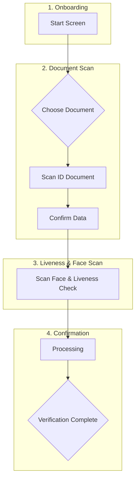

# FIVUCSAS Application UX Design Guide

**Version:** 2.0
**Last Updated:** December 2025
**Status:** Production Ready

This document outlines the user experience (UX) design principles, design system, and application flow for the FIVUCSAS identity verification platform. The design prioritizes trust, simplicity, accessibility, and a high success rate for all users.

---

## Table of Contents

1. [UX Philosophy & Core Principles](#1-ux-philosophy--core-principles)
2. [Design System](#2-design-system)
3. [User Personas](#3-user-personas)
4. [Application Flows](#4-application-flows)
5. [Screen-by-Screen Design](#5-screen-by-screen-design)
6. [Component Library](#6-component-library)
7. [Accessibility Guidelines](#7-accessibility-guidelines)
8. [Micro-interactions & Animations](#8-micro-interactions--animations)
9. [Error Handling & Recovery](#9-error-handling--recovery)
10. [Form Design & Validation](#10-form-design--validation)
11. [Responsive Design](#11-responsive-design)
12. [Performance Guidelines](#12-performance-guidelines)
13. [Testing & Validation](#13-testing--validation)

---

## 1. UX Philosophy & Core Principles

The primary goal is to make the identity verification process feel secure, fast, and intuitive across all platforms.

### Core Principles

| Principle | Description | Implementation |
|-----------|-------------|----------------|
| **Trust & Transparency** | Users should always feel in control and informed | Clear privacy notices, data usage explanations, visible security indicators |
| **Simplicity & Guidance** | Clean, uncluttered interface with step-by-step instructions | Progressive disclosure, contextual help, visual guides |
| **Efficiency & Speed** | Process should be as fast as possible | Auto-capture, OCR, pre-filled forms, minimal steps |
| **Accessibility** | Usable by everyone, following WCAG 2.1 AA | Screen reader support, high contrast, keyboard navigation |
| **Consistency** | Same patterns across all platforms | Unified design system, shared components |
| **Forgiveness** | Easy error recovery | Clear error messages, undo options, retry flows |

### **[CLAUDE'S ENHANCEMENT]** Cognitive Load Reduction

> Design decisions should minimize cognitive load by:
> - **Chunking information**: Break complex tasks into 3-5 step wizards
> - **Recognition over recall**: Use visual cues instead of requiring memory
> - **Progressive disclosure**: Show only relevant options at each step
> - **Sensible defaults**: Pre-select the most common options
> - **Visible system status**: Always show where users are in a process

---

## 2. Design System

### 2.1 Color Palette

#### Primary Colors
```
Primary Blue:     #1976D2  (Main actions, links, focus states)
Primary Light:    #42A5F5  (Hover states, backgrounds)
Primary Dark:     #1565C0  (Active states, emphasis)
```

#### Secondary Colors
```
Secondary Purple: #9C27B0  (Accent, highlights)
Secondary Light:  #BA68C8  (Hover states)
Secondary Dark:   #7B1FA2  (Active states)
```

#### Semantic Colors
```
Success Green:    #2E7D32  (Confirmations, completed states)
Success Light:    #4CAF50  (Backgrounds, icons)
Error Red:        #D32F2F  (Errors, destructive actions)
Error Light:      #EF5350  (Backgrounds)
Warning Orange:   #ED6C02  (Warnings, attention needed)
Warning Light:    #FF9800  (Backgrounds)
Info Blue:        #0288D1  (Information, tips)
Info Light:       #03A9F4  (Backgrounds)
```

#### Neutral Colors
```
Background:       #F5F5F5  (Page background)
Surface:          #FFFFFF  (Cards, panels)
Border:           #E0E0E0  (Dividers, borders)
Text Primary:     #212121  (Headings, primary text)
Text Secondary:   #757575  (Secondary text, captions)
Text Disabled:    #BDBDBD  (Disabled states)
```

### **[CLAUDE'S ENHANCEMENT]** Dark Mode Colors

> For dark mode support (recommended for kiosk environments):
> ```
> Dark Background:     #121212
> Dark Surface:        #1E1E1E
> Dark Surface 2:      #2D2D2D
> Dark Text Primary:   #FFFFFF
> Dark Text Secondary: #B3B3B3
> Dark Primary:        #90CAF9
> Dark Success:        #81C784
> Dark Error:          #EF5350
> ```

### 2.2 Typography

#### Font Family
```
Primary:    "Roboto", "Helvetica Neue", Arial, sans-serif
Monospace:  "Roboto Mono", "Consolas", monospace
```

#### Type Scale
| Name | Size | Weight | Line Height | Use Case |
|------|------|--------|-------------|----------|
| Display | 56sp | 400 | 64sp | Kiosk welcome screens |
| H1 | 40px / 2.5rem | 500 | 48px | Page titles |
| H2 | 32px / 2rem | 500 | 40px | Section headers |
| H3 | 28px / 1.75rem | 500 | 36px | Card titles |
| H4 | 24px / 1.5rem | 500 | 32px | Subsections |
| H5 | 20px / 1.25rem | 500 | 28px | List headers |
| H6 | 16px / 1rem | 500 | 24px | Small headers |
| Body 1 | 16px / 1rem | 400 | 24px | Primary text |
| Body 2 | 14px / 0.875rem | 400 | 20px | Secondary text |
| Caption | 12px / 0.75rem | 400 | 16px | Captions, hints |
| Button | 14px / 0.875rem | 500 | 16px | Buttons |

### 2.3 Spacing System

```
xs:     4px  (0.25rem)   - Inline spacing, icon margins
sm:     8px  (0.5rem)    - Tight spacing
md:     16px (1rem)      - Default spacing
lg:     24px (1.5rem)    - Section spacing
xl:     32px (2rem)      - Large gaps
xxl:    48px (3rem)      - Page sections
xxxl:   64px (4rem)      - Major separations
```

### 2.4 Elevation & Shadows

| Level | Shadow | Use Case |
|-------|--------|----------|
| 0 | none | Flat elements |
| 1 | `0 1px 3px rgba(0,0,0,0.12)` | Subtle elevation (buttons) |
| 2 | `0 2px 4px rgba(0,0,0,0.1)` | Cards, panels |
| 3 | `0 4px 8px rgba(0,0,0,0.12)` | Dropdown menus |
| 4 | `0 8px 16px rgba(0,0,0,0.14)` | Dialogs, modals |
| 5 | `0 16px 24px rgba(0,0,0,0.16)` | Focus state overlays |

### 2.5 Border Radius

```
Sharp:    0px      - Tables, inline elements
Small:    4px      - Chips, tags
Medium:   8px      - Buttons, inputs, small cards
Large:    16px     - Cards, panels
XLarge:   24px     - Large cards, images
Full:     9999px   - Pills, avatars, circles
```

### **[CLAUDE'S ENHANCEMENT]** Z-Index Scale

> Consistent layering system:
> ```
> Base:        0       - Default content
> Dropdown:    1000    - Dropdowns, autocomplete
> Sticky:      1100    - Sticky headers
> Modal:       1200    - Modal dialogs
> Popover:     1300    - Popovers, tooltips
> Toast:       1400    - Notifications, toasts
> Loading:     1500    - Global loading overlays
> ```

---

## 3. User Personas

### 3.1 End User (Identity Verification)

| Attribute | Details |
|-----------|---------|
| **Name** | Alex |
| **Age** | 25-65 |
| **Technical Skills** | Novice to Expert (design for novice) |
| **Goal** | Quickly and securely verify identity |
| **Concerns** | Data safety, process complexity, failure recovery |
| **Context** | Mobile device, kiosk, or web browser |

### 3.2 System Administrator (Super Admin)

| Attribute | Details |
|-----------|---------|
| **Name** | Sarah Chen |
| **Age** | 32 |
| **Technical Skills** | High |
| **Goal** | Manage platform, tenants, security |
| **Concerns** | System stability, security incidents, performance |
| **Tasks** | Tenant management, global metrics, security monitoring |

### 3.3 Tenant Administrator

| Attribute | Details |
|-----------|---------|
| **Name** | Michael Rodriguez |
| **Age** | 38 |
| **Technical Skills** | Medium-High |
| **Goal** | Manage organization users, enrollments |
| **Concerns** | Employee onboarding, compliance, authentication issues |
| **Tasks** | User CRUD, biometric enrollment, audit logs |

### 3.4 Security Officer

| Attribute | Details |
|-----------|---------|
| **Name** | Lisa Park |
| **Age** | 29 |
| **Technical Skills** | High |
| **Goal** | Monitor security, investigate incidents |
| **Concerns** | Threat detection, compliance reports, log noise |
| **Tasks** | Real-time monitoring, audit trails, reports |

### **[CLAUDE'S ENHANCEMENT]** Support Staff Persona

> | Attribute | Details |
> |-----------|---------|
> | **Name** | David Kim |
> | **Age** | 25 |
> | **Technical Skills** | Medium |
> | **Goal** | Resolve user issues quickly |
> | **Concerns** | Limited visibility, tool switching, escalations |
> | **Tasks** | User lookup, troubleshooting, re-enrollment assistance |
> | **Design Needs** | Quick search, guided troubleshooting flows, user history view |

---

## 4. Application Flows

### 4.1 End-User Verification Flow



### 4.2 Kiosk Mode Flow

```
+-------------------------------------------------------------+
|                       KIOSK MODE FLOW                       |
+-------------------------------------------------------------+
|                                                             |
|  [Welcome Screen] --> [Mode Selection]                      |
|         |                    |                              |
|         |              +-----+-----+                        |
|         |              v           v                        |
|         |        [Enrollment]  [Verification]               |
|         |              |           |                        |
|         |        +-----+---+ +-----+---+                    |
|         |        v         v v         v                    |
|         |   [ID Input] [ID Input]                           |
|         |        |         |                                |
|         |        v         v                                |
|         |   [Face Cap] [Face Cap]                           |
|         |        |         |                                |
|         |        v         v                                |
|         |   [Liveness] [Liveness]                           |
|         |        |         |                                |
|         |        v         v                                |
|         |   [Process]  [Process]                            |
|         |        |         |                                |
|         |        v         v                                |
|         |   [Success/  [Success/                            |
|         |    Failure]   Failure]                            |
|         |        |         |                                |
|         +--------+---------+                                |
|                  |                                          |
|                  v                                          |
|           [Return to Welcome]                               |
|                                                             |
+-------------------------------------------------------------+
```

### 4.3 Admin Dashboard Flow

```
+-------------------------------------------------------------+
|                    ADMIN DASHBOARD FLOW                     |
+-------------------------------------------------------------+
|                                                             |
|  [Login] --> [Dashboard Home]                               |
|                    |                                        |
|         +---------++---------+----------+---------+         |
|         v         v          v          v         v         |
|     [Users]  [Tenants] [Enrollments] [Audit]  [Settings]    |
|         |         |          |          |         |         |
|    +----+----+    |    +-----+----+     |         |         |
|    v    v    v    |    v    v    v      |         |         |
|  [List][Add][View]|  [List][Add][View]  |         |         |
|                   |                     |         |         |
|              [Tenant Detail]       [Log View]  [Config]     |
|                                                             |
+-------------------------------------------------------------+
```

### **[CLAUDE'S ENHANCEMENT]** Mobile App Flow with Offline Support

> ```
> +-------------------------------------------------------------+
> |                    MOBILE APP FLOW                          |
> +-------------------------------------------------------------+
> |                                                             |
> |  [Splash] --> [Connection Check]                            |
> |                      |                                      |
> |              +-------+-------+                              |
> |              v               v                              |
> |         [Online]        [Offline]                           |
> |              |               |                              |
> |              v               v                              |
> |         [Full App]    [Limited Mode]                        |
> |              |               |                              |
> |              |          * View cached data                  |
> |              |          * Queue verifications               |
> |              |          * Sync when online                  |
> |              |               |                              |
> |              +-------+-------+                              |
> |                      v                                      |
> |              [Sync Indicator]                               |
> |              (persistent status)                            |
> |                                                             |
> +-------------------------------------------------------------+
> ```

---

## 5. Screen-by-Screen Design

### 5.1 Welcome & Consent Screen

**Purpose:** Welcome users and obtain consent for biometric data collection.

| Element | Specification |
|---------|---------------|
| **Logo** | Tenant logo, max height 64px |
| **Headline** | H1: "Verify Your Identity" |
| **Body Text** | Brief, friendly explanation (max 2 sentences) |
| **Privacy Link** | Text link to privacy policy |
| **Consent Checkbox** | Required before proceeding |
| **Primary Button** | "Start Verification" (disabled until consent) |

**Visual Layout:**
```
+----------------------------------------+
|                                        |
|              [LOGO]                    |
|                                        |
|       Verify Your Identity             |
|                                        |
|   We need to confirm your identity.    |
|   This will only take a minute.        |
|                                        |
|   [Privacy Policy Link]                |
|                                        |
|   [ ] I agree to the collection of     |
|       my biometric data for identity   |
|       verification purposes.           |
|                                        |
|   +------------------------------+     |
|   |     Start Verification       |     |
|   +------------------------------+     |
|                                        |
+----------------------------------------+
```

### 5.2 ID Document Scan Screen

**Purpose:** Capture clear image of identity document.

| Element | Specification |
|---------|---------------|
| **Camera View** | Full-screen with overlay |
| **Overlay** | Rectangle matching ID aspect ratio (85.6mm x 53.98mm) |
| **Instructions** | Dynamic text based on detection state |
| **Auto-capture** | Triggers when conditions met |
| **Manual Button** | Fallback capture button |

**Dynamic Instructions:**
```
State: No Document    --> "Position your ID card inside the frame"
State: Detecting      --> "Hold steady..."
State: Glare Detected --> "Too much glare. Please adjust lighting"
State: Blurry         --> "Image is blurry. Hold the camera steady"
State: Ready          --> "Great! Capturing..."
```

### 5.3 Face Scan & Liveness Detection

**Purpose:** Capture face and verify liveness through biometric puzzle.

| Element | Specification |
|---------|---------------|
| **Camera View** | Front-facing, centered |
| **Face Overlay** | Oval guide, color-coded (red/yellow/green) |
| **Instructions** | Step-by-step liveness prompts |
| **Progress** | Visual progress indicator |
| **Audio** | Optional voice prompts |

**Liveness Steps (Biometric Puzzle):**
```
Step 1: Face Alignment   --> "Position your face inside the oval"
Step 2: Hold Still       --> "Hold still for 2 seconds"
Step 3: Blink            --> "Blink slowly"
Step 4: Turn Right       --> "Turn your head to the right"
Step 5: Turn Left        --> "Turn your head to the left"
Step 6: Smile            --> "Smile"
Step 7: Complete         --> "Perfect! Processing..."
```

### **[CLAUDE'S ENHANCEMENT]** Enhanced Real-time Face Feedback

> Provide multi-dimensional feedback during face capture:
>
> | Metric | Visual Indicator | Threshold |
> |--------|------------------|-----------|
> | Face Detected | Green checkmark | Yes/No |
> | Face Centered | Crosshair alignment | Within 10% of center |
> | Face Size | Size indicator bar | 30-70% of frame |
> | Lighting | Sun icon (dim/bright) | 100-200 lux range |
> | Face Angle | 3D head icon | Within 15 degrees of frontal |
> | Eye Contact | Eye icon | Both eyes visible |
> | Expression | Neutral face icon | Neutral required |
>
> Display these as a compact status panel above the camera view.

### 5.4 Processing Screen

**Purpose:** Show verification in progress.

| Element | Specification |
|---------|---------------|
| **Animation** | Subtle loading animation |
| **Text** | "Verifying your identity..." |
| **Security Badge** | "End-to-end encrypted" |
| **Progress** | Optional progress percentage |

### 5.5 Result Screens

**Success State:**
```
+----------------------------------------+
|                                        |
|               [CHECK]                  |
|          (Green checkmark)             |
|                                        |
|      Verification Successful!          |
|                                        |
|   You can now continue to              |
|   [Service Name].                      |
|                                        |
|   +------------------------------+     |
|   |         Continue             |     |
|   +------------------------------+     |
|                                        |
+----------------------------------------+
```

**Failure State:**
```
+----------------------------------------+
|                                        |
|               [X]                      |
|          (Red X icon)                  |
|                                        |
|      Verification Failed               |
|                                        |
|   We couldn't match your face to       |
|   your ID document.                    |
|                                        |
|   Tips:                                |
|   * Use better lighting                |
|   * Remove glasses if possible         |
|   * Ensure face is clearly visible     |
|                                        |
|   +----------------+ +-----------+     |
|   |   Try Again    | |  Support  |     |
|   +----------------+ +-----------+     |
|                                        |
+----------------------------------------+
```

---

## 6. Component Library

### 6.1 Buttons

| Type | Use Case | Style |
|------|----------|-------|
| **Primary** | Main actions | Filled, primary color |
| **Secondary** | Alternative actions | Outlined, primary color |
| **Text** | Tertiary actions | No background, text only |
| **Destructive** | Delete, cancel | Red filled/outlined |
| **Gradient** | Kiosk CTAs | Blue gradient with shadow |

**Button Sizes:**
```
Small:    Height 32px, padding 12px, font 12px
Medium:   Height 40px, padding 16px, font 14px
Large:    Height 48px, padding 20px, font 16px
XLarge:   Height 56px, padding 24px, font 18px (kiosk)
```

### 6.2 Input Fields

| State | Border Color | Background | Icon Color |
|-------|--------------|------------|------------|
| Default | #E0E0E0 | #FFFFFF | #757575 |
| Focused | #1976D2 | #FFFFFF | #1976D2 |
| Error | #D32F2F | #FFFFFF | #D32F2F |
| Disabled | #E0E0E0 | #F5F5F5 | #BDBDBD |
| Success | #2E7D32 | #FFFFFF | #2E7D32 |

### 6.3 Cards

```
Standard Card:
  - Background: #FFFFFF
  - Border Radius: 16px
  - Shadow: 0 2px 4px rgba(0,0,0,0.1)
  - Padding: 16-24px

Elevated Card:
  - Background: #FFFFFF
  - Border Radius: 16px
  - Shadow: 0 8px 16px rgba(0,0,0,0.14)
  - Padding: 24px
```

### 6.4 Status Indicators

| Status | Background | Text | Icon |
|--------|------------|------|------|
| Active | #E8F5E9 | #2E7D32 | Check circle |
| Inactive | #EEEEEE | #757575 | Minus circle |
| Pending | #FFF3E0 | #E65100 | Clock |
| Locked | #FFEBEE | #C62828 | Lock |
| Verified | #E3F2FD | #1565C0 | Verified |

### **[CLAUDE'S ENHANCEMENT]** Loading States

> Every interactive element should have defined loading states:
>
> | Element | Loading Indicator | Duration |
> |---------|-------------------|----------|
> | Button | Inline spinner replacing text | Show after 300ms delay |
> | Page | Skeleton screens | Show immediately |
> | Table Row | Row shimmer animation | Show after 200ms |
> | Image | Blur-up placeholder | Progressive loading |
> | Form Submit | Button disabled + spinner | Until response |
>
> **Skeleton Screen Guidelines:**
> - Match exact layout of loaded content
> - Use subtle pulse animation (1.5s duration)
> - Gray tones: #F0F0F0 base, #E0E0E0 highlight

---

## 7. Accessibility Guidelines

### 7.1 WCAG 2.1 AA Compliance

| Requirement | Implementation |
|-------------|----------------|
| **Color Contrast** | Minimum 4.5:1 for normal text, 3:1 for large text |
| **Focus Indicators** | 2px solid outline, 2px offset, primary color |
| **Touch Targets** | Minimum 44x44px (48x48px recommended) |
| **Text Scaling** | Support 200% zoom without horizontal scroll |
| **Motion** | Respect prefers-reduced-motion |

### 7.2 Keyboard Navigation

```
Tab:        Move to next focusable element
Shift+Tab:  Move to previous focusable element
Enter:      Activate buttons, submit forms
Space:      Toggle checkboxes, activate buttons
Escape:     Close modals, cancel operations
Arrow Keys: Navigate within menus, lists
```

### 7.3 Screen Reader Support

| Element | ARIA Attribute | Example |
|---------|----------------|---------|
| Buttons | `aria-label` | "Submit enrollment form" |
| Forms | `aria-describedby` | Link to help text |
| Alerts | `role="alert"` | Error messages |
| Loading | `aria-busy="true"` | Processing states |
| Progress | `aria-valuenow` | Step 2 of 5 |

### **[CLAUDE'S ENHANCEMENT]** Biometric Accessibility

> Special considerations for users with disabilities during biometric capture:
>
> | Condition | Accommodation |
> |-----------|---------------|
> | **Visual Impairment** | Audio instructions, haptic feedback, high contrast mode |
> | **Motor Impairment** | Extended timeouts, stabilization assistance, wider tolerance |
> | **Cognitive** | Simple language, visual progress, break options |
> | **Hearing Impairment** | Visual-only cues, captions for audio |
>
> Implement accessible alternatives:
> - Audio-guided face positioning
> - Vibration feedback for alignment
> - Manual capture fallback
> - Support staff assistance mode

---

## 8. Micro-interactions & Animations

### 8.1 Animation Timing

| Animation Type | Duration | Easing |
|----------------|----------|--------|
| Micro (feedback) | 100-150ms | ease-out |
| Small (buttons, toggles) | 200-250ms | ease-in-out |
| Medium (cards, panels) | 300-350ms | ease-in-out |
| Large (modals, pages) | 400-500ms | ease-out |

### 8.2 Standard Animations

| Animation | Use Case | Properties |
|-----------|----------|------------|
| Fade In | Elements appearing | opacity 0 to 1 |
| Slide Up | Toasts, modals | transform + opacity |
| Scale | Button press | scale 0.95 to 1 |
| Pulse | Loading, attention | opacity oscillation |
| Shake | Error feedback | horizontal offset |

### **[CLAUDE'S ENHANCEMENT]** Animation Code Examples

> ```css
> /* Button press feedback */
> .button:active {
>   transform: scale(0.98);
>   transition: transform 100ms ease-out;
> }
>
> /* Success checkmark animation */
> @keyframes checkmark {
>   0% { stroke-dashoffset: 100; }
>   100% { stroke-dashoffset: 0; }
> }
>
> /* Card hover elevation */
> .card:hover {
>   transform: translateY(-2px);
>   box-shadow: 0 8px 16px rgba(0,0,0,0.14);
>   transition: all 200ms ease-out;
> }
>
> /* Skeleton loading pulse */
> @keyframes skeleton-pulse {
>   0%, 100% { opacity: 1; }
>   50% { opacity: 0.5; }
> }
> ```

### 8.3 Face Alignment Feedback Animation

```
State Transitions:
+--------------+
|   NO FACE    |  Red oval, pulsing outline
|   DETECTED   |  Message: "Position your face"
+------+-------+
       | Face enters frame
       v
+--------------+
|  ADJUSTING   |  Yellow oval, stabilizing
|              |  Message: "Almost there..."
+------+-------+
       | Face aligned
       v
+--------------+
|   ALIGNED    |  Green oval, solid
|              |  Message: "Perfect! Hold still"
+--------------+
```

---

## 9. Error Handling & Recovery

### 9.1 Error Message Guidelines

| Do | Don't |
|----|-------|
| Be specific about what went wrong | Use technical jargon |
| Provide actionable next steps | Blame the user |
| Offer alternatives | Use negative language |
| Keep it brief but complete | Show error codes only |

### 9.2 Error Types & Responses

| Error Type | Example Message | Recovery Action |
|------------|-----------------|-----------------|
| **Validation** | "Email format is invalid" | Highlight field, show correction |
| **Network** | "Connection lost. Retrying..." | Auto-retry with indicator |
| **Server** | "Something went wrong. Please try again." | Retry button |
| **Biometric** | "Face not detected. Please ensure good lighting." | Tips + retry |
| **Timeout** | "Session expired. Please start again." | Restart flow |

### **[CLAUDE'S ENHANCEMENT]** Graceful Degradation Strategy

> When critical features fail, provide fallbacks:
>
> | Feature | Failure | Fallback |
> |---------|---------|----------|
> | Camera | No permission | Manual photo upload |
> | OCR | Low accuracy | Manual data entry form |
> | Liveness | Repeated failure | Human review queue |
> | Network | Offline | Queue & sync later |
> | Face Match | Low confidence | Additional verification |
>
> Always inform users about alternative paths and estimated wait times.

### 9.3 Toast Notifications

| Type | Duration | Position | Color |
|------|----------|----------|-------|
| Success | 3 seconds | Top center | Green |
| Error | 5 seconds + dismiss | Top center | Red |
| Warning | 4 seconds | Top center | Orange |
| Info | 3 seconds | Top center | Blue |

---

## 10. Form Design & Validation

### 10.1 Field Validation Rules

| Field Type | Validation | Error Message |
|------------|------------|---------------|
| Email | RFC 5322 regex | "Enter a valid email address" |
| Password | Min 8 chars, upper, lower, number | "Password must be 8+ chars with mixed case and number" |
| Phone | Country-specific format | "Enter a valid phone number" |
| ID Number | Country-specific (TR: 11 digits) | "ID number must be 11 digits" |
| Name | 2-50 chars, letters/spaces | "Name should be 2-50 characters" |

### 10.2 Validation Timing

| Event | Action |
|-------|--------|
| On Focus | Clear previous error |
| On Input | Debounced validation (300ms) |
| On Blur | Immediate validation |
| On Submit | Validate all, focus first error |

### **[CLAUDE'S ENHANCEMENT]** Inline Validation UX

> Best practices for real-time validation:
>
> 1. **Don't validate too early**: Wait until user has finished typing (blur or 1s pause)
> 2. **Validate continuously once touched**: After first blur, validate on every change
> 3. **Success indicators**: Show green checkmark when field is valid
> 4. **Character counters**: For text areas, show "X/max" counter
> 5. **Password strength**: Visual meter (weak/medium/strong)
>
> ```
> +-------------------------------------+
> | Password                         [x]|
> | ************                        |
> +-------------------------------------+
>   Strength: [========--] Strong
>   [x] 8+ characters  [x] Uppercase  [x] Number
> ```

### 10.3 Form Layout

```
Single Column (Mobile/Simple Forms):
+------------------------------------+
| Label                              |
| +--------------------------------+ |
| | Input                          | |
| +--------------------------------+ |
| Helper text or error               |
+------------------------------------+

Two Column (Desktop/Complex Forms):
+-----------------+ +-----------------+
| First Name      | | Last Name       |
| [___________]   | | [___________]   |
+-----------------+ +-----------------+
```

---

## 11. Responsive Design

### 11.1 Breakpoints

| Name | Width | Target |
|------|-------|--------|
| Mobile S | 320px | Small phones |
| Mobile M | 375px | Standard phones |
| Mobile L | 425px | Large phones |
| Tablet | 768px | Tablets portrait |
| Laptop | 1024px | Small laptops |
| Desktop | 1440px | Standard desktop |
| Large | 1920px+ | Large monitors |

### 11.2 Layout Adaptations

| Element | Mobile | Tablet | Desktop |
|---------|--------|--------|---------|
| Navigation | Bottom nav | Side rail | Side drawer |
| Grid | 1 column | 2 columns | 3-4 columns |
| Cards | Full width | 2 per row | 3-4 per row |
| Modals | Full screen | Centered | Centered |
| Tables | Cards | Horizontal scroll | Full table |

### **[CLAUDE'S ENHANCEMENT]** Kiosk-Specific Responsive Design

> For kiosk mode (touch-first, larger displays):
>
> | Element | Standard | Kiosk Mode |
> |---------|----------|------------|
> | Touch targets | 44px min | 64px min |
> | Font size | 16px body | 20px body |
> | Button height | 48px | 64px |
> | Spacing | 16px | 24px |
> | Icons | 24px | 32px |
>
> Kiosk displays should assume:
> - No keyboard (on-screen keyboard for input)
> - Touch-only interaction
> - Standing user (eye level 150-180cm)
> - Viewing distance 50-100cm

---

## 12. Performance Guidelines

### 12.1 Loading Time Targets

| Metric | Target | Acceptable |
|--------|--------|------------|
| First Contentful Paint | < 1.5s | < 2.5s |
| Time to Interactive | < 3.0s | < 5.0s |
| Largest Contentful Paint | < 2.5s | < 4.0s |
| Cumulative Layout Shift | < 0.1 | < 0.25 |
| First Input Delay | < 100ms | < 300ms |

### 12.2 Perceived Performance

| Technique | Implementation |
|-----------|----------------|
| Skeleton screens | Show immediately while loading |
| Progressive images | Blur-up / Low-quality placeholder |
| Optimistic UI | Update UI before server confirms |
| Lazy loading | Load below-fold content on demand |
| Preloading | Preload likely next screens |

### **[CLAUDE'S ENHANCEMENT]** Camera Performance Optimization

> For biometric capture, optimize camera performance:
>
> | Setting | Recommendation |
> |---------|----------------|
> | Resolution | 720p for preview, 1080p for capture |
> | Frame rate | 30fps for preview, single frame for capture |
> | Auto-focus | Enable, debounce detection |
> | Processing | Offload to worker thread |
> | Memory | Release camera when not in use |
>
> Face detection should run at minimum 10fps for smooth UX.

---

## 13. Testing & Validation

### 13.1 UX Testing Checklist

**Accessibility:**
- [ ] Screen reader navigation works
- [ ] Keyboard-only navigation works
- [ ] Color contrast meets WCAG AA
- [ ] Focus indicators visible
- [ ] Touch targets adequate

**Responsiveness:**
- [ ] Mobile layout correct (320-425px)
- [ ] Tablet layout correct (768px)
- [ ] Desktop layout correct (1024px+)
- [ ] No horizontal scroll
- [ ] Images scale properly

**Performance:**
- [ ] Page loads < 3s
- [ ] Animations smooth (60fps)
- [ ] No layout shift
- [ ] Loading states present

**Error Handling:**
- [ ] Validation messages clear
- [ ] Recovery paths available
- [ ] Network errors handled
- [ ] Empty states designed

### 13.2 Usability Testing Scenarios

| Scenario | Success Criteria |
|----------|------------------|
| First-time enrollment | Complete in < 3 minutes |
| Repeat verification | Complete in < 1 minute |
| Failed verification | Understand error, retry successfully |
| Admin user search | Find user in < 30 seconds |
| Audit log review | Filter results in < 10 seconds |

### **[CLAUDE'S ENHANCEMENT]** A/B Testing Recommendations

> Key areas to A/B test for conversion optimization:
>
> | Element | Variants to Test |
> |---------|------------------|
> | CTA button | Color, text, size, position |
> | Consent flow | Single checkbox vs. expandable |
> | Progress indicator | Steps vs. percentage |
> | Face guide | Oval vs. rectangle vs. animated |
> | Error messages | Technical vs. friendly tone |
> | Success animation | Checkmark vs. confetti |
>
> Track completion rate, time to complete, and error recovery rate.

---

## Appendix A: Icon Library

Use Material Design Icons (MDI) as the primary icon set.

| Category | Common Icons |
|----------|--------------|
| Navigation | menu, arrow_back, close, expand_more |
| Actions | add, edit, delete, search, refresh |
| Status | check_circle, error, warning, info |
| User | person, group, admin_panel_settings |
| Security | lock, fingerprint, verified_user |
| Biometric | face, camera, photo_camera |

---

## Appendix B: Glossary

| Term | Definition |
|------|------------|
| **Liveness Detection** | Verification that user is physically present (not a photo) |
| **Biometric Puzzle** | Series of actions to prove liveness (blink, turn, smile) |
| **OCR** | Optical Character Recognition for document reading |
| **Tenant** | Organization using the FIVUCSAS platform |
| **Embedding** | Mathematical representation of face for comparison |
| **FAR** | False Acceptance Rate |
| **FRR** | False Rejection Rate |

---

## Appendix C: Key Components & Rationale

-   **Dynamic Instructions:** Text that changes based on user action (or inaction) is key to guiding users through the complex scanning processes. This reduces errors and frustration.
-   **Real-time Feedback:** Visual cues like the color-changing frame for face/document alignment provide immediate feedback, helping the user correct their actions instantly without having to wait for an error message.
-   **Auto-Capture:** Automating the photo-taking process reduces user effort and increases the likelihood of a high-quality, usable image.
-   **OCR with Confirmation:** Using OCR to pre-fill forms saves the user time and effort. The confirmation step ensures accuracy and keeps the user in control.

---

## Revision History

| Version | Date | Author | Changes |
|---------|------|--------|---------|
| 1.0 | Nov 2025 | Team | Initial release - basic verification flow |
| 2.0 | Dec 2025 | Team + Claude | Major enhancements: complete design system, all user personas, admin flows, component library, accessibility guidelines, animations, performance, testing |

---

*This guide is a living document. Update it as the design system evolves.*

*Note: Sections marked with **[CLAUDE'S ENHANCEMENT]** are recommendations added by Claude AI to improve the UX design guide based on industry best practices.*
