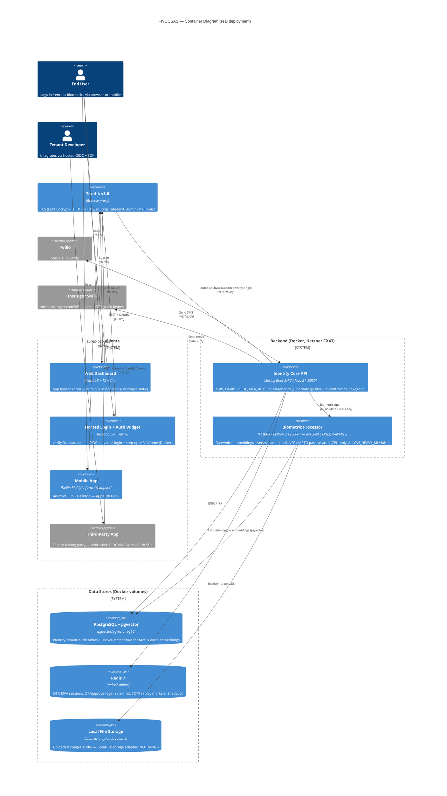
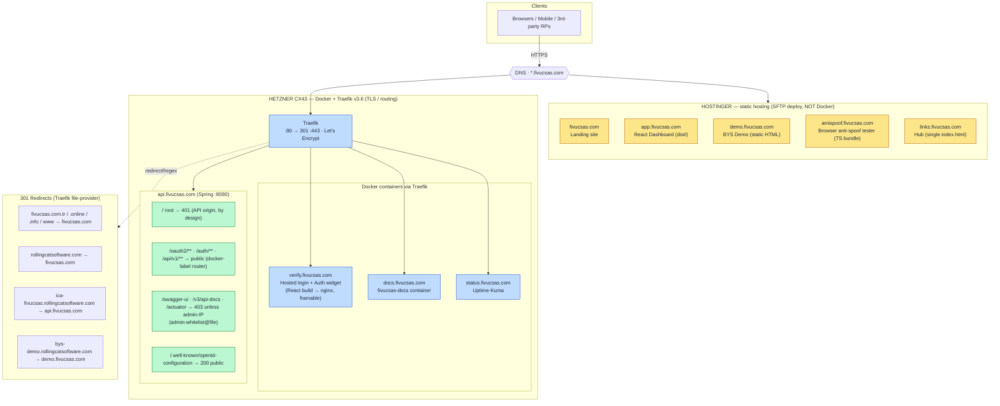
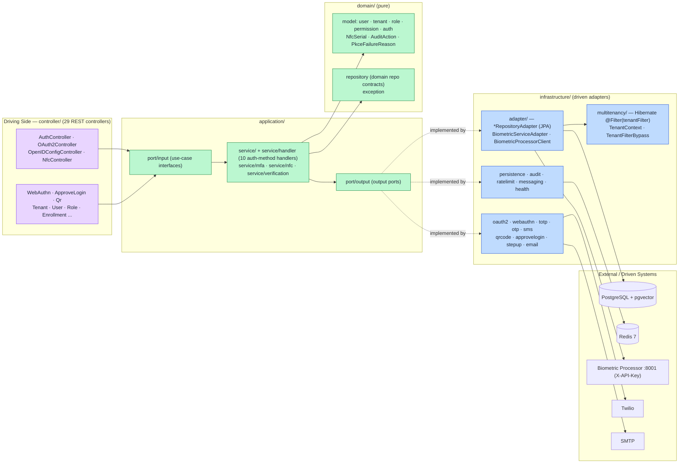
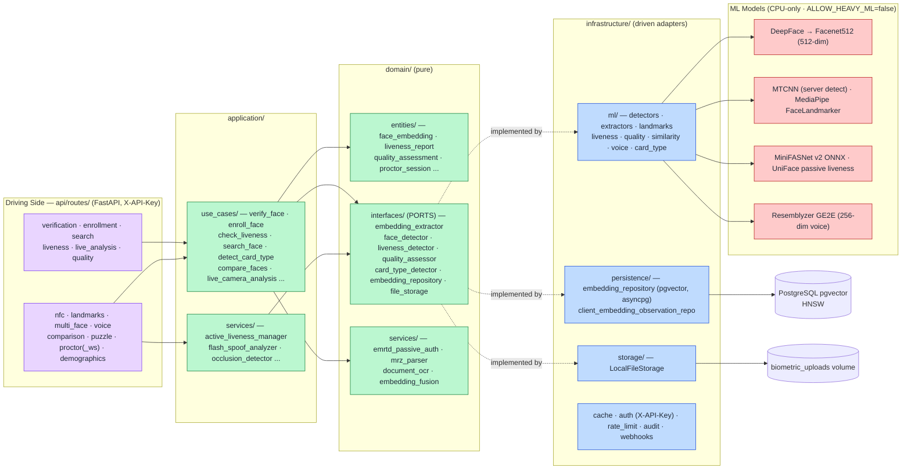
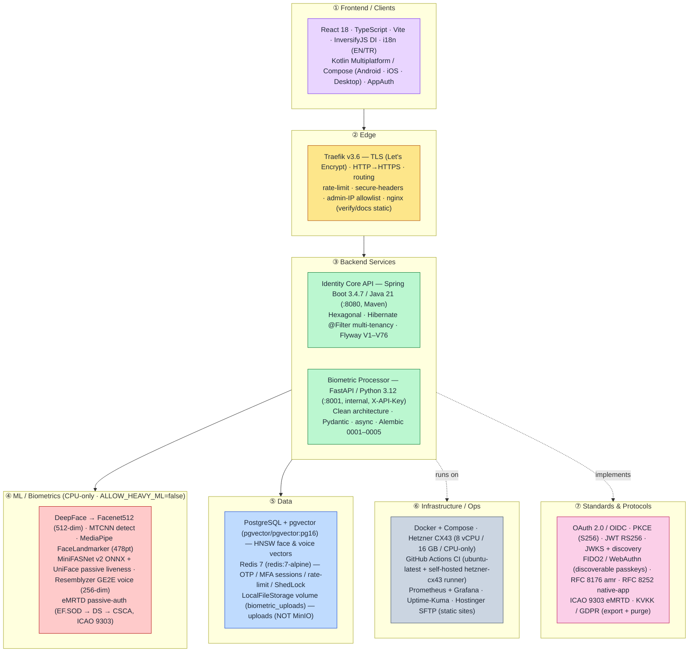

# FIVUCSAS — System Architecture & Deployment Diagrams

> All diagrams below reflect the **real** deployed system (verified against the parent
> `CLAUDE.md`, `identity-core-api/CLAUDE.md`, `infra/traefik/config/*.yml`, the prod
> compose files, and the actual Java/Python package trees on `HEAD`, 2026-06-02).
>
> **Honesty notes that shaped these diagrams:**
> - **Tenant isolation is application-layer**, not Postgres RLS — it is a Hibernate
>   `@Filter(tenantFilter)` (`@FilterDef` on `User` + 8 tenant-scoped entities) plus a
>   controller-level `TenantScopeResolver`. There is **no Postgres Row-Level Security**.
> - **GPU-less.** The Hetzner CX43 is CPU-only; `ALLOW_HEAVY_ML=false` (default) hard-blocks
>   GPU-class models (RetinaFace, YOLOv8/11/12, ArcFace, VGG-Face, GhostFaceNet) at boot.
> - **Object storage is NOT MinIO.** The biometric-processor persists uploads via
>   `LocalFileStorage` onto the `biometric_uploads` Docker volume. (`FileStorage` is a
>   port, so S3/MinIO is *possible*, but the only shipped adapter is local-FS.) The
>   diagrams show the real local-volume store.
> - **DB image** is pinned `pgvector/pgvector:pg16` in compose; the docs text says
>   "PostgreSQL 17 + pgvector". Diagrams label it "PostgreSQL + pgvector" to avoid asserting
>   a version the compose file contradicts.
> - **Flyway migrations are at V76** in `identity-core-api/CLAUDE.md` (the brief said "V79";
>   the *parent* roadmap references V79 — the API repo's own migration ledger documents
>   through V76, with V73–V76 applied on the 2026-05-31 rebuild). Labeled as such.
> - The **biometric-processor has no public route** — it is reachable only on the internal
>   Docker `backend` network, on port 8001, behind an `X-API-Key`.

---

## 1. System Context + Container Diagram

How the clients, the edge, the two backend services, and the data/3rd-party dependencies
fit together. The biometric processor is internal-only (Docker network + `X-API-Key`); the
two external comms providers (Twilio SMS, Hostinger SMTP) are called only by the Spring API.

---

## 2. Deployment & Domain Map

Every public domain and **how it is served**. The hard split is **Hostinger static hosting**
(landing, dashboard, BYS demo, amispoof, links) vs **Docker-behind-Traefik** (API, hosted
login, docs). `api.fivucsas.com` has path-specific behavior: root is `401` by design,
Swagger/actuator/`api-docs` are admin-IP-gated (`403` for the public), OIDC discovery is
public (`200`).

---

## 3. Hexagonal (Ports & Adapters) Architecture

Both services follow ports-and-adapters. **Left = driving (inbound) adapters → application
use-cases → domain; right = output ports realized by infrastructure adapters.** Names below
are the *actual* classes/dirs from the source trees.

### 3a. Identity Core API (Spring Boot / Java 21)

### 3b. Biometric Processor (FastAPI / Python 3.12)

---

## 4. Tech-Stack Layered Diagram

Top-to-bottom layers, each labeled with the concrete technologies in production, plus the
standards the platform implements. CPU-only ML is called out explicitly.

