# FIVUCSAS — Authentication / OAuth2 / OIDC / MFA / OTP Flows

GitHub-renderable Mermaid diagrams, grounded in the real code:

- `identity-core-api/.../controller/AuthController.java` — `/auth/login`, `/auth/mfa/step`, `/auth/mfa/send-otp`, `/auth/login/preflight`, `/auth/login/begin`, `/auth/login-config`
- `application/service/AuthenticateUserService.java` — legacy password login + config-driven Layer-1 + MFA-session creation
- `application/service/mfa/VerifyMfaStepService.java` — the N-step MFA engine
- `application/service/OAuth2Service.java` + `controller/OAuth2Controller.java` — `/oauth2/authorize`, `/authorize/complete`, `/oauth2/token`, PKCE `validateAuthorizeRequest`
- `security/JwtService.java` (RS256 prod, `aud`/`iss` pinned), `service/RefreshTokenService.java` (rotation + `RefreshTokenFamilyRevoker`)
- `infrastructure/otp/OtpService.java` (NIST 5-strike), `infrastructure/totp/TotpService.java` (RFC 6238 + replay marker), `infrastructure/webauthn/WebAuthnService.java`
- `controller/QrController.java`, `controller/ApproveLoginController.java`, `controller/DeviceController.java` (WebAuthn / passkey)
- SDK: `verify-widget/html/fivucsas-auth.js` (`loginRedirect` → S256 → `handleRedirectCallback` → `/oauth2/token`)

**Honesty invariants baked into these diagrams:**
- PKCE **S256 is mandatory** for public clients (`OAuth2Controller.validateAuthorizeRequest`); `plain` is rejected for public clients.
- Access + ID tokens are **RS256** in prod (`JwtService.assertProdAlgoIsRs256`), carry pinned `iss` + `aud`.
- Refresh-token **reuse triggers whole-family revocation** in a `REQUIRES_NEW` transaction (survives the rollback-on-throw).
- Authorization codes are **single-use**, 10-minute TTL in Redis; the MFA session is **consumed + deleted** when minting the code.

---

## 1. HERO — OIDC "Login with FIVUCSAS" full round-trip (redirective, hosted login)

The primary integration mode. The tenant app uses the SDK (`FivucsasAuth.loginRedirect`) which generates a PKCE verifier/challenge (S256), `state` (CSRF) and `nonce` (OIDC replay), sends the browser to `/oauth2/authorize?display=page`, which 302-redirects to `verify.fivucsas.com/login` (the hosted surface). The example shows **Marmara's 2-step flow: PASSWORD then EMAIL_OTP**. After MFA completes, the hosted page trades the completed `MfaSession` for a single-use auth code at `/oauth2/authorize/complete`, the browser returns to the tenant with `?code&state`, and the SDK exchanges the code (with `code_verifier`) at `/oauth2/token`.

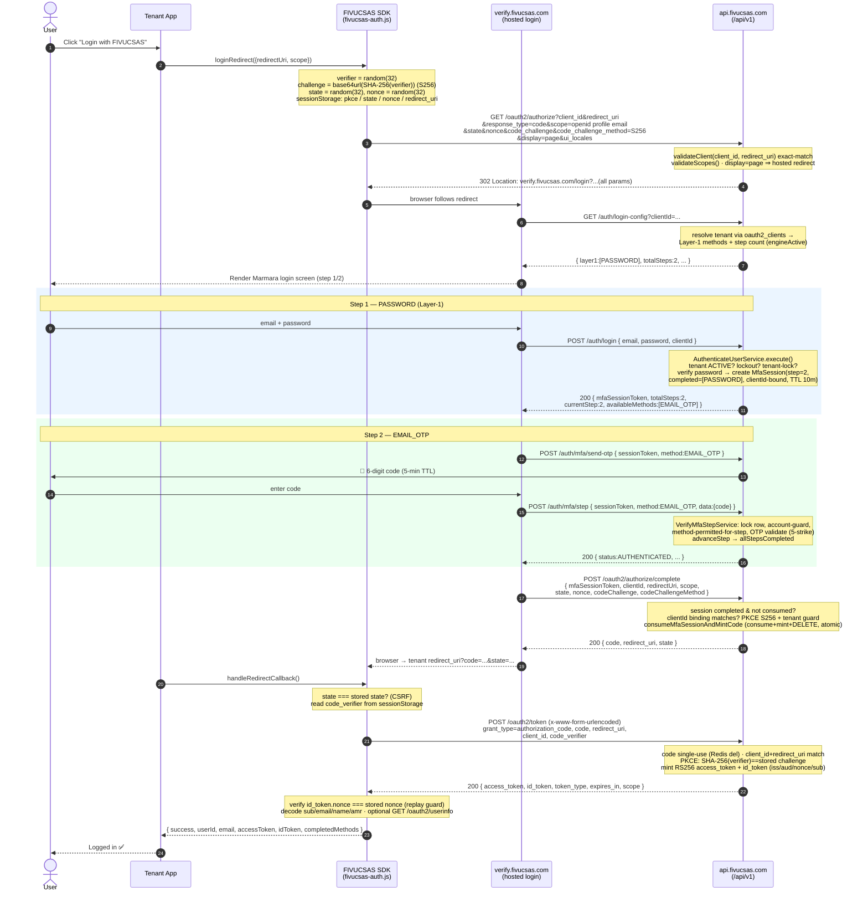

**Caption.** The hero round-trip: PKCE S256 throughout, `state` for CSRF, `nonce` echoed into the id_token and verified client-side, single-use authorization code, RS256 tokens. The hosted page never sees the tenant's `code_verifier` — only the SDK does, at `/oauth2/token`.

---

## 2. N-step MFA engine

### 2a. Sequence — `POST /auth/mfa/step` orchestration (`VerifyMfaStepService`)

Every step posts `{ sessionToken, method, data }`. The service pessimistically locks the session row, enforces account state + tenant method policy + per-step method binding, dispatches to the per-method `VerifyMfaStepHandler`, accumulates RFC 8176 `amr`, and **only mints the JWT on the final step**.

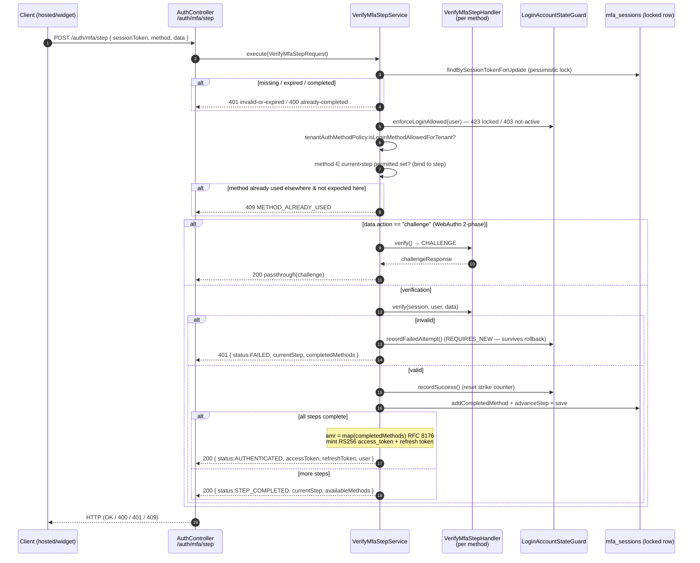

### 2b. State — the MFA session lifecycle (`mfa_sessions`)

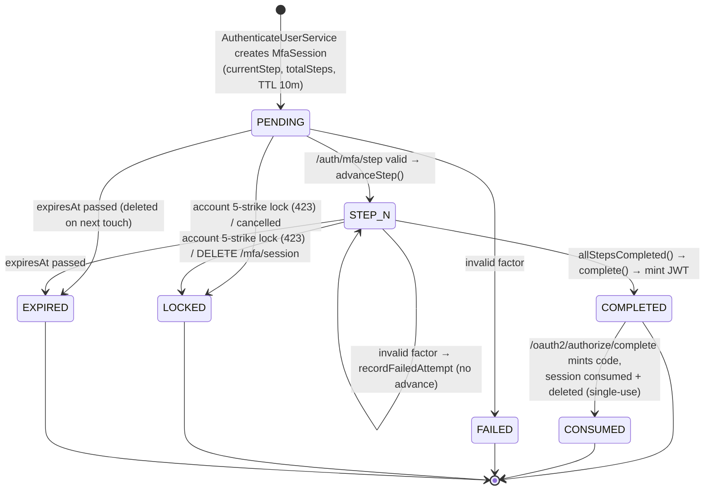

**Caption.** The session starts `PENDING` at the first unsatisfied step (step 2 when PASSWORD is the verified Layer-1, step 1 for identifier-first). Each valid step advances `currentStep`; the final step flips to `COMPLETED` and mints the JWT (widget) or is later `CONSUMED` by `/oauth2/authorize/complete` (hosted). Lockout (5 strikes / 15 min) and expiry (10 min) are terminal.

---

## 3. OTP factors — Email OTP, SMS OTP (Twilio Verify), TOTP (RFC 6238)

### 3a. Email OTP (`OtpService`, Redis-backed, NIST 5-strike)

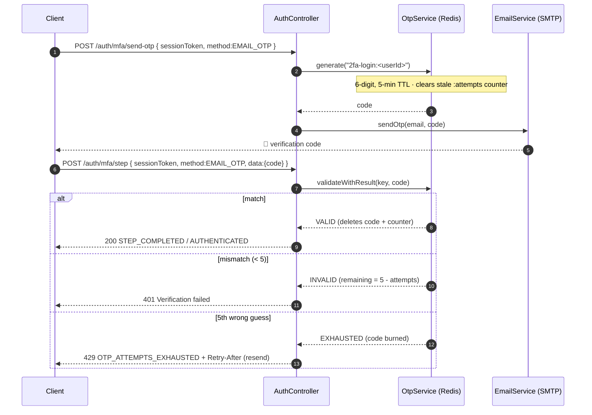

### 3b. SMS OTP (Twilio Verify — `VerifiableSmsService`, no local code store)

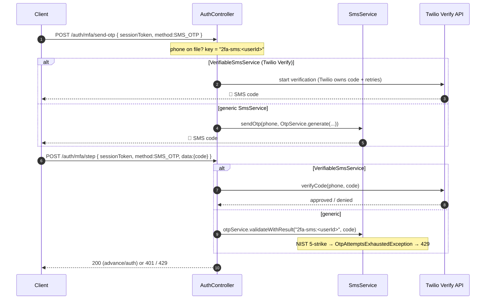

### 3c. TOTP (RFC 6238 — `TotpService`, SHA-1 / 30s / 6-digit + S13 replay marker)

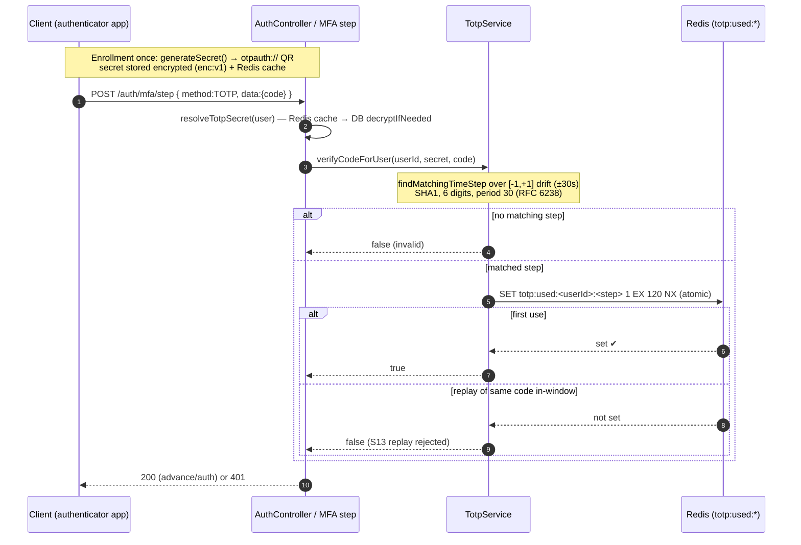

**Caption.** Email OTP and the generic SMS path enforce the NIST 800-63B 5-strike counter in Redis (5th wrong guess → 429 + Retry-After). Twilio Verify owns its own code lifecycle. TOTP is RFC 6238 (SHA-1, 30s step, ±1 drift); login/MFA verification additionally writes a short-TTL `totp:used:(userId,step)` marker so a captured code cannot be replayed inside its ~90s window.

---

## 4. Cross-device — QR-code login & Approve-login (number-matching, Redis-backed)

### 4a. QR-code login (`QrController` + `QrSessionService`)

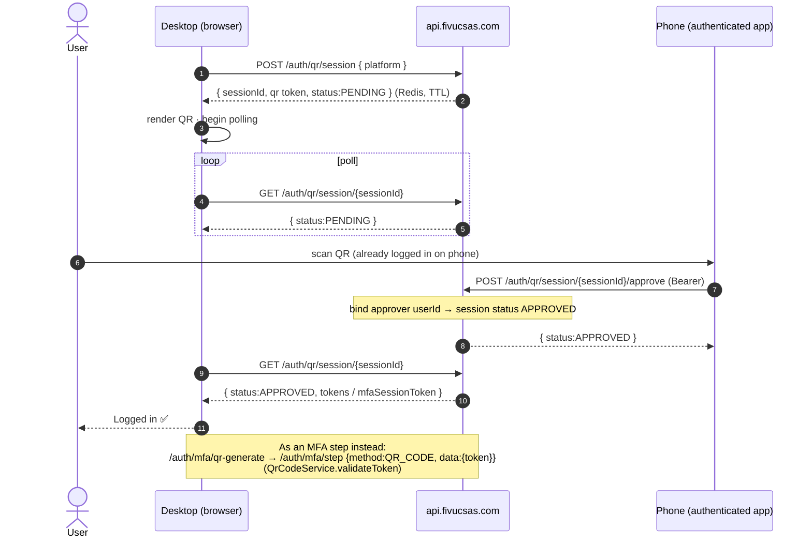

### 4b. Approve-login — number matching (`ApproveLoginController` + `ApproveLoginService`)

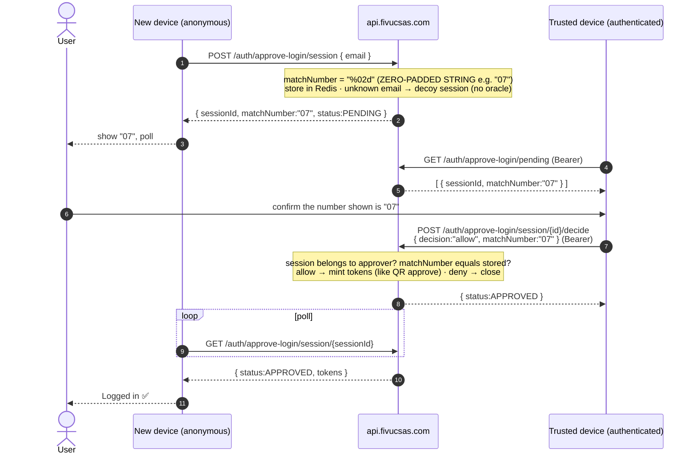

**Caption.** Both cross-device flows are Redis-backed poll loops. The new/desktop device starts an anonymous session; an already-authenticated device approves it. Approve-login adds a two-digit **`matchNumber` (a zero-padded STRING, e.g. `"07"`)** the user must match between devices, and returns a **decoy session for unknown emails** so it is not an account-existence oracle.

---

## 5. WebAuthn / Passkey / Fingerprint (`DeviceController` + `WebAuthnService`)

### 5a. Registration (attestation) + Authentication (assertion) + usernameless passkey

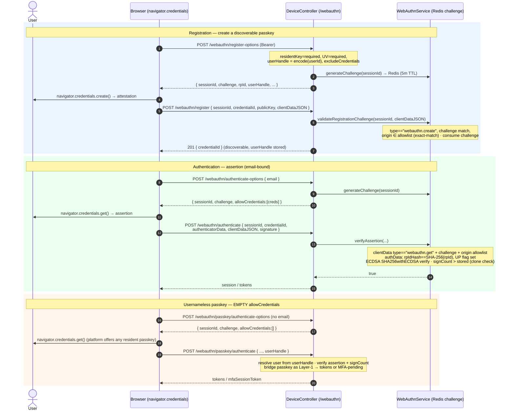

**Caption.** FINGERPRINT is delivered as a WebAuthn platform authenticator (no separate biometric path). Registration produces a **discoverable** passkey (resident key + UV required) carrying a `userHandle = encode(userId)`. The email-bound assertion sends a populated `allowCredentials`; the **usernameless passkey** flow sends an **empty `allowCredentials`** and resolves the account from the asserted `userHandle`. Every assertion validates challenge freshness, exact-match origin allowlist, RP-ID hash, the UP flag, the ECDSA signature, and a monotonic sign-counter (clone detection).

---

## 6. Refresh-token rotation + reuse detection (`RefreshTokenService` + `RefreshTokenFamilyRevoker`)

### 6a. Sequence — happy rotation, then a stolen-token replay kills the family

Wire format is `<id>.<secret>`; only `sha256(secret)` is stored (`token_secret_hash`, V55/V60 — plaintext column dropped). Every token from one login shares a `family_id` (V50).

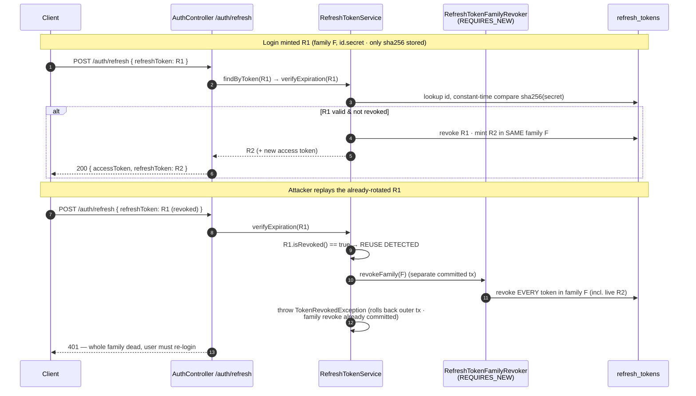

### 6b. Flowchart — rotation + reuse decision

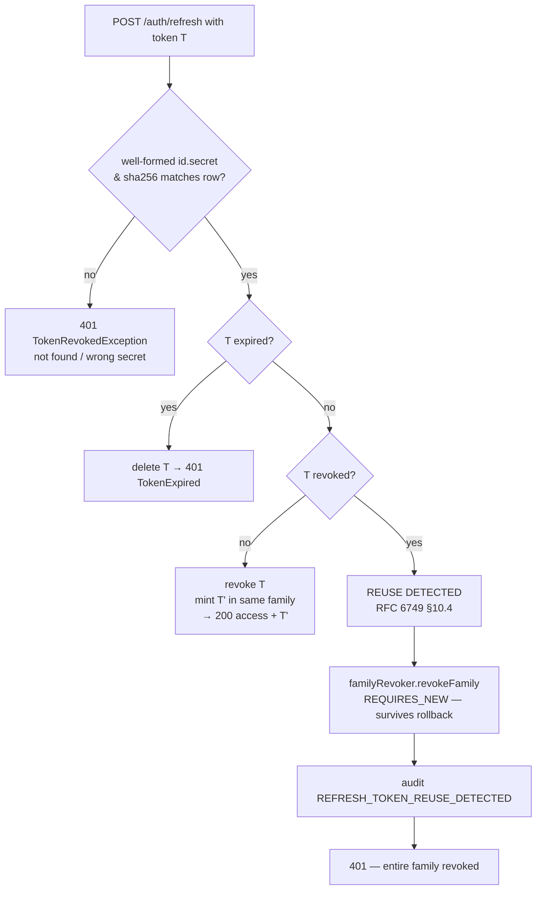

**Caption.** Normal refresh rotates `R1 → R2` (old revoked, successor inherits the family). Presenting an already-revoked `R1` is **reuse**: the entire rotation family — including the legitimate `R2` — is revoked in a **`REQUIRES_NEW`** transaction so it commits even though the request itself throws and rolls back. A wrong secret for a real id is treated as "not found" (404-shaped), **not** reuse — only an explicitly revoked-and-presented token triggers family revocation.

---

## 7. Account lockout + overall login activity

### 7a. Account lockout — 5 strikes → 423, 15-minute window (`LoginAccountStateGuard`)

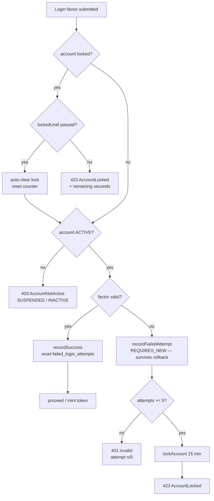

### 7b. Overall login activity — picking the path (legacy vs config-driven vs cross-device)

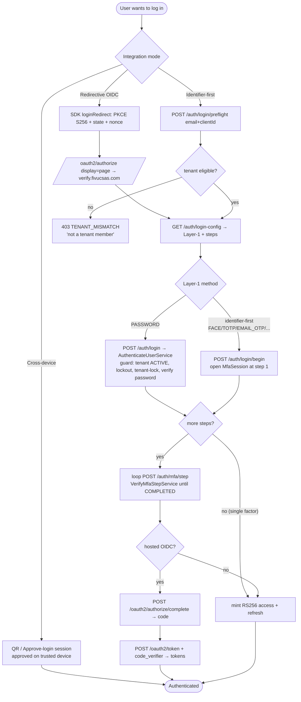

**Caption.** The strike counter and account-status gate are path-independent (`LoginAccountStateGuard`) and run on **both** the legacy `/auth/login` path and the live `/auth/mfa/step` engine; the 5th failed factor locks the account for 15 minutes (HTTP 423). The activity overview shows the three entry modes (redirective OIDC, identifier-first, cross-device) converging on the same MFA engine and, for hosted OIDC, the `authorize/complete → token` code exchange.
