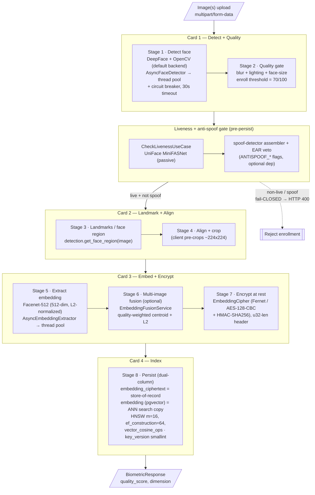
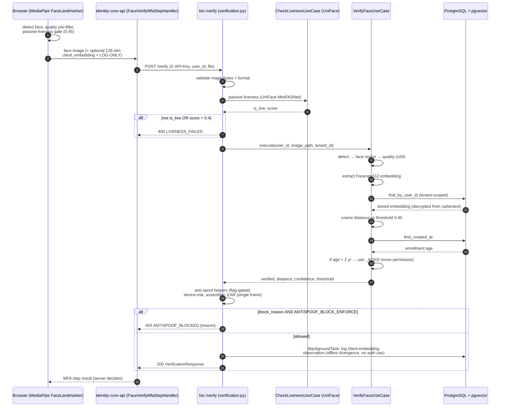
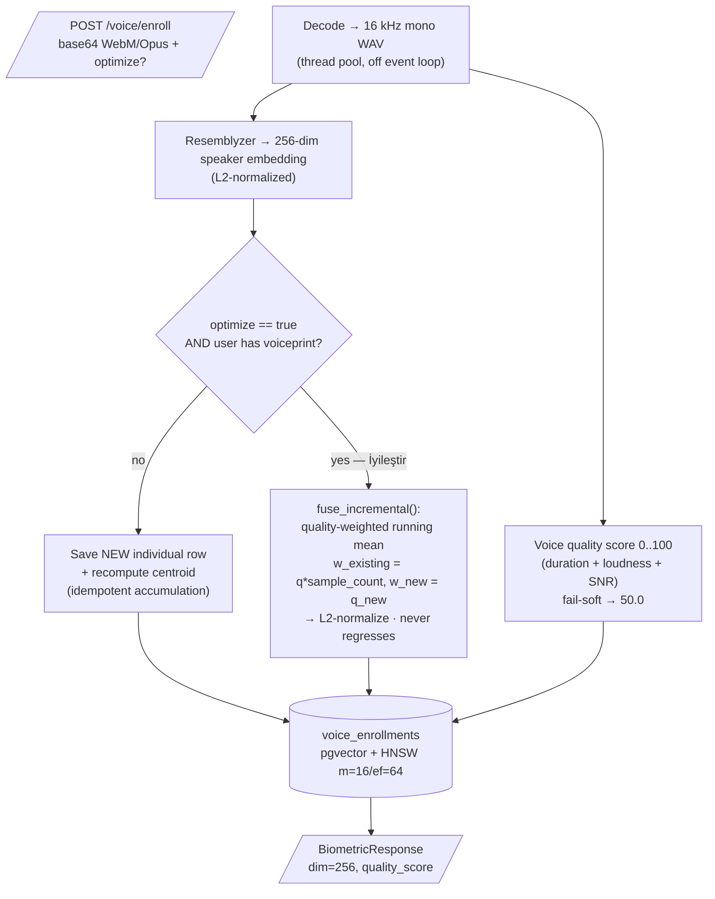
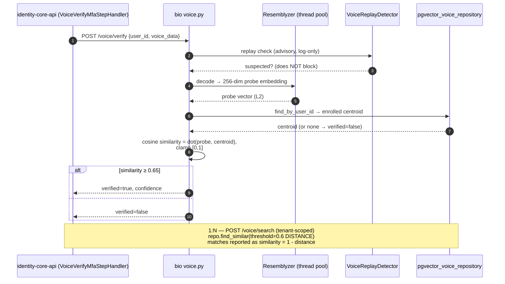
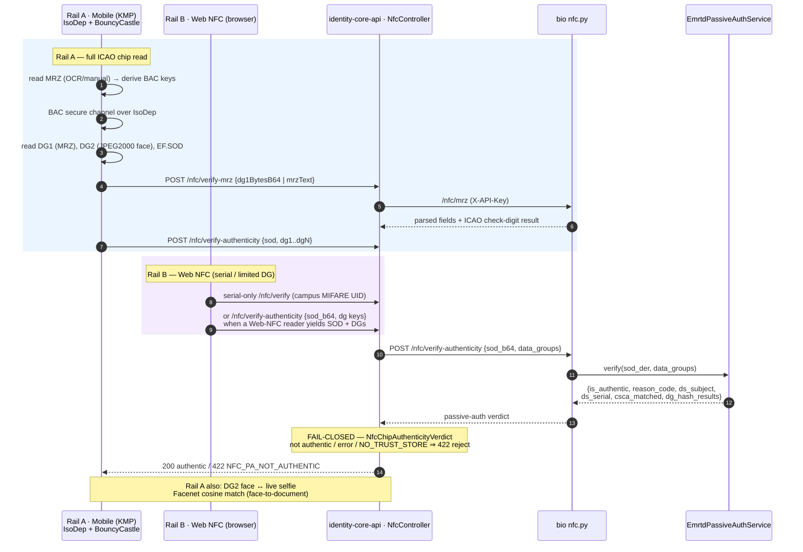
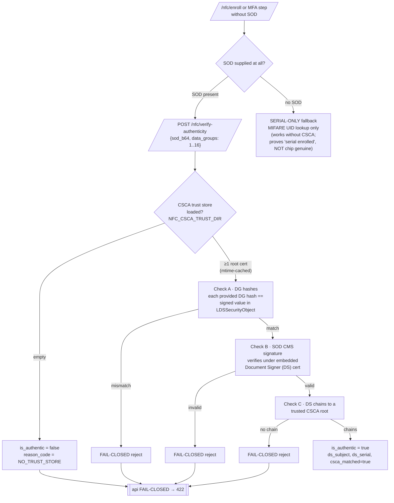
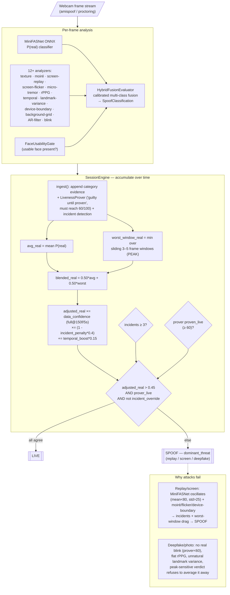
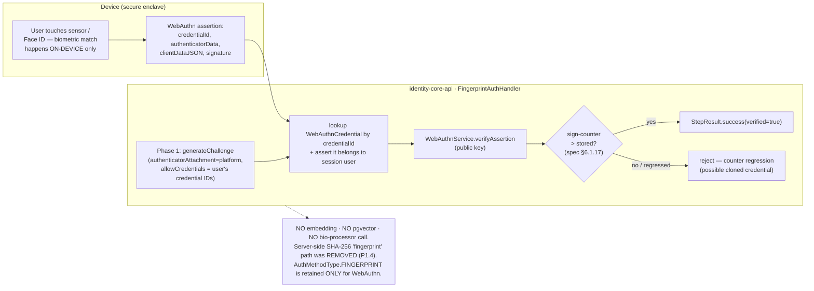

# FIVUCSAS Biometric Pipelines

Accurate, code-grounded Mermaid diagrams of the FIVUCSAS biometric stack.
All facts below were read directly from `biometric-processor`, `spoof-detector`,
and `identity-core-api` source on 2026-06-02 — not invented.

**Honesty notes (read these before trusting any marketing slide):**

- **Auth decision is server-side.** The browser pre-filters with MediaPipe and
  may send a 128-dim client embedding, but that is **log-only** (D2). The
  authoritative 1:1 cosine match runs in `VerifyFaceUseCase` on the server.
- **Server-side fingerprint was REMOVED** (it was a SHA-256 placeholder, never a
  real biometric). `FINGERPRINT` is delivered *only* via WebAuthn / FIDO2
  platform authenticators in `identity-core-api` (`FingerprintAuthHandler`).
- **NFC passive authentication is fail-closed and needs CSCA roots loaded.** With
  an empty trust store the verdict is always `is_authentic=false`
  (`reason_code=NO_TRUST_STORE`). **Serial-only enrollment/verify works without
  CSCA** (campus MIFARE UID cards have no ICAO chip).
- **Anti-spoof / EAR veto on `/verify` is flag-gated** (`ANTISPOOF_*`,
  `spoof_detector` is an optional dep). When the package is absent or all flags
  are off, those response fields are `None` and nothing is vetoed.
- Config defaults verified: cosine distance threshold `0.45`
  (`VERIFICATION_THRESHOLD`, aged > 2 yr ⇒ more-permissive `_AGED`, must be ≥
  base or boot fails), `EMBEDDING_DIMENSION=512`, `LIVENESS_MODE=passive` →
  `uniface`, voice verify cosine `≥ 0.65` / search distance `< 0.6`, HNSW
  `m=16, ef_construction=64`, Fernet = AES-128-CBC + HMAC-SHA256.

---

## 1a. Face ENROLLMENT pipeline (8 stages in 4 cards)

`POST /enroll` and `/enroll/multi`. Server-authoritative passive liveness +
anti-spoof now run **before** the embedding is persisted
(`ENROLL_LIVENESS_ENABLED=true`, default; multi-image is **fail-CLOSED** per
frame). Embedding is written twice: encrypted ciphertext (store-of-record) +
plaintext pgvector column (search index).

---

## 1b. Face VERIFICATION (1:1) — sequence

Client MediaPipe pre-filter (log-only) → server detect → embed → cosine match
with aged-threshold adaptation → flag-gated anti-spoof veto. The `/verify` route
runs a passive-liveness **floor** (score ≥ 0.4) before the match.

---

## 2a. Voice ENROLLMENT — flowchart

Resemblyzer 256-dim speaker embedding, centroid storage. The `optimize=true`
("İyileştir" / re-enroll & optimize) path folds the new sample into the existing
centroid via a quality-weighted running mean instead of replacing it.

## 2b. Voice VERIFICATION / SEARCH — sequence

Note the **two different thresholds**: 1:1 verify uses cosine **similarity ≥
0.65**; 1:N search uses pgvector cosine **distance < 0.6**. The replay-attack
detector is advisory + log-only (gated `VOICE_REPLAY_DETECTION_ENABLED`,
default off) — it never blocks today.

---

## 3a. NFC two rails — sequence

Rail A = mobile native chip read (IsoDep + BouncyCastle, BAC session from MRZ,
DG2 face → Facenet match). Rail B = browser Web NFC. Both rails converge on the
same server endpoints: `/nfc/mrz` (parse) and `/nfc/verify-authenticity`
(passive auth). API side is `NfcController` + `NfcDocumentVerifyMfaStepHandler`.

## 3b. NFC passive authentication — flowchart (fail-closed)

ICAO 9303 Part 11. Three checks must ALL pass: DG hashes match the signed values
in EF.SOD, the SOD CMS signature verifies under the embedded Document Signer
cert, and that DS chains to a trusted CSCA root. Serial-only is the fallback when
no SOD is supplied.

---

## 4. Liveness decision — passive + active

Two distinct mechanisms. **Passive** = single-frame UniFace MiniFASNet on
`/verify` and `/liveness` (default `LIVENESS_MODE=passive`). **Active** =
challenge/response: the server generates a sequence (face challenges scored by
EAR/MAR/yaw, hand-gesture challenges scored from landmarks), tracks the session,
and on success issues a short-lived **HS256 JWT verification token** (TTL 300s,
UUID `jti`). 23 micro-challenges exist in the web registry: **14 face + 9 hand**.

```mermaid
flowchart TB
    subgraph PASSIVE["PASSIVE — single frame"]
        P1[/"POST /liveness or /verify<br/>one still frame"/]
        P2["UniFace MiniFASNet (passive)<br/>texture / depth cue → score"]
        P3{"is_live AND<br/>score ≥ floor?<br/>(verify floor 0.4)"}
        P1 --> P2 --> P3
        P3 -->|"no"| PR[["reject"]]
        P3 -->|"yes"| PG[["pass to match"]]
    end

    subgraph ACTIVE["ACTIVE — challenge / response"]
        A1[/"POST /liveness/active/start<br/>(or /active/gesture/start)"/]
        A2["StartActiveLiveness:<br/>session_id = uuid4()<br/>pick num_challenges (cfg 1–5, def 3)<br/>session TTL = 120s · per-challenge 5s"]
        A3["Client performs each action,<br/>POSTs frames to /active/frame"]
        A4["FACE: MediaPipe FaceLandmarker (server)<br/>EAR (blink), MAR (mouth), yaw (head turn),<br/>eyebrow-raise vs per-session baseline"]
        A5["HAND/gesture: client sends 21-pt hand<br/>landmarks + anti-spoof scores (landmarks-only,<br/>no server MediaPipe)"]
        A6{"all challenges<br/>completed in order,<br/>within TTL?"}
        A7["ActiveLivenessTokenService:<br/>HS256 JWT, scope=active_liveness_verification,<br/>jti=uuid4(), exp = now + 300s"]
        A1 --> A2 --> A3
        A3 --> A4
        A3 --> A5
        A4 --> A6
        A5 --> A6
        A6 -->|"expired → 410"| AEXP[["session expired"]]
        A6 -->|"not found → 404"| ANF[["unknown session"]]
        A6 -->|"yes"| A7 --> ATOK[["signed liveness token"]]
    end

    subgraph PUZZLE["ACTIVE (puzzle variant) — GeneratePuzzle / VerifyPuzzle"]
        Z1["GeneratePuzzleUseCase: random steps<br/>(easy 2-3 / standard 3-4 / hard 4-5),<br/>incompatible pairs (turn_left↔turn_right) filtered,<br/>thresholds sent to client (ear 0.21, mar 0.4, yaw 0.15)"]
        Z2["persist puzzle, expires = timeout + 60s"]
        Z3["VerifyPuzzleUseCase: anti-replay (P0-#9) —<br/>corrupt/garbage frames counted as FAILURE;<br/>timestamp-before-puzzle rejected"]
        Z1 --> Z2 --> Z3
    end
```

---

## 5. spoof-detector — session verdict (peak-sensitive)

Standalone `spoof-detector` repo (algorithms live here; `biometric-processor`
only wires them). Per frame: MiniFASNet ONNX classifier + a bank of analyzers
(`src/infrastructure/analyzers/` ships **14**: MiniFASNet, texture, moiré,
screen-replay, screen-flicker, micro-tremor, rPPG, temporal, landmark-variance,
device-boundary, background-grid, AR-filter, blink, + flash). Frames fuse into a
**session** verdict that is intentionally NOT a plain average — it is
peak-sensitive (blends mean P(real) with the **worst sliding window**) so a brief
spoof flash can't be averaged away.

---

## 6. Fingerprint → WebAuthn mapping (no server biometric)

There is **no server-side fingerprint matcher**. The `FINGERPRINT` auth method is
a WebAuthn/FIDO2 *platform* authenticator ceremony — the device's secure enclave
does the biometric match locally and returns a signed assertion; the server only
verifies the assertion + sign-counter against the stored public key. This is a
possession+inherence factor, not a template stored in pgvector.

