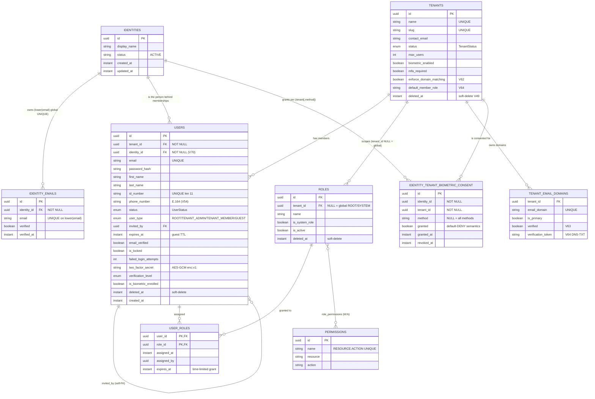
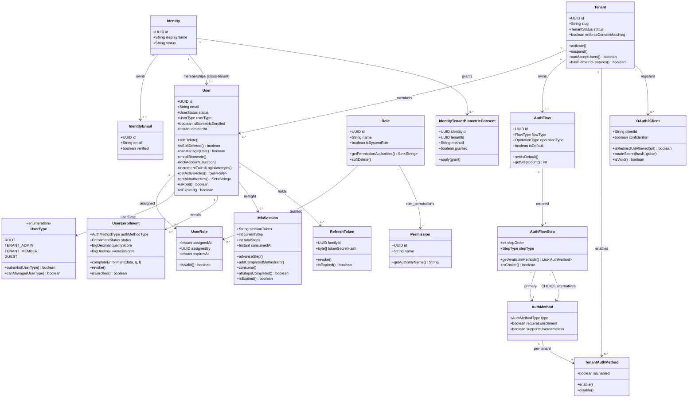
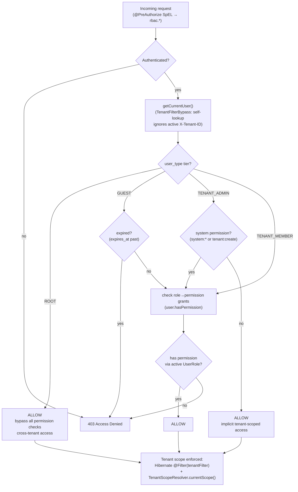
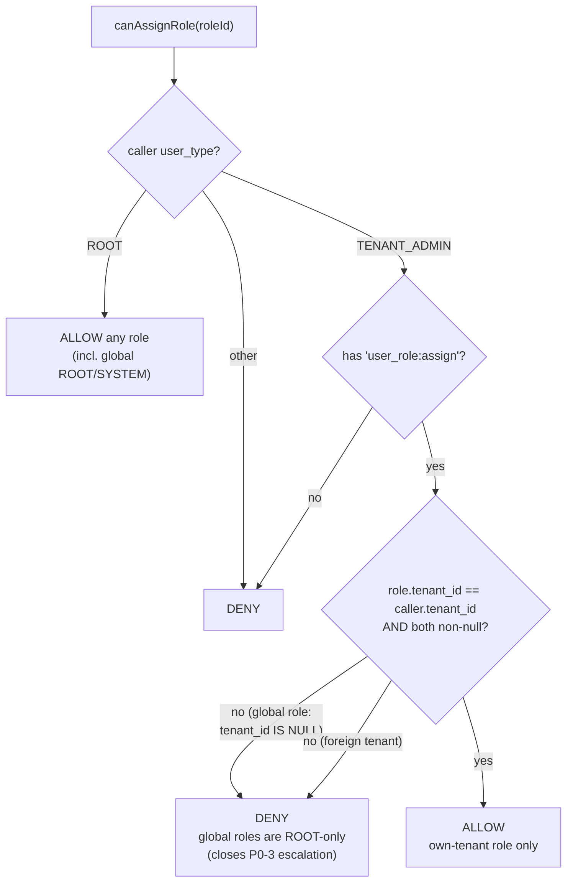

# FIVUCSAS — Data Model, Domain Class, Use-Case & RBAC Diagrams

Source of truth: `identity-core-api/src/main/java/com/fivucsas/identity/entity/*.java`
(JPA entities) + `identity-core-api/src/main/resources/db/migration/V1..V79`
(Flyway) + `security/RbacAuthorizationService.java`. Column / FK / cardinality
names are taken verbatim from the code — nothing is invented.

Cross-cutting facts that shape these diagrams:

- **Person layer (Model A, V65-V70).** `identities` is a platform-level PERSON; a
  `users` row is a tenant MEMBERSHIP that references exactly one identity
  (`users.identity_id` FK → `identities.id`, now `NOT NULL` per V70). One person
  may hold memberships in several tenants. `identities`, `identity_emails`, and
  `identity_tenant_biometric_consent` are **deliberately NOT tenant-scoped** (no
  `@Filter(tenantFilter)`).
- **Tenant isolation (P0-1).** A global `@FilterDef(tenantFilter)` lives on `User`;
  the tenant-scoped entities (`AuthFlow`, `AuditLog`, `MfaSession`, `UserEnrollment`,
  `OAuth2Client`, `UserDevice`, `Role`) re-declare `@Filter`. `Role`'s filter also
  exposes global rows (`tenant_id IS NULL`).
- **Soft delete.** `users` and `tenants` carry `deleted_at` + `@SQLDelete`/
  `@SQLRestriction`; a V53 BEFORE-DELETE trigger forbids hard `DELETE`.
- **Two biometric stores.** Face embeddings (`vector(512)`) and voice embeddings
  (`voice_enrollments`, `vector(256)`) live in the pgvector store and key on a
  *string* `user_id` — they are NOT hard JPA FKs (the legacy `biometric_data` table
  was dropped in V48). `user_enrollments` is the JPA-side enrollment ledger.

---

## 1a. ER Diagram — Identity, Tenancy & RBAC

The person/membership/tenant core plus the role→permission graph.

---

## 1b. ER Diagram — Auth Methods, Flows, Enrollment, Sessions & Tokens

The configurable N-step auth engine, the credential/enrollment stores, and the
session/token/audit surfaces.

```mermaid
erDiagram
    TENANTS ||--o{ AUTH_FLOWS : "owns flows"
    TENANTS ||--o{ TENANT_AUTH_METHODS : "enables methods"
    AUTH_METHODS ||--o{ TENANT_AUTH_METHODS : "enabled per tenant"
    AUTH_FLOWS ||--o{ AUTH_FLOW_STEPS : "ordered steps"
    AUTH_METHODS ||--o{ AUTH_FLOW_STEPS : "primary method"
    AUTH_METHODS ||--o{ AUTH_FLOW_STEPS : "fallback_method"
    AUTH_FLOW_STEPS }o--o{ AUTH_METHODS : "auth_flow_step_methods (CHOICE alts)"
    USERS ||--o{ USER_ENROLLMENTS : "enrolls factors"
    TENANTS ||--o{ USER_ENROLLMENTS : "scopes"
    USERS ||--o{ NFC_CARDS : "registers cards"
    USERS ||--o{ USER_DEVICES : "trusts devices"
    USERS ||--o{ WEBAUTHN_CREDENTIALS : "passkeys/keys"
    USERS ||--o{ REFRESH_TOKENS : "holds (family_id)"
    USERS ||--o{ MFA_SESSIONS : "in-flight login"
    TENANTS ||--o{ OAUTH2_CLIENTS : "registers RPs"
    TENANTS ||--o{ AUDIT_LOGS : "scopes"
    USERS ||--o{ AUDIT_LOGS : "actor (nullable)"

    AUTH_METHODS {
        uuid id PK
        enum type "PASSWORD..NFC_DOCUMENT,PASSKEY,APPROVE_LOGIN (UNIQUE)"
        enum category "BASIC/STANDARD/PREMIUM"
        text_array platforms
        boolean requires_enrollment
        boolean supports_usernameless "V73"
        boolean is_active
        jsonb config_schema
    }
    TENANT_AUTH_METHODS {
        uuid id PK
        uuid tenant_id FK
        uuid auth_method_id FK
        boolean is_enabled
        jsonb config
    }
    AUTH_FLOWS {
        uuid id PK
        uuid tenant_id FK "NOT NULL @Filter"
        string name
        enum flow_type "AUTHENTICATION/VERIFICATION/ENROLLMENT"
        string industry_template
        enum operation_type "APP_LOGIN/DOOR_ACCESS/EXAM_PROCTORING.."
        boolean is_default "uq_auth_flow_default"
        boolean is_active
    }
    AUTH_FLOW_STEPS {
        uuid id PK
        uuid auth_flow_id FK
        uuid auth_method_id FK "primary"
        int step_order
        enum step_type "SEQUENTIAL/CHOICE"
        boolean is_required
        int timeout_seconds
        int max_attempts
        uuid fallback_method_id FK
        jsonb config
    }
    USER_ENROLLMENTS {
        uuid id PK
        uuid user_id FK "NOT NULL"
        uuid tenant_id FK "NOT NULL @Filter"
        enum auth_method_type
        enum status "NOT_ENROLLED/PENDING/ENROLLED/FAILED/REVOKED/EXPIRED"
        jsonb enrollment_data
        numeric quality_score "5,4 (V47)"
        numeric liveness_score "5,4 (V47)"
        instant enrolled_at
        instant revoked_at
    }
    NFC_CARDS {
        uuid id PK
        uuid user_id FK
        uuid tenant_id FK
        string card_serial "canonical UPPERHEX; UNIQUE(serial,tenant)"
        string card_type
        boolean is_active
        instant revoked_at
    }
    USER_DEVICES {
        uuid id PK
        uuid user_id FK
        uuid tenant_id FK "@Filter"
        enum platform "DevicePlatform"
        string device_fingerprint
        boolean is_trusted
        text public_key "step-up EC_P256 (V17)"
    }
    WEBAUTHN_CREDENTIALS {
        uuid id PK
        uuid user_id FK "ON DELETE CASCADE"
        string credential_id "UNIQUE"
        text public_key
        long sign_count
        boolean discoverable "V72 passkey"
        string user_handle "V72 usernameless"
    }
    REFRESH_TOKENS {
        uuid id PK
        uuid user_id FK "ON DELETE CASCADE"
        bytea token_secret_hash "SHA-256 (V55; plaintext dropped V60)"
        uuid family_id "rotation family (V50)"
        instant expiry_date
        boolean is_revoked
        instant revoked_at
    }
    MFA_SESSIONS {
        uuid id PK
        string session_token "UNIQUE"
        uuid user_id
        uuid tenant_id "@Filter"
        uuid flow_id
        int current_step
        int total_steps
        jsonb steps_data "amr list"
        string client_id "OIDC cross-client guard (V36)"
        instant consumed_at "anti-replay (V35)"
        instant expires_at
    }
    OAUTH2_CLIENTS {
        uuid id PK
        string client_id "UNIQUE"
        string client_secret "bcrypt"
        uuid tenant_id FK "@Filter"
        text redirect_uris "JSON array"
        string allowed_scopes "openid profile email"
        boolean confidential "V34 PKCE for public"
        string previous_secret "rotation grace (V58)"
        instant revoked_at
    }
    AUDIT_LOGS {
        uuid id PK
        uuid tenant_id "NOT NULL V61; 000..0 sentinel for anon"
        uuid user_id "actor, nullable"
        string action
        string resource_type
        uuid resource_id
        int status_code
        boolean success
        jsonb metadata
        instant created_at "pg_partman partitioned (V40/V57)"
    }
```

> **Not hard-FK'd by design:** `voice_enrollments` (`vector(256)`, V33) and the
> face-embedding pgvector store reference `user_id` as a `VARCHAR(255)` in the
> biometric store — they are logically per-user but not JPA foreign keys, so they
> are intentionally omitted from the relationship lines above.

---

## 2. Domain Class Diagram

Key aggregates, their business methods, and the person-layer (Identity 1..* User
memberships across tenants). Methods shown are the load-bearing ones from the
entities; `+` = public domain behaviour.

---

## 3. Use-Case Diagram

Actors and their use cases. ROOT/Platform Owner sits above all tenants;
Developer/Integrator drives the OIDC surface; Guest is time-limited.

```mermaid
flowchart LR
    EU(["End User"])
    TA(["Tenant Admin"])
    ROOT(["ROOT / Platform Owner"])
    DEV(["Developer / Integrator"])
    GUEST(["Guest"])

    subgraph AUTHN["Authentication & Account"]
        UC1["Log in with N factors<br/>(PASSWORD + any 2FA/3FA)"]
        UC2["Identifier-first login<br/>(config-driven engine)"]
        UC3["Passwordless / passkey<br/>(discoverable WebAuthn)"]
        UC4["Approve-login<br/>(number matching, cross-device)"]
        UC5["Step-up MFA (widget)"]
        UC6["Reset password / verify email"]
    end

    subgraph ENROLL["Biometrics & Credentials"]
        UC7["Enroll FACE / VOICE / FINGERPRINT"]
        UC8["Register NFC card"]
        UC9["Register passkey / hardware key"]
        UC10["Manage trusted devices"]
        UC11["Grant/revoke per-tenant<br/>biometric consent"]
    end

    subgraph SELF["Self-Service / Identity"]
        UC12["View profile & enrollments"]
        UC13["Link / unlink accounts<br/>(person across tenants)"]
        UC14["Switch membership<br/>(in-session, same identity)"]
        UC15["Export data / request deletion<br/>(GDPR / KVKK)"]
    end

    subgraph TENANT["Tenant Administration"]
        UC16["Manage users & guests"]
        UC17["Configure auth flows & steps"]
        UC18["Enable tenant auth methods"]
        UC19["Manage roles & permissions"]
        UC20["Manage email domains<br/>(DNS-TXT verify)"]
        UC21["View tenant audit logs"]
    end

    subgraph PLATFORM["Platform Administration"]
        UC22["Manage all tenants<br/>(create/suspend/delete)"]
        UC23["Cross-tenant access & audit"]
        UC24["Assign global/ROOT roles"]
        UC25["System configuration"]
    end

    subgraph INTEG["OIDC / Integration"]
        UC26["Register OAuth2 client"]
        UC27["Redirect login (PKCE)<br/>+ token exchange"]
        UC28["Rotate client secret"]
        UC29["Consume OIDC discovery / JWKS"]
        UC30["Embed auth widget / SDK"]
    end

    EU --> UC1 & UC2 & UC3 & UC4 & UC6
    EU --> UC7 & UC8 & UC9 & UC10 & UC11
    EU --> UC12 & UC13 & UC14 & UC15
    GUEST --> UC1 & UC12
    GUEST --> UC5

    TA --> UC16 & UC17 & UC18 & UC19 & UC20 & UC21
    TA --> UC1

    ROOT --> UC22 & UC23 & UC24 & UC25
    ROOT --> UC16 & UC17 & UC19 & UC21

    DEV --> UC26 & UC27 & UC28 & UC29 & UC30
    DEV --> UC5
```

---

## 4. RBAC / Authorization Model

Two orthogonal axes resolve every request:

1. **Platform tier** — `user_type` (`ROOT` 100 › `TENANT_ADMIN` 80 ›
   `TENANT_MEMBER` 50 › `GUEST` 10). This is the SOLE platform-tier authority
   (`UserType.getHierarchyLevel`). ROOT bypasses all permission checks;
   TENANT_ADMIN has implicit access to all non-system permissions in its tenant.
2. **Within-tenant RBAC** — `role → permission` via `user_roles` + `role_permissions`
   (only consulted for TENANT_MEMBER / GUEST).

### Role-assignment ceiling (`canAssignRole`)

The assignment ceiling prevents privilege escalation across both axes:

**Key guardrails (verified in `RbacAuthorizationService` + `UserType`):**

- `UserType.canManage`: ROOT manages anyone; otherwise must strictly `outranks` the
  target (and `User.canManage` additionally requires same tenant for non-ROOT).
- A non-ROOT caller may assign **only roles belonging to their own tenant**; global
  roles (`tenant_id IS NULL`) are ROOT-only — this is the P0-3 escalation fix
  (2026-06-01): previously the `roleId` argument was ignored.
- `canAccessTenant`: ROOT is cross-tenant; everyone else is pinned to their own
  `tenant_id`.
- ROOT holds all **48** permissions on the renamed `ROOT` role (V69 rename +
  V71 grant), but its real power is `user_type=ROOT`, which bypasses permission
  checks entirely. Tenant-scoped `TENANT_ADMIN` roles were stripped to
  tenant-level grants only (V76).
