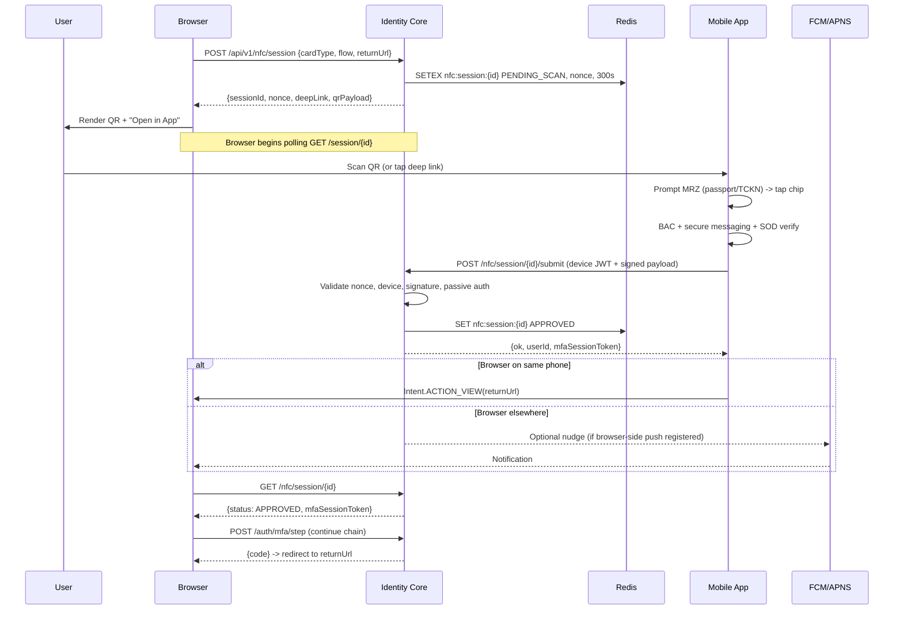

# NFC Push-Approval Protocol

Status: Draft v1.0
Owner: Identity Core API / Client-Apps
Scope: Cross-device NFC verification handoff (browser -> mobile -> browser)
Depends on: V34-V38 (confidential clients, mfa_sessions guards), QR session pattern, device registration
Author: Platform Engineering
Last reviewed: 2026-04-18

## 1. Problem Statement

FIVUCSAS supports ten auth methods, including `NFC_DOCUMENT`. The web surface cannot read an ICAO 9303 passport, a Turkish eID chip (TD1 MRZ), nor arbitrary ISO 14443 cards across target browsers:

- **iOS Safari has no WebNFC.** No shipped API, no public timeline. iPhone users have no chip path today.
- **Desktop browsers have no NFC radio.** Even where WebNFC exists (Chromium Android) it only exposes NDEF, not ISO-DEP / APDU required for BAC/PACE.
- **Web BAC is impossible.** BAC derives session keys from the MRZ and opens secure messaging over APDU; the WebNFC NDEF surface cannot transmit `transceive()` traffic.
- **The app can already read the chips.** `PassportNfcReader.kt` does BAC + secure messaging + SOD/DG1/DG2 today; `StudentCardNfcReader` and `IstanbulkartNfcReader` cover NDEF. Capability exists; cross-device handoff does not.

e-Devlet solves the same gap by handing users into a mobile app to approve a pending web session. This spec defines the FIVUCSAS equivalent.

## 2. Actors

| Actor | Role |
|-------|------|
| Browser | Initiates verification, renders QR/deep-link, polls. Hosted login (`verify.fivucsas.com`) or widget. |
| Identity Core (IC) | `api.fivucsas.com`. Owns session state (Redis + Postgres), validates chip signatures, mints MFA tokens. |
| Mobile App | KMP/Compose (Android now, iOS Phase 2). Reads chip, signs with device-bound key, returns user to browser. |
| FCM / APNS | Optional nudge when browser is on the same phone and tab is hidden. |
| User | Physically present with phone + chip. |

## 3. End-to-End Sequence

### 3.1 Textual steps

1. **Browser** `POST /api/v1/nfc/session` with `{ cardType, flow, returnUrl, clientId, mfaSessionId? }`. `cardType in {passport, tckn_id, student_card, rp_card}`; `flow in {enroll, auth}`; `mfaSessionId` present when NFC is a step inside an MFA chain.
2. **IC** writes `nfc:session:{sessionId}` in Redis: `status=PENDING_SCAN`, TTL 300s, random base64url `nonce` (32 bytes) bound to the session (PKCE-style: app must echo, IC recomputes). Returns `{ sessionId, nonce, expiresAt, deepLink, qrPayload }`.
3. **Browser** renders QR + "Open in App" button (on mobile user-agent). Link: `fivucsas://nfc-session?sessionId=<uuid>&nonce=<b64>&returnUrl=<urlencoded>`. Polls `GET /api/v1/nfc/session/{sessionId}` every 2s.
4. **User** opens app via deep link / Universal Link / manual code. App displays approval context (requesting device fingerprint, city, time) and prompts for scan.
5. **App** reads chip. Passport / TCKN: user enters MRZ first; `PassportNfcReader.readCardWithAuth()` runs BAC and returns SOD-verified DG1/DG2. NDEF cards: `StudentCardNfcReader` returns UID + parsed records.
6. **App** `POST /api/v1/nfc/session/{sessionId}/submit` with body `{ deviceId, nonce, cardType, chipPayload, documentHash, capturedAt, sodSignatureValid, dg1Hash, dg2Hash }`, signed by device private key (Ed25519), `Authorization: Bearer <device JWT>`.
7. **IC** validates in order: (a) session exists + `PENDING_SCAN`, (b) nonce matches, (c) device JWT valid + trusted, (d) payload signature verifies, (e) for ICAO chips: passive authentication (SOD -> CSCA trust store; submitted DG hashes match SOD), (f) dedupe (same device in last 30s), (g) document not blacklisted.
8. **IC** marks session `APPROVED`, writes a `verification_sessions` row linking `nfc_session_id` + resolved `user_id` + `document_hash`, and if inside an MFA chain advances `mfa_sessions` per the V35 `consumed_at` pattern.
9. **Browser** polling receives `{ status: "APPROVED", mfaSessionToken }`, calls `POST /api/v1/auth/mfa/step`, completes the chain, redirects to `returnUrl` with the OIDC `code`.
10. **App** optionally fires `Intent.ACTION_VIEW(returnUrl)` (Android) or `UIApplication.open(_:)` (iOS) so the same-phone browser tab returns. Desktop browsers advance on their own via polling.

### 3.2 Sequence diagram



## 4. Deep-Link URI Scheme

### 4.1 Format

```
fivucsas://nfc-session?sessionId=<uuid>&nonce=<base64url-32B>&returnUrl=<urlencoded-https-url>&v=1
```

`sessionId` (UUID v4), `nonce` (base64url 32B, must match Redis), `returnUrl` (HTTPS, validated against `oauth2_clients.redirect_uris` before the app renders it), `v` (protocol version; unknown versions fail closed).

### 4.2 Android registration

`AndroidManifest.xml` (`client-apps/androidApp/src/main/AndroidManifest.xml`) adds an intent filter on the entry activity:

```xml
<intent-filter android:autoVerify="true">
    <action android:name="android.intent.action.VIEW" />
    <category android:name="android.intent.category.DEFAULT" />
    <category android:name="android.intent.category.BROWSABLE" />
    <data android:scheme="fivucsas" android:host="nfc-session" />
</intent-filter>
<intent-filter android:autoVerify="true">
    <action android:name="android.intent.action.VIEW" />
    <category android:name="android.intent.category.DEFAULT" />
    <category android:name="android.intent.category.BROWSABLE" />
    <data android:scheme="https" android:host="api.fivucsas.com"
          android:pathPrefix="/nfc-session" />
</intent-filter>
```

App Link hardens against hostile apps registering the same scheme; `assetlinks.json` lives at `https://api.fivucsas.com/.well-known/assetlinks.json`.

### 4.3 iOS registration

`Info.plist`:

```xml
<key>CFBundleURLTypes</key>
<array>
  <dict>
    <key>CFBundleURLName</key><string>com.fivucsas.mobile</string>
    <key>CFBundleURLSchemes</key><array><string>fivucsas</string></array>
  </dict>
</array>
```

Universal Link: `apple-app-site-association` at `https://api.fivucsas.com/.well-known/apple-app-site-association` with `applinks` path `/nfc-session/*`. Requires Apple Developer Team ID (Section 15).

### 4.4 Fallback when app is not installed

If the deep link does not resolve within 1500ms, the browser redirects to a mobile landing page that sends the user to the Play / App Store with a `referrer` carrying the `sessionId`. On first launch the app reads the install referrer and resumes the session if still within TTL.

## 5. Device Registration Protocol

Submissions must be signed by a registered, user-bound device; otherwise a harvested link plus a forged chip dump would authenticate anyone.

### 5.1 One-time flow

1. User logs in on the mobile app (existing flow).
2. App generates a non-exportable Ed25519 key pair in Android Keystore (StrongBox preferred) or iOS Secure Enclave.
3. App `POST /api/v1/device/register` with:

```json
{
  "publicKey": "<base64 Ed25519>",
  "platform": "android|ios",
  "osVersion": "14",
  "appVersion": "1.4.0",
  "fingerprint": "<sha256(install-id + model + android-id-hash)>",
  "fcmToken": "<optional>",
  "apnsToken": "<optional>"
}
```

4. IC persists a `devices` row, returns `{ deviceId, deviceJwt }`. JWT lifetime 90 days, claim `cnf.jkt = sha256(publicKey)` so replay requires the private key.
5. Subsequent submits sign the canonical JSON payload with Ed25519 and send the signature in `X-Device-Signature`; unsigned submissions are rejected.

### 5.2 Revocation

My Profile lists devices with `last_seen` + revoke button. Revoke flips `devices.trusted=false` and adds a Redis denylist entry `device:revoked:{deviceId}` (TTL = remaining JWT lifetime).

## 6. FCM / APNS Push

### 6.1 When push fires

Push is optional; primary path is polling. Push fires only when the browser is on the same phone, the user has switched apps (tab hidden), and a push token is registered. Without push, polling completes in 2 seconds.

### 6.2 Payload

```json
{
  "type": "nfc.approve",
  "sessionId": "<uuid>",
  "expiresAt": "2026-04-18T14:32:17Z",
  "cardType": "passport"
}
```

Silent on Android (`content_available=true`), `aps.content-available=1` on iOS. App posts a high-priority system notification and deep-links to the approval screen on tap.

### 6.3 Rate limit

One push per `sessionId`, at most three per device per hour, enforced via the existing Bucket4j layer.

### 6.4 Fallback

On `NotRegistered` / `Unregistered`, mark the token inactive and fall back to polling. Push delivery never blocks the flow.

## 7. Return Path

Once the app has submitted and IC returns `APPROVED`, the user's attention must return to the browser that began the session.

| Option | Mechanism | Trade-off |
|--------|-----------|-----------|
| **(a) Deep-link back** | Android `Intent.ACTION_VIEW(returnUrl)`, iOS `UIApplication.open(_:)`. | Works same-phone; no-op when browser is elsewhere. **Ship.** |
| **(b) In-app browser** | Custom Tabs / SFSafariViewController. | Seamless single-device, but cookie isolation + doesn't help cross-device. Not Phase 1. |
| **(c) Manual switch + polling** | Browser polls every 2s. | Works across all topologies; risk if user closes tab. **Always active.** |

Ship (a) + (c). Success screen copy: "You can return to your computer now."

## 8. Security Review

| Threat | Mitigation | Server-side test |
|--------|------------|------------------|
| Deep-link replay | Nonce bound to session, 5-min TTL, invalidated on first submit. | Submit same nonce twice -> 409. |
| MITM on submit | TLS 1.3, HSTS preload, device JWT bound to pubkey (`cnf.jkt`). | Reject when `cnf.jkt` != hash(pubkey). |
| Session fixation | `sessionId` generated server-side; never accepted from client. | Attacker-chosen id -> 400. |
| Cross-session confusion | Submit carries `sessionId` + `nonce`; IC cross-checks. | Swap nonces across sessions -> 401. |
| Device spoofing | Device JWT + Ed25519 signature; StrongBox / Secure Enclave when available. | Rotated pubkey -> 401. |
| Chip forgery (passive auth) | SOD verified against CSCA trust store; DG1/DG2 hashes must match SOD. | Tampered DG1 -> 422; unknown CSCA -> 422. |
| Active Authentication bypass | When DG15/DG14 present, require AA response; policy-gated rejection if absent. | DG15-present fixture with no AA -> reject in strict mode. |
| PII in logs / URLs | `returnUrl` query params tenant-allowlisted; `SecureLogger` redacts chip fields. | Static scan + unit: logs carry no chip fields. |
| TTL leak / zombies | Redis TTL 300s; terminal write to Postgres; polling past TTL -> 410. | Approve, wait 301s -> Postgres row present, Redis key gone. |
| `returnUrl` open redirect | Validated against `oauth2_clients.redirect_uris` at session creation. | Non-allowlisted URL -> 400 at create. |
| FCM/APNS token leak | AES-GCM encrypted at rest; never echoed to browser; rotated on reinstall. | Dump `devices` row JSON -> token masked. |
| Stolen document | Daily Interpol SLTD refresh; KPS/MERNIS check when tenant has contract. | Blacklisted hash -> 403 `DOCUMENT_REVOKED`. |
| Unrelated chip | `cardType` declared in web session checked against AID / DG1 format. | Mismatched type -> 422. |

All rows above must have passing tests before Phase 1 ships.

## 9. Database Changes

Next migration: `V39__nfc_sessions_and_devices.sql` (current max confirmed is V38).

```sql
-- V39__nfc_sessions_and_devices.sql

CREATE TABLE nfc_sessions (
    id                UUID PRIMARY KEY,
    tenant_id         UUID NOT NULL REFERENCES tenants(id),
    client_id         UUID NOT NULL REFERENCES oauth2_clients(id),
    mfa_session_id    UUID REFERENCES mfa_sessions(id),
    card_type         VARCHAR(32) NOT NULL,
    flow              VARCHAR(16) NOT NULL, -- 'enroll' | 'auth'
    status            VARCHAR(24) NOT NULL, -- PENDING_SCAN | APPROVED | EXPIRED | REJECTED
    nonce_hash        CHAR(64) NOT NULL,    -- SHA-256 of nonce; raw nonce never persisted
    return_url        TEXT NOT NULL,
    device_id         UUID,
    document_hash     CHAR(64),             -- SHA-256 of document number + issuer
    approved_at       TIMESTAMPTZ,
    created_at        TIMESTAMPTZ NOT NULL DEFAULT now(),
    expires_at        TIMESTAMPTZ NOT NULL
);

CREATE INDEX idx_nfc_sessions_status_expires
    ON nfc_sessions(status, expires_at);
CREATE INDEX idx_nfc_sessions_tenant_created
    ON nfc_sessions(tenant_id, created_at DESC);

CREATE TABLE devices (
    id               UUID PRIMARY KEY,
    user_id          UUID NOT NULL REFERENCES users(id) ON DELETE CASCADE,
    public_key       BYTEA NOT NULL,
    platform         VARCHAR(16) NOT NULL,
    os_version       VARCHAR(32),
    app_version      VARCHAR(32),
    fingerprint      CHAR(64) NOT NULL,
    fcm_token_enc    BYTEA,
    apns_token_enc   BYTEA,
    trusted          BOOLEAN NOT NULL DEFAULT true,
    created_at       TIMESTAMPTZ NOT NULL DEFAULT now(),
    last_seen_at     TIMESTAMPTZ,
    revoked_at       TIMESTAMPTZ,
    UNIQUE(user_id, fingerprint)
);

CREATE INDEX idx_devices_user_trusted
    ON devices(user_id, trusted) WHERE revoked_at IS NULL;

ALTER TABLE verification_sessions
    ADD COLUMN nfc_session_id UUID REFERENCES nfc_sessions(id);
CREATE INDEX idx_verification_sessions_nfc
    ON verification_sessions(nfc_session_id);
```

Notes: Redis is source of truth for live sessions; Postgres row is written on terminal transition so audit survives a Redis flush. Only the nonce hash is persisted; raw nonce never leaves Redis. `fcm_token_enc` / `apns_token_enc` use AES-GCM via existing `CryptoService`.

## 10. Android Implementation Notes

- Manifest: add the two intent filters from Section 4.2 to `MainActivity`.
- `NfcSessionDeepLinkParser` extracts `sessionId`, `nonce`, `returnUrl`; reject on missing/malformed.
- `PassportNfcReader.readCardWithAuth(tag, AuthenticationData.MrzData(...))` is unchanged. New `NfcApprovalViewModel` invokes it, then `NfcSessionRepository.submit(...)` handles canonical JSON + Ed25519 signing.
- ViewModel states: `Idle -> AwaitingMrz -> Ready -> Scanning -> Submitting -> Approved | Failed(reason)`, logged via `SecureLogger`.
- Error UX: no NFC hardware -> fall back to manual entry if tenant permits; NFC disabled -> `Settings.ACTION_NFC_SETTINGS`; BAC failed -> retry up to 3x then server-side invalidate; SOD invalid -> abort with support code; expired -> back to browser.
- Timeouts: chip read 45s (existing `TIMEOUT_MS`); submit HTTP 10s with exponential back-off on 5xx.

## 11. iOS Implementation Notes

- Entitlements: `com.apple.developer.nfc.readersession.formats = ["TAG"]` and `applinks:api.fivucsas.com`. Requires paid developer account.
- `NFCTagReaderSession` with `.iso14443` polling; cast to `NFCISO7816Tag`; run the same APDU ladder as `EidApduHelper`.
- BAC/PACE: iOS has no OS-level BAC. Use a port of JMRTD or in-house OpenSSL primitives in `shared/iosMain`, sharing logic with `BacAuthentication` via `expect/actual`.
- Reuse `MrzParser`, `Dg1Parser`, `Dg2Parser` from `shared/commonMain`.
- Deep-link: `SceneDelegate.scene(_:openURLContexts:)` for custom scheme; `scene(_:continue:)` + `NSUserActivity.webpageURL` for Universal Links. Both route to `NfcApprovalViewModel`.
- Pre-NFC iPhones (6 and below): show `CoreNFC not supported`, offer QR-to-other-device fallback.

## 12. Desktop Implementation Notes

Desktop typically has no NFC radio. Two paths:

- **(a) Delegate to phone.** Default. Browser renders QR, user scans with the app, polling completes. No new desktop code.
- **(b) USB NFC reader.** Phase 3. Compose Desktop module using `javax.smartcardio` to drive PC/SC readers (ACR1252U class). Reuses `PassportNfcReader` via KMP `desktopMain`. Gated on tenant demand.

Phase 1 ships (a) only.

## 13. Test Plan

- **Unit.** Chip fixtures (3 TD3 passports: US/TR/DE; 2 TD1 Turkish eID; 2 student cards); canonical JSON + Ed25519 round-trip; nonce replay/mismatch; device JWT tampering; `cnf.jkt` mismatch.
- **Integration (Testcontainers).** Full `/api/v1/nfc/session` lifecycle (Postgres + Redis); passive auth against a test CSCA; SLTD / MERNIS / KPS stubs via WireMock; per-device submit rate limits.
- **End-to-end.** Playwright drives `verify.fivucsas.com`, reads QR; Android emulator with HCE fixture consumes the deep link and submits; browser must advance within 3s.
- **Acceptance.** 99.5% happy-path sessions under 90s wall-clock; zero false approvals in a 10k fuzz suite; p95 submit validation under 400ms excluding cached CSCA chain; every Section 8 row has a passing test.

## 14. Rollout Phases

| Phase | Scope | Gate |
|-------|-------|------|
| 1 | Android + web. Passports + TCKN. Polling only. Internal tenants. | V39 applied; Android internal track; Section 13 acceptance. |
| 2 | iOS CoreNFC. Universal Links. FCM + APNS. | Apple entitlement; CSCA loaded in prod. |
| 3 | Desktop USB reader module. | Tenant demand; hardware matrix frozen. |
| 4 | Tenant opt-in GA. Dashboard + runbook. SLA. | 30 days of Phase 1+2 with <0.1% non-user validation failures. |

## 15. Open Questions (for Ahmet)

1. **Turkish ID ISO-DEP scope.** Target only post-2017 Kimlik Kart, or do we need a legacy read path? Field data suggests post-2017 only; confirm.
2. **Apple Developer Team ID.** Universal Links + CoreNFC need a paid account. Team ID? Is the USD 99/yr budgeted? Blocks Phase 2.
3. **CSCA master list source.** Public ICAO PKD, commercial mirror (Netrust/HID), or monthly download from ICAO's free master list? Drives passive-auth freshness SLA.
4. **SMS push fallback.** For devices without FCM/APNS (HMS-only OEMs), do we accept SMS carrying the deep link (Twilio cost), or polling-only?
5. **KPS/MERNIS contract.** TCKN revocation needs a licensed NVI integrator. Partner lined up, or Phase 1 ships without revocation check?
6. **Active Authentication policy.** When DG15/DG14 present, reject on missing AA, or log-only? Strict is safer; log-only is more compatible with older chips.
7. **`nfc_sessions` retention.** Proposed 90 days then purge. Confirm against KVKK/GDPR retention.
